# Entity-relationship model

- **Task:** T-DG1-ARCH-01 (solution-architect), 2026-09-30.
- **Covers:** master prompt §16 "Minimum domain entities", all twelve groups (REQ-S16-011…022).
- **Detail:** the physical columns of the tables P1 implements are in `data-dictionary.md`.
- **Marking:**
  - **P1** means the table is created by P1 migrations.
  - **P2** in bold means the table is created by the P2 migrations 0010–0018 (section 1b; T-DG2-ARCH-01B).
  - **P3** tables are created by the P3 migrations 0020–0024 (section 1c; T-DG3-ARCH-01).
  - `Px` names the stage that adds the table.
  - Entity names are conceptual. Table names are snake_case singular, and `User` becomes `app_user` because `user` is a reserved word.

## Conventions shared by every table (ADR-0003/0004)

- `id uuid` (UUIDv7, app-generated) primary key.
- `organization_id` on every tenant-scoped row.
- `version integer` (optimistic concurrency) on every mutable row.
- `created_at`/`updated_at timestamptz` and `created_by`/`updated_by`.
- Explicit status columns with CHECK-constrained values and documented transitions.
- `ON DELETE RESTRICT` foreign keys.
- No hard deletes of business records.
- Money is `numeric` plus `currency`.
- Extensible custom fields live in `custom_field_values jsonb`, validated against the pinned `form_schema_version` (ADR-0014).

**Canonical shared records:**
- **one `decision` model:** T04 design decisions, T11 decision-right decisions, T16 executive decisions and gate decisions all reference or specialise it;
- **one `dependency` record**, shared by T08 and RAID;
- **one benefit register:** `benefit` plus `benefit_allocation`, with no duplicated benefit rows per initiative.

## 1. P1 physical model (implemented at DG1)

```mermaid
erDiagram
    organization ||--o{ business_unit : has
    business_unit ||--o{ business_unit : "parent of"
    organization ||--o{ app_user : "home org of"
    app_user ||--o{ user_identity : "bound to (issuer, subject)"
    app_user ||--o{ session : has
    role ||--o{ role_permission : grants
    permission ||--o{ role_permission : "granted by"
    app_user ||--o{ scoped_assignment : holds
    role ||--o{ scoped_assignment : "assigned as"
    organization ||--o{ scoped_assignment : "tenant of"
    app_user ||--o{ delegation : "delegator / delegate"
    organization ||--o{ transformation : owns
    business_unit ||--o{ transformation : contains
    app_user |o--o{ transformation : "sponsor / lead"
    organization ||--o{ audit_event : "tenant of"
    transformation |o--o{ audit_event : "scoped trail"
    organization ||--o{ outbox_event : "tenant of"
    outbox_event ||--o| processed_message : "consumed as"

    organization {
        uuid id PK
        text code UK
        text name_en
        text name_ar
        text default_timezone
        char3 default_currency
        text default_locale
        text status
        int version
    }
    business_unit {
        uuid id PK
        uuid organization_id FK
        uuid parent_business_unit_id FK
        text code
        text name_en
        text name_ar
        text status
        int version
    }
    app_user {
        uuid id PK
        uuid organization_id FK
        text display_name
        text email
        text preferred_locale
        text timezone
        text status
        int version
    }
    user_identity {
        uuid id PK
        uuid user_id FK
        text issuer
        text subject
    }
    session {
        uuid id PK
        bytea token_hash UK
        uuid user_id FK
        text auth_mode
        timestamptz idle_expires_at
        timestamptz absolute_expires_at
        timestamptz revoked_at
    }
    oidc_login_state {
        bytea state_hash PK
        text code_verifier
        text nonce
        text return_to
        timestamptz expires_at
    }
    role {
        uuid id PK
        text code UK
        text kind
        bool inherits_downward
    }
    permission {
        text code PK
        text category
    }
    role_permission {
        uuid role_id PK
        text permission_code PK
    }
    scoped_assignment {
        uuid id PK
        uuid organization_id FK
        uuid user_id FK
        uuid role_id FK
        text scope_type
        uuid scope_id
        timestamptz effective_from
        timestamptz effective_to
        timestamptz revoked_at
        int version
    }
    delegation {
        uuid id PK
        uuid delegator_user_id FK
        uuid delegate_user_id FK
        text scope_type
        uuid scope_id
        timestamptz effective_from
        timestamptz effective_to
        text status
        int version
    }
    transformation {
        uuid id PK
        uuid organization_id FK
        uuid business_unit_id FK
        text code
        text name
        text mode
        text entry_phase
        text status
        text current_phase
        uuid sponsor_user_id FK
        uuid lead_user_id FK
        text timezone
        char3 currency
        timestamptz archived_at
        int version
    }
    audit_event {
        uuid id PK
        bigint seq UK
        timestamptz occurred_at
        text action
        text record_type
        uuid record_id
        uuid transformation_id
        uuid actor_user_id
        int prior_version
        int new_version
        text reason
        text request_id
        jsonb changes
    }
    outbox_event {
        uuid id PK
        bigint seq UK
        text event_type
        int schema_version
        jsonb payload
        text idempotency_key UK
        timestamptz published_at
    }
    processed_message {
        text consumer PK
        text idempotency_key PK
        timestamptz processed_at
    }
    idempotency_record {
        uuid user_id PK
        text key PK
        text request_hash
        jsonb response
        timestamptz expires_at
    }
```

Also created in P1, not drawn above:
- Three **views** (read models, `SELECT` only for `mth_app`; columns in the data dictionary, section "Views"). They store no data:
  - `actor_display` (0001) is derived from `app_user` as `(user_id, display_name)`. Audit reads actor names through it.
  - `business_unit_closure` (0001) is the recursive closure of `business_unit` `parent of`, as `(ancestor_id, descendant_id, organization_id, depth)` with depth 0–10. The policy function uses it for downward inheritance, and the organization module for cycle and depth checks.
  - `scope_node` (0002) is the `UNION ALL` of `organization`, `business_unit` and `transformation`, as `(scope_type, scope_id, organization_id, business_unit_id, transformation_id)`. It resolves the scope that a `scoped_assignment` points at.
- The `business_unit` self-relation is acyclic and at most 10 levels deep. The database enforces this with the trigger `business_unit_hierarchy_guard` (0009, F-DG1-140) in addition to the API check.
- `schema_migration`: migration bookkeeping.
- The `pgboss.*` schema: owned and migrated by pg-boss (ADR-0008). This is P1's "job tables as required by the queue choice", and the physical form of the §16 entity **Job**.

## 1b. P2 physical model (migrations 0010–0018, DG2)

- **Task:** T-DG2-ARCH-01 / 01B (solution-architect), 2026-10-02.
- **What it documents:** exactly what migrations `0010`–`0018` build. The diagrams were checked against the migrated PostgreSQL 16.13 catalogue, and the columns are in `data-dictionary.md` § "P2 tables".
- **Common columns:** every business table below has `id uuid PK`, `organization_id` (FK, equal to the transformation's), `transformation_id` (FK), `version int` (optimistic concurrency, +1 per change), `created_at`/`updated_at timestamptz` and `created_by`/`updated_by` (FK `app_user`). The diagrams omit them unless they matter.
- **References:** `T`-prefixed FKs are composite `(transformation_id, x_id)`, so a reference never crosses transformations.
- **Guards:** every mutable table carries the record guards of ADR-0016: version step, audit coverage at COMMIT, and no DELETE.

### 1b.1 Methodology catalogue (seed) and pin — `methodology` / `workflows` modules

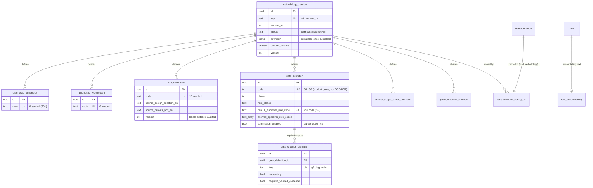
```mermaid
erDiagram
    methodology_version ||--o{ diagnostic_dimension : defines
    methodology_version ||--o{ diagnostic_workstream : defines
    methodology_version ||--o{ tom_dimension : defines
    methodology_version ||--o{ gate_definition : defines
    gate_definition ||--o{ gate_criterion_definition : "required outputs"
    methodology_version ||--o{ charter_scope_check_definition : defines
    methodology_version ||--o{ good_outcome_criterion : defines
    transformation ||--|| transformation_config_pin : "pinned to (kind methodology)"
    methodology_version ||--o{ transformation_config_pin : "pinned by"
    role ||--o| role_accountability : "accountability text"

    methodology_version {
        uuid id PK
        text key UK "with version_no"
        int version_no
        text status "draft|published|retired"
        jsonb definition "immutable once published"
        char64 content_sha256
        int version
    }
    gate_definition {
        uuid id PK
        text code UK "G1..G6 (product gates, not DG0-DG7)"
        text phase
        text next_phase
        text default_approver_role_code FK "role.code (SP)"
        text_array allowed_approver_role_codes
        bool submission_enabled "G1-G3 true in P2"
    }
    gate_criterion_definition {
        uuid id PK
        uuid gate_definition_id FK
        text key UK "g1.diagnostic ..."
        bool mandatory
        bool requires_verified_evidence
    }
    tom_dimension {
        uuid id PK
        text code UK "10 seeded"
        text source_design_question_en
        text source_canvas_box_en
        int version "labels editable, audited"
    }
    diagnostic_dimension {
        uuid id PK
        text code UK "6 seeded (T01)"
    }
    diagnostic_workstream {
        uuid id PK
        text code UK "6 seeded"
    }
```

### 1b.2 Direction and charter — `transformations` module

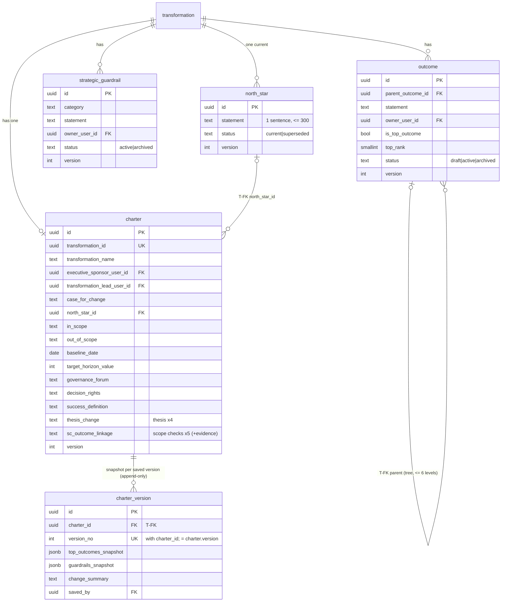
```mermaid
erDiagram
    transformation ||--o| charter : "has one"
    charter ||--o{ charter_version : "snapshot per saved version (append-only)"
    transformation ||--o{ north_star : "one current"
    north_star |o--o{ charter : "T-FK north_star_id"
    transformation ||--o{ strategic_guardrail : has
    transformation ||--o{ outcome : has
    outcome |o--o{ outcome : "T-FK parent (tree, <= 6 levels)"

    charter {
        uuid id PK
        uuid transformation_id UK
        text transformation_name
        uuid executive_sponsor_user_id FK
        uuid transformation_lead_user_id FK
        text case_for_change
        uuid north_star_id FK
        text in_scope
        text out_of_scope
        date baseline_date
        int target_horizon_value
        text governance_forum
        text decision_rights
        text success_definition
        text thesis_change "thesis x4"
        text sc_outcome_linkage "scope checks x5 (+evidence)"
        int version
    }
    charter_version {
        uuid id PK
        uuid charter_id FK "T-FK"
        int version_no UK "with charter_id; = charter.version"
        jsonb top_outcomes_snapshot
        jsonb guardrails_snapshot
        text change_summary
        uuid saved_by FK
    }
    north_star {
        uuid id PK
        text statement "1 sentence, <= 300"
        text status "current|superseded"
        int version
    }
    strategic_guardrail {
        uuid id PK
        text category
        text statement
        uuid owner_user_id FK
        text status "active|archived"
        int version
    }
    outcome {
        uuid id PK
        uuid parent_outcome_id FK
        text statement
        uuid owner_user_id FK
        bool is_top_outcome
        smallint top_rank
        text status "draft|active|archived"
        int version
    }
```

### 1b.3 Diagnose, KPI, baseline and value — `transformations` and `kpi` modules

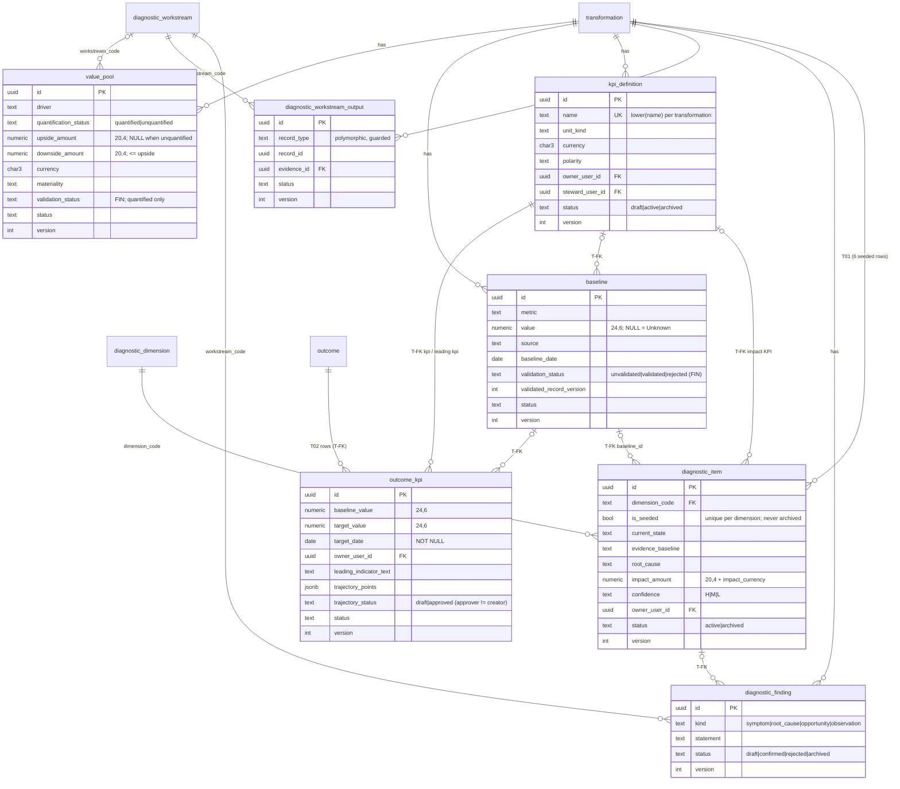
```mermaid
erDiagram
    transformation ||--o{ diagnostic_item : "T01 (6 seeded rows)"
    diagnostic_dimension ||--o{ diagnostic_item : "dimension_code"
    baseline |o--o{ diagnostic_item : "T-FK baseline_id"
    kpi_definition |o--o{ diagnostic_item : "T-FK impact KPI"
    transformation ||--o{ diagnostic_finding : has
    diagnostic_workstream ||--o{ diagnostic_finding : "workstream_code"
    diagnostic_item |o--o{ diagnostic_finding : "T-FK"
    transformation ||--o{ diagnostic_workstream_output : has
    diagnostic_workstream ||--o{ diagnostic_workstream_output : "workstream_code"
    transformation ||--o{ kpi_definition : has
    transformation ||--o{ baseline : has
    kpi_definition |o--o{ baseline : "T-FK"
    outcome ||--o{ outcome_kpi : "T02 rows (T-FK)"
    kpi_definition ||--o{ outcome_kpi : "T-FK kpi / leading kpi"
    baseline |o--o{ outcome_kpi : "T-FK"
    transformation ||--o{ value_pool : has
    diagnostic_workstream |o--o{ value_pool : "workstream_code"

    diagnostic_item {
        uuid id PK
        text dimension_code FK
        bool is_seeded "unique per dimension; never archived"
        text current_state
        text evidence_baseline
        text root_cause
        numeric impact_amount "20,4 + impact_currency"
        text confidence "H|M|L"
        uuid owner_user_id FK
        text status "active|archived"
        int version
    }
    diagnostic_finding {
        uuid id PK
        text kind "symptom|root_cause|opportunity|observation"
        text statement
        text status "draft|confirmed|rejected|archived"
        int version
    }
    diagnostic_workstream_output {
        uuid id PK
        text record_type "polymorphic, guarded"
        uuid record_id
        uuid evidence_id FK
        text status
        int version
    }
    kpi_definition {
        uuid id PK
        text name UK "lower(name) per transformation"
        text unit_kind
        char3 currency
        text polarity
        uuid owner_user_id FK
        uuid steward_user_id FK
        text status "draft|active|archived"
        int version
    }
    baseline {
        uuid id PK
        text metric
        numeric value "24,6; NULL = Unknown"
        text source
        date baseline_date
        text validation_status "unvalidated|validated|rejected (FIN)"
        int validated_record_version
        text status
        int version
    }
    outcome_kpi {
        uuid id PK
        numeric baseline_value "24,6"
        numeric target_value "24,6"
        date target_date "NOT NULL"
        uuid owner_user_id FK
        text leading_indicator_text
        jsonb trajectory_points
        text trajectory_status "draft|approved (approver != creator)"
        text status
        int version
    }
    value_pool {
        uuid id PK
        text driver
        text quantification_status "quantified|unquantified"
        numeric upside_amount "20,4; NULL when unquantified"
        numeric downside_amount "20,4; <= upside"
        char3 currency
        text materiality
        text validation_status "FIN; quantified only"
        text status
        int version
    }
```

### 1b.4 Design (TOM) — `transformations` module

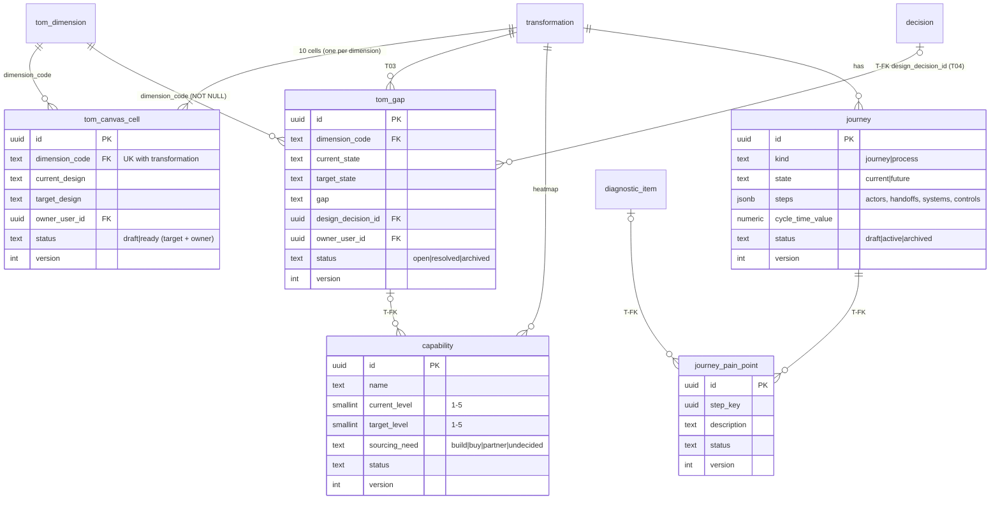
```mermaid
erDiagram
    transformation ||--|{ tom_canvas_cell : "10 cells (one per dimension)"
    tom_dimension ||--o{ tom_canvas_cell : "dimension_code"
    transformation ||--o{ tom_gap : "T03"
    tom_dimension ||--o{ tom_gap : "dimension_code (NOT NULL)"
    decision |o--o{ tom_gap : "T-FK design_decision_id (T04)"
    transformation ||--o{ capability : "heatmap"
    tom_gap |o--o{ capability : "T-FK"
    transformation ||--o{ journey : has
    journey ||--o{ journey_pain_point : "T-FK"
    diagnostic_item |o--o{ journey_pain_point : "T-FK"

    tom_canvas_cell {
        uuid id PK
        text dimension_code FK "UK with transformation"
        text current_design
        text target_design
        uuid owner_user_id FK
        text status "draft|ready (target + owner)"
        int version
    }
    tom_gap {
        uuid id PK
        text dimension_code FK
        text current_state
        text target_state
        text gap
        uuid design_decision_id FK
        uuid owner_user_id FK
        text status "open|resolved|archived"
        int version
    }
    capability {
        uuid id PK
        text name
        smallint current_level "1-5"
        smallint target_level "1-5"
        text sourcing_need "build|buy|partner|undecided"
        text status
        int version
    }
    journey {
        uuid id PK
        text kind "journey|process"
        text state "current|future"
        jsonb steps "actors, handoffs, systems, controls"
        numeric cycle_time_value
        text status "draft|active|archived"
        int version
    }
    journey_pain_point {
        uuid id PK
        uuid step_key
        text description
        text status
        int version
    }
```

### 1b.5 Decisions, workshops, actions, dependencies and product gates — `workflows` module

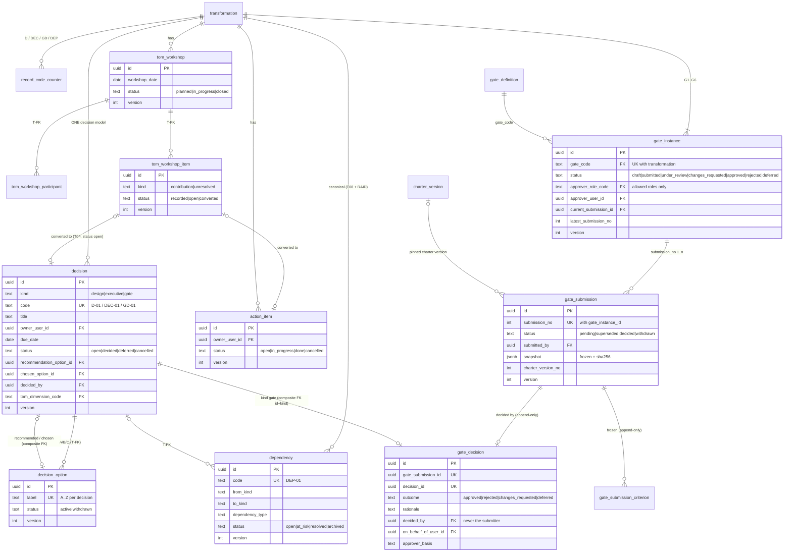
```mermaid
erDiagram
    transformation ||--o{ decision : "ONE decision model"
    decision ||--o{ decision_option : "A/B/C (T-FK)"
    decision_option |o--o| decision : "recommended / chosen (composite FK)"
    transformation ||--o{ record_code_counter : "D / DEC / GD / DEP"
    transformation ||--o{ tom_workshop : has
    tom_workshop ||--o{ tom_workshop_participant : "T-FK"
    tom_workshop ||--o{ tom_workshop_item : "T-FK"
    tom_workshop_item |o--o| decision : "converted to (T04, status open)"
    tom_workshop_item |o--o| action_item : "converted to"
    transformation ||--o{ action_item : has
    transformation ||--o{ dependency : "canonical (T08 + RAID)"
    decision |o--o{ dependency : "T-FK"
    transformation ||--|{ gate_instance : "G1..G6"
    gate_definition ||--o{ gate_instance : "gate_code"
    gate_instance ||--o{ gate_submission : "submission_no 1..n"
    charter_version |o--o{ gate_submission : "pinned charter version"
    gate_submission ||--o{ gate_submission_criterion : "frozen (append-only)"
    gate_submission ||--o| gate_decision : "decided by (append-only)"
    decision ||--o| gate_decision : "kind gate (composite FK id+kind)"

    decision {
        uuid id PK
        text kind "design|executive|gate"
        text code UK "D-01 / DEC-01 / GD-01"
        text title
        uuid owner_user_id FK
        date due_date
        text status "open|decided|deferred|cancelled"
        uuid recommendation_option_id FK
        uuid chosen_option_id FK
        uuid decided_by FK
        text tom_dimension_code FK
        int version
    }
    decision_option {
        uuid id PK
        text label UK "A..Z per decision"
        text status "active|withdrawn"
        int version
    }
    gate_instance {
        uuid id PK
        text gate_code FK "UK with transformation"
        text status "draft|submitted|under_review|changes_requested|approved|rejected|deferred"
        text approver_role_code FK "allowed roles only"
        uuid approver_user_id FK
        uuid current_submission_id FK
        int latest_submission_no
        int version
    }
    gate_submission {
        uuid id PK
        int submission_no UK "with gate_instance_id"
        text status "pending|superseded|decided|withdrawn"
        uuid submitted_by FK
        jsonb snapshot "frozen + sha256"
        int charter_version_no
        int version
    }
    gate_decision {
        uuid id PK
        uuid gate_submission_id UK
        uuid decision_id UK
        text outcome "approved|rejected|changes_requested|deferred"
        text rationale
        uuid decided_by FK "never the submitter"
        uuid on_behalf_of_user_id FK
        text approver_basis
    }
    tom_workshop {
        uuid id PK
        date workshop_date
        text status "planned|in_progress|closed"
        int version
    }
    tom_workshop_item {
        uuid id PK
        text kind "contribution|unresolved"
        text status "recorded|open|converted"
        int version
    }
    action_item {
        uuid id PK
        uuid owner_user_id FK
        text status "open|in_progress|done|cancelled"
        int version
    }
    dependency {
        uuid id PK
        text code UK "DEP-01"
        text from_kind
        text to_kind
        text dependency_type
        text status "open|at_risk|resolved|archived"
        int version
    }
```

### 1b.6 Evidence — `evidence` module

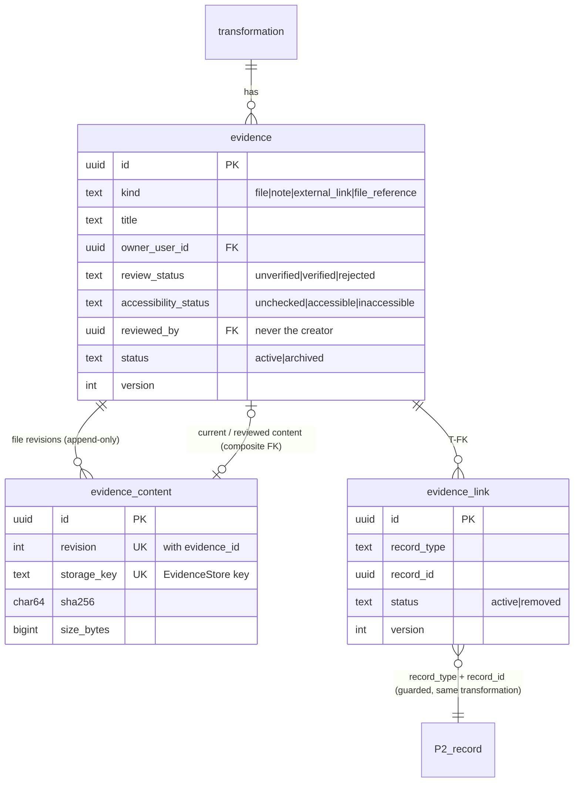
```mermaid
erDiagram
    transformation ||--o{ evidence : has
    evidence ||--o{ evidence_content : "file revisions (append-only)"
    evidence_content |o--o| evidence : "current / reviewed content (composite FK)"
    evidence ||--o{ evidence_link : "T-FK"
    evidence_link }o--|| P2_record : "record_type + record_id (guarded, same transformation)"

    evidence {
        uuid id PK
        text kind "file|note|external_link|file_reference"
        text title
        uuid owner_user_id FK
        text review_status "unverified|verified|rejected"
        text accessibility_status "unchecked|accessible|inaccessible"
        uuid reviewed_by FK "never the creator"
        text status "active|archived"
        int version
    }
    evidence_content {
        uuid id PK
        int revision UK "with evidence_id"
        text storage_key UK "EvidenceStore key"
        char64 sha256
        bigint size_bytes
    }
    evidence_link {
        uuid id PK
        text record_type
        uuid record_id
        text status "active|removed"
        int version
    }
```

### 1b.7 P2 entity register: §16 and template entities → tables

| Entity (§16 / template) | Table | PK | Owner role (writes) | Status field | `version` | API module |
|---|---|---|---|---|---|---|
| DiagnosticFinding (§16) | `diagnostic_finding` | `id` | TL, TO (`diagnostic.edit`); WL own (`diagnostic.contribute`) | `status` draft/confirmed/rejected/archived | yes | transformations |
| Baseline (§16) | `baseline` | `id` | TL, KDS (`baseline.edit`); FIN validates | `validation_status`, `status` | yes | kpi |
| Evidence (§16) | `evidence` (+ `evidence_content`, `evidence_link`) | `id` | evidence.create holders; reviewers per ADR-0018 | `review_status`, `accessibility_status`, `status` | yes (content: append-only) | evidence |
| ValuePool (§16) | `value_pool` | `id` | TL, TO (`diagnostic.edit`); FIN validates | `quantification_status`, `validation_status`, `status` | yes | kpi |
| Outcome (§16) | `outcome` | `id` | TL, BO, KDS (`outcome.edit`) | `status` draft/active/archived | yes | transformations |
| StrategicGuardrail (§16) | `strategic_guardrail` | `id` | TL, TO (`charter.edit`) | `status` active/archived | yes | transformations |
| Charter (+ version) (§16) | `charter`, `charter_version` | `id` | TL, TO (`charter.edit`) | version history (one current row) | yes (snapshots append-only) | transformations |
| NorthStar | `north_star` | `id` | TL (`north_star.edit`) | `status` current/superseded | yes | transformations |
| DiagnosticItem (T01) | `diagnostic_item` | `id` | TL, TO; WL own | `status` (seeded rows never archived) | yes | transformations |
| OutcomeKpi (T02) | `outcome_kpi` | `id` | TL, BO, KDS; SP/BO approve the trajectory | `trajectory_status`, `status` | yes | kpi |
| KPIDefinition (§16, P2 subset) | `kpi_definition` | `id` | TL, KDS | `status` | yes | kpi |
| TomDimension (seed) | `tom_dimension` | `id` (code UK) | seed; ADM_METHOD labels | — | yes | methodology |
| TomGap (T03) | `tom_gap` | `id` | TL, BO; WL/TD own | `status` open/resolved/archived | yes | transformations |
| DesignDecision (T04) | `decision` (kind `design`) + `decision_option` | `id` (code `D-nn` UK) | TL, WL create; the named owner decides | `status` open/decided/deferred/cancelled | yes | workflows |
| TOMCanvas cell | `tom_canvas_cell` | `id` | TL, BO (`tom.edit`) | `status` draft/ready | yes | transformations |
| Capability heatmap entry | `capability` | `id` | TL, BO; WL/TD own | `status` | yes | transformations |
| JourneyMap / ProcessStep | `journey` (`steps` jsonb) + `journey_pain_point` | `id` | TL, BO; WL/TD own | `status` | yes | transformations |
| TOM workshop (+ participant, item) | `tom_workshop`, `tom_workshop_participant`, `tom_workshop_item` | `id` | TL (`workshop.facilitate`) | `status` | yes | workflows |
| Action (P2 subset) | `action_item` | `id` | TL, TO; owner | `status` | yes | workflows |
| Dependency (canonical, P2 subset) | `dependency` | `id` (code `DEP-nn` UK) | TL, WL, TO, TD | `status` | yes | workflows |
| GateInstance | `gate_instance` | `id` | system (instantiation); TO configures the approver | `status` | yes | workflows |
| GateSubmission | `gate_submission` (+ `gate_submission_criterion`) | `id` (`submission_no` UK per gate) | TL (`gate.submit`) | `status` pending/superseded/decided/withdrawn | yes (criteria append-only) | workflows |
| GateDecision | `gate_decision` → canonical `decision` (kind `gate`) | `id` | configured approver (default SP) with `gate.decide`; never the submitter | `outcome` | append-only | workflows |
| MethodologyVersion + pin | `methodology_version`, `transformation_config_pin` | `id` | seed / system | `status` | yes | methodology |
| Role accountability | `role_accountability` | `role_id` | seed | — | yes | access |

**Not built in P2.** These remain as in section 2:
- `phase_definition` (the phases stay CHECK values plus `gate_definition.phase`);
- `performance_area`;
- KPI versions, actuals and calculation runs (P4);
- `process` as its own table (a process is a `journey` row with `kind = 'process'`);
- `approval` (P2 gate approvals are `gate_decision`; the generic approval table comes in P4).

## 1c. P3 physical model (migrations 0020–0024, DG3)

- **Task:** T-DG3-ARCH-01 (solution-architect), 2026-10-07. **ADRs:** ADR-0021…0024. Columns, constraints, indexes and triggers are in `data-dictionary.md` ("P3 tables"), generated from the migrated catalogue.
- **Guards:** every P3 table attaches the P2 guards (row guard, version step, deferred audit coverage). History and decision tables are append-only. `T-FK` = composite foreign key `(transformation_id, x_id)`, so every reference stays inside one transformation.

### 1c.1 Portfolio: initiatives, links, waves, deliverables, milestones, dispensations — `portfolio` module

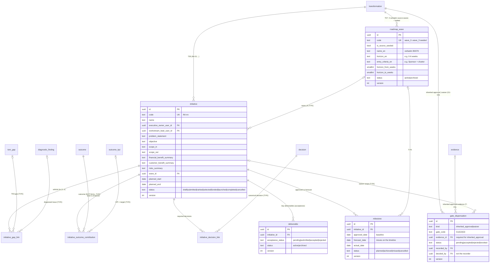
```mermaid
erDiagram
    transformation ||--o{ initiative : "T05 (INI-01…)"
    transformation ||--o{ roadmap_wave : "T07: 4 verbatim source waves + added"
    roadmap_wave |o--o{ initiative : "wave_id (T-FK)"
    initiative ||--o{ initiative_gap_link : "vehicle for (1..n)"
    tom_gap |o--o{ initiative_gap_link : "T03 gap (T-FK)"
    diagnostic_finding |o--o{ initiative_gap_link : "diagnosed issue (T-FK)"
    initiative ||--o{ initiative_outcome_contribution : "level 5 of B0048"
    outcome ||--o{ initiative_outcome_contribution : "outcome (NOT NULL, T-FK)"
    outcome_kpi |o--o{ initiative_outcome_contribution : "KPI + target (T-FK)"
    initiative ||--o{ initiative_decision_link : "required decisions"
    decision ||--o{ initiative_decision_link : "canonical decision (T-FK)"
    initiative ||--o{ deliverable : "key deliverables (acceptance)"
    initiative ||--o{ milestone : "approved vs forecast"
    roadmap_wave |o--o{ milestone : "T-FK"
    transformation ||--o{ gate_dispensation : "inherited approval | waiver (G1-G3)"
    evidence |o--o{ gate_dispensation : "inherited approval evidence (T-FK)"
    initiative |o--o{ gate_dispensation : "waiver scope (T-FK)"

    initiative {
        uuid id PK
        text code UK "INI-nn"
        text name
        uuid executive_owner_user_id FK
        uuid workstream_lead_user_id FK
        text problem_statement
        text objective
        text scope_in
        text scope_out
        text financial_benefit_summary
        text customer_benefit_summary
        text risks_summary
        uuid wave_id FK
        date planned_start
        date planned_end
        text status "draft|submitted|ranked|selected|funded|launched|completed|cancelled"
        int version
    }
    roadmap_wave {
        uuid id PK
        text code UK "wave_0..wave_3 seeded"
        bool is_source_seeded
        text name_en "verbatim B0079"
        text horizon_en "e.g. 0-6 weeks"
        text entry_criteria_en "e.g. Sponsor + charter"
        smallint horizon_from_weeks
        smallint horizon_to_weeks
        text status "active|archived"
        int version
    }
    milestone {
        uuid id PK
        uuid initiative_id FK
        date approved_date "baseline"
        date forecast_date "moves on the timeline"
        date actual_date
        text status "planned|achieved|missed|cancelled"
        int version
    }
    deliverable {
        uuid id PK
        uuid initiative_id FK
        text acceptance_status "pending|submitted|accepted|rejected"
        text status "active|archived"
        int version
    }
    gate_dispensation {
        uuid id PK
        text kind "inherited_approval|waiver"
        text gate_code "G1|G2|G3"
        uuid evidence_id FK "required for inherited_approval"
        text status "pending|accepted|rejected|revoked"
        uuid recorded_by FK
        uuid decided_by FK "not the recorder"
        int version
    }
```

### 1c.2 Prioritization (T06) — `portfolio` module

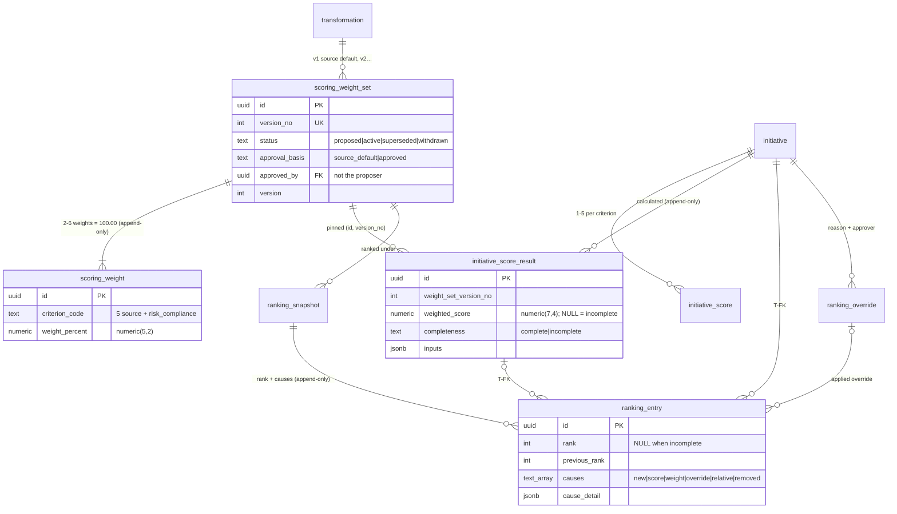
```mermaid
erDiagram
    transformation ||--o{ scoring_weight_set : "v1 source default, v2…"
    scoring_weight_set ||--|{ scoring_weight : "2-6 weights = 100.00 (append-only)"
    initiative ||--o{ initiative_score : "1-5 per criterion"
    initiative ||--o{ initiative_score_result : "calculated (append-only)"
    scoring_weight_set ||--o{ initiative_score_result : "pinned (id, version_no)"
    scoring_weight_set ||--o{ ranking_snapshot : "ranked under"
    ranking_snapshot ||--o{ ranking_entry : "rank + causes (append-only)"
    initiative ||--o{ ranking_entry : "T-FK"
    initiative_score_result |o--o{ ranking_entry : "T-FK"
    initiative ||--o{ ranking_override : "reason + approver"
    ranking_override |o--o{ ranking_entry : "applied override"

    scoring_weight_set {
        uuid id PK
        int version_no UK
        text status "proposed|active|superseded|withdrawn"
        text approval_basis "source_default|approved"
        uuid approved_by FK "not the proposer"
        int version
    }
    scoring_weight {
        uuid id PK
        text criterion_code "5 source + risk_compliance"
        numeric weight_percent "numeric(5,2)"
    }
    initiative_score_result {
        uuid id PK
        int weight_set_version_no
        numeric weighted_score "numeric(7,4); NULL = incomplete"
        text completeness "complete|incomplete"
        jsonb inputs
    }
    ranking_entry {
        uuid id PK
        int rank "NULL when incomplete"
        int previous_rank
        text_array causes "new|score|weight|override|relative|removed"
        jsonb cause_detail
    }
```

### 1c.3 Dependencies (T08), capacity, selection and funding — `workflows` / `portfolio` modules

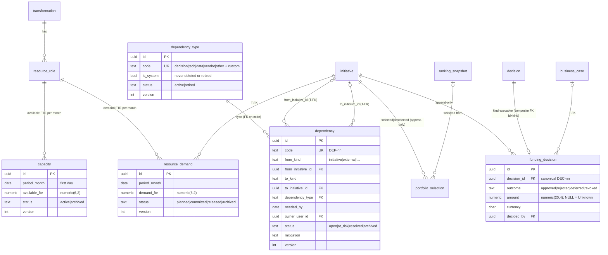
```mermaid
erDiagram
    dependency_type ||--o{ dependency : "type (FK on code)"
    initiative |o--o{ dependency : "from_initiative_id (T-FK)"
    initiative |o--o{ dependency : "to_initiative_id (T-FK)"
    transformation ||--o{ resource_role : has
    resource_role ||--o{ capacity : "available FTE per month"
    resource_role ||--o{ resource_demand : "demand FTE per month"
    initiative ||--o{ resource_demand : "T-FK"
    initiative ||--o{ portfolio_selection : "selected|deselected (append-only)"
    ranking_snapshot |o--o{ portfolio_selection : "selected from"
    initiative ||--o{ funding_decision : "append-only"
    decision ||--o| funding_decision : "kind executive (composite FK id+kind)"
    business_case |o--o{ funding_decision : "T-FK"

    dependency {
        uuid id PK
        text code UK "DEP-nn"
        text from_kind "initiative|external|…"
        uuid from_initiative_id FK
        text to_kind
        uuid to_initiative_id FK
        text dependency_type FK
        date needed_by
        uuid owner_user_id FK
        text status "open|at_risk|resolved|archived"
        text mitigation
        int version
    }
    dependency_type {
        uuid id PK
        text code UK "decision|tech|data|vendor|other + custom"
        bool is_system "never deleted or retired"
        text status "active|retired"
        int version
    }
    capacity {
        uuid id PK
        date period_month "first day"
        numeric available_fte "numeric(6,2)"
        text status "active|archived"
        int version
    }
    resource_demand {
        uuid id PK
        date period_month
        numeric demand_fte "numeric(6,2)"
        text status "planned|committed|released|archived"
        int version
    }
    funding_decision {
        uuid id PK
        uuid decision_id FK "canonical DEC-nn"
        text outcome "approved|rejected|deferred|revoked"
        numeric amount "numeric(20,4); NULL = Unknown"
        char currency
        uuid decided_by FK
    }
```

### 1c.4 Business case and the T09 formula foundation — `kpi` module

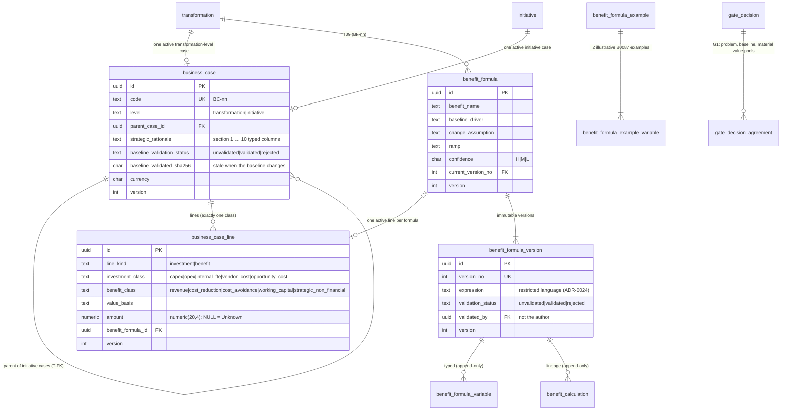
```mermaid
erDiagram
    transformation ||--o| business_case : "one active transformation-level case"
    business_case ||--o{ business_case : "parent of initiative cases (T-FK)"
    initiative ||--o| business_case : "one active initiative case"
    business_case ||--o{ business_case_line : "lines (exactly one class)"
    benefit_formula |o--o| business_case_line : "one active line per formula"
    transformation ||--o{ benefit_formula : "T09 (BF-nn)"
    benefit_formula ||--|{ benefit_formula_version : "immutable versions"
    benefit_formula_version ||--o{ benefit_formula_variable : "typed (append-only)"
    benefit_formula_version ||--o{ benefit_calculation : "lineage (append-only)"
    benefit_formula_example ||--|{ benefit_formula_example_variable : "2 illustrative B0087 examples"
    gate_decision ||--o{ gate_decision_agreement : "G1: problem, baseline, material value pools"

    business_case {
        uuid id PK
        text code UK "BC-nn"
        text level "transformation|initiative"
        uuid parent_case_id FK
        text strategic_rationale "section 1 … 10 typed columns"
        text baseline_validation_status "unvalidated|validated|rejected"
        char baseline_validated_sha256 "stale when the baseline changes"
        char currency
        int version
    }
    business_case_line {
        uuid id PK
        text line_kind "investment|benefit"
        text investment_class "capex|opex|internal_fte|vendor_cost|opportunity_cost"
        text benefit_class "revenue|cost_reduction|cost_avoidance|working_capital|strategic_non_financial"
        text value_basis
        numeric amount "numeric(20,4); NULL = Unknown"
        uuid benefit_formula_id FK
        int version
    }
    benefit_formula {
        uuid id PK
        text benefit_name
        text baseline_driver
        text change_assumption
        text ramp
        char confidence "H|M|L"
        int current_version_no FK
        int version
    }
    benefit_formula_version {
        uuid id PK
        int version_no UK
        text expression "restricted language (ADR-0024)"
        text validation_status "unvalidated|validated|rejected"
        uuid validated_by FK "not the author"
        int version
    }
```

### 1c.5 P3 entity register: §16 S16-016 and template entities → tables

| Entity (§16 / template) | Table | PK | Owner (column) | Writers | Status field | `version` | API module |
|---|---|---|---|---|---|---|---|
| **Initiative** (§16) / T05 | `initiative` (+ `initiative_gap_link`, `initiative_outcome_contribution`, `initiative_decision_link`) | `id` (code `INI-nn` UK) | `executive_owner_user_id`, `workstream_lead_user_id` | TL, WL, TO (`initiative.edit`); TL launches | `status` (ADR-0021 §3) | yes | portfolio |
| **Deliverable** (§16) | `deliverable` | `id` | `owner_user_id` | `initiative.edit`; acceptance `deliverable.accept` + executive owner | `acceptance_status`, `status` | yes | portfolio |
| **Milestone** (§16) | `milestone` | `id` | `owner_user_id` | `roadmap.edit` / `initiative.edit`; `roadmap.approve` for approved dates | `status` | yes | portfolio |
| **RoadmapWave** (§16) / T07 | `roadmap_wave` | `id` (code UK) | `owner_user_id` | system seed; `roadmap.edit` | `status` | yes | portfolio |
| **Dependency** (§16) / T08 | `dependency` (canonical, extended) + `dependency_type` | `id` (code `DEP-nn` UK) | `owner_user_id` | `dependency.edit`; types `dependency_type.configure` | `status` | yes | workflows |
| **ResourceDemand** (§16) | `resource_demand` | `id` | `owner_user_id` | `capacity.edit`; commit `capacity.commit` | `status` | yes | portfolio |
| **Capacity** (§16) | `capacity` (+ `resource_role`) | `id` | `owner_user_id` | `capacity.edit` | `status` | yes | portfolio |
| **FundingDecision** (§16) | `funding_decision` → canonical `decision` (kind `executive`) | `id` | `decided_by` | `funding.approve` (SP, FIN) | `outcome` | append-only | portfolio |
| T06 Prioritization Scorecard | `scoring_weight_set`, `scoring_weight`, `initiative_score`, `initiative_score_result`, `ranking_snapshot`, `ranking_entry`, `ranking_override` | `id` | — | `prioritization.score/edit/approve` | per table | headers yes, results append-only | portfolio |
| Portfolio selection | `portfolio_selection` | `id` | `decided_by` | `portfolio.select` (SP) | `action` | append-only | portfolio |
| BusinessCase (§16, P3 part) | `business_case`, `business_case_line` | `id` (code `BC-nn` UK) | ownership columns (section 9) | `business_case.edit`; FIN validates the baseline | `status`, `baseline_validation_status` | yes | kpi |
| BenefitFormulaVersion (§16, P3 part) / T09 | `benefit_formula`, `benefit_formula_version`, `benefit_formula_variable`, `benefit_calculation`; seed `benefit_formula_example(_variable)` | `id` (code `BF-nn` UK) | `owner_user_id` | `benefit_formula.edit`; FIN validates | `status`, `validation_status` | yes (variables, lineage append-only) | kpi |
| Gate G4 / G1 extension | `gate_criterion_definition` rows `g4.*`; `gate_decision_agreement` | `id` | — | seed; the G1 decider | — | append-only | workflows |
| Modular entry / waiver | `gate_dispensation` | `id` | `recorded_by` | `gate.submit`; accepted by `gate.decide` | `status` | yes | portfolio |

**Not built in P3** (stay as in section 2): `benefit`, `benefit_allocation`, `scenario`, `benefit_measurement`, `finance_validation` as generic tables (P4; the P3 Finance validations are columns on `business_case` and `benefit_formula_version`), `approval` (P4), critical-path scheduling (out of P3 scope, ADR-0023 §5).

## 1d. P4 physical model, slices I and C (migrations 0028–0031, DG4)

Task T-DG4-ARCH-01 (ADR-0025, ADR-0026). Column details: data dictionary "P4 tables, slices I and C". Every mutable table carries the P2 record guards (version step, audit coverage at COMMIT); `approval_decision` and `approval_escalation` are append-only. Product approvals here are business approvals inside the product, never DG0–DG7.

### 1d.1 Calendar, job schedules, work items and inbox — `organization`, `tasks` modules, worker

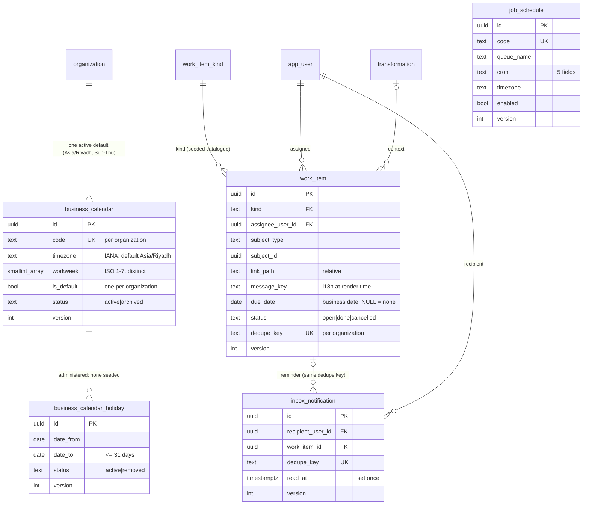
```mermaid
erDiagram
    organization ||--|{ business_calendar : "one active default (Asia/Riyadh, Sun-Thu)"
    business_calendar ||--o{ business_calendar_holiday : "administered; none seeded"
    work_item_kind ||--o{ work_item : "kind (seeded catalogue)"
    app_user ||--o{ work_item : "assignee"
    transformation |o--o{ work_item : "context"
    work_item |o--o{ inbox_notification : "reminder (same dedupe key)"
    app_user ||--o{ inbox_notification : "recipient"

    business_calendar {
        uuid id PK
        text code UK "per organization"
        text timezone "IANA; default Asia/Riyadh"
        smallint_array workweek "ISO 1-7, distinct"
        bool is_default "one per organization"
        text status "active|archived"
        int version
    }
    business_calendar_holiday {
        uuid id PK
        date date_from
        date date_to "<= 31 days"
        text status "active|removed"
        int version
    }
    job_schedule {
        uuid id PK
        text code UK
        text queue_name
        text cron "5 fields"
        text timezone
        bool enabled
        int version
    }
    work_item {
        uuid id PK
        text kind FK
        uuid assignee_user_id FK
        text subject_type
        uuid subject_id
        text link_path "relative"
        text message_key "i18n at render time"
        date due_date "business date; NULL = none"
        text status "open|done|cancelled"
        text dedupe_key UK "per organization"
        int version
    }
    inbox_notification {
        uuid id PK
        uuid recipient_user_id FK
        uuid work_item_id FK
        text dedupe_key UK
        timestamptz read_at "set once"
        int version
    }
```

### 1d.2 Groups, governance parties, role mapping and delegation — `access` module

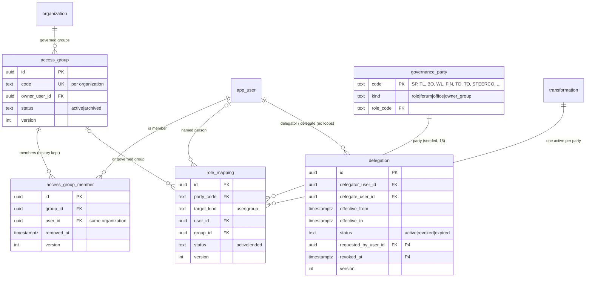
```mermaid
erDiagram
    organization ||--o{ access_group : "governed groups"
    access_group ||--o{ access_group_member : "members (history kept)"
    app_user ||--o{ access_group_member : "is member"
    governance_party ||--o{ role_mapping : "party (seeded, 18)"
    transformation ||--o{ role_mapping : "one active per party"
    app_user |o--o{ role_mapping : "named person"
    access_group |o--o{ role_mapping : "or governed group"
    app_user ||--o{ delegation : "delegator / delegate (no loops)"

    access_group {
        uuid id PK
        text code UK "per organization"
        uuid owner_user_id FK
        text status "active|archived"
        int version
    }
    access_group_member {
        uuid id PK
        uuid group_id FK
        uuid user_id FK "same organization"
        timestamptz removed_at
        int version
    }
    governance_party {
        text code PK "SP, TL, BO, WL, FIN, TD, TO, STEERCO, ..."
        text kind "role|forum|office|owner_group"
        text role_code FK
    }
    role_mapping {
        uuid id PK
        text party_code FK
        text target_kind "user|group"
        uuid user_id FK
        uuid group_id FK
        text status "active|ended"
        int version
    }
    delegation {
        uuid id PK
        uuid delegator_user_id FK
        uuid delegate_user_id FK
        timestamptz effective_from
        timestamptz effective_to
        text status "active|revoked|expired"
        uuid requested_by_user_id FK "P4"
        timestamptz revoked_at "P4"
        int version
    }
```

### 1d.3 T11, T12, governance matrices and approvals — `governance`, `workflows` modules

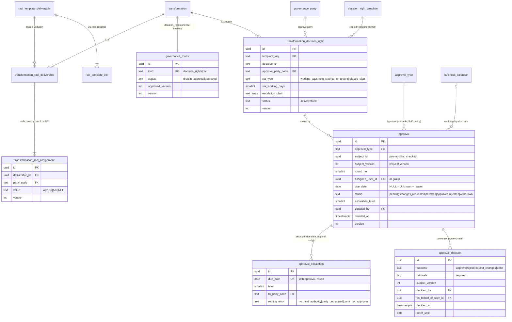
```mermaid
erDiagram
    decision_right_template ||--o{ transformation_decision_right : "copied verbatim (B0099)"
    transformation ||--|{ transformation_decision_right : "T11 matrix"
    governance_party ||--o{ transformation_decision_right : "approve party"
    transformation ||--|| governance_matrix : "decision_rights and raci headers"
    raci_template_deliverable ||--|{ raci_template_cell : "36 cells (B0101)"
    raci_template_deliverable ||--o{ transformation_raci_deliverable : "copied verbatim"
    transformation ||--|{ transformation_raci_deliverable : "T12"
    transformation_raci_deliverable ||--|{ transformation_raci_assignment : "cells; exactly one A or A/R"
    approval_type ||--o{ approval : "type (subject table, SoD policy)"
    transformation_decision_right |o--o{ approval : "routed by"
    approval ||--o{ approval_decision : "outcomes (append-only)"
    approval ||--o{ approval_escalation : "once per due date (append-only)"
    business_calendar |o--o{ approval : "working-day due date"

    transformation_decision_right {
        uuid id PK
        text template_key FK
        text decision_en
        text approve_party_code FK
        text sla_type "working_days|next_steerco_or_urgent|release_plan"
        smallint sla_working_days
        text_array escalation_chain
        text status "active|retired"
        int version
    }
    governance_matrix {
        uuid id PK
        text kind UK "decision_rights|raci"
        text status "draft|in_approval|approved"
        int approved_version
        int version
    }
    transformation_raci_assignment {
        uuid id PK
        uuid deliverable_id FK
        text party_code FK
        text value "A|R|C|I|A/R|NULL"
        int version
    }
    approval {
        uuid id PK
        text approval_type FK
        uuid subject_id "polymorphic, checked"
        int subject_version "request version"
        smallint round_no
        uuid assignee_user_id FK "or group"
        date due_date "NULL = Unknown + reason"
        text status "pending|changes_requested|deferred|approved|rejected|withdrawn"
        smallint escalation_level
        uuid decided_by FK
        timestamptz decided_at
        int version
    }
    approval_decision {
        uuid id PK
        text outcome "approve|reject|request_changes|defer"
        text rationale "required"
        int subject_version
        uuid decided_by FK
        uuid on_behalf_of_user_id FK
        timestamptz decided_at
        date defer_until
    }
    approval_escalation {
        uuid id PK
        date due_date UK "with approval, round"
        smallint level
        text to_party_code FK
        text routing_error "no_next_authority|party_unmapped|party_not_approver"
    }
```

The view `approval_decision_record` unions `approval_decision`, `gate_decision` and `funding_decision` (D-089 Q10).

### 1d.4 P4 entity register (slices I and C): §16 and template entities → tables

| Entity (§16 / template) | Table | PK | Owner (column) | Writers | Status field | `version` | API module |
|---|---|---|---|---|---|---|---|
| **Group** (§16 S16-011) | `access_group` (+ `access_group_member`) | `id` (code UK) | `owner_user_id` | `group.manage` (TO) | `status`; member `removed_at` | yes | access |
| **Delegation** (§16 S16-011) | `delegation` (0001, extended 0029) | `id` | `delegator_user_id` | delegator (`delegation.create_own`); ADM_ACCESS on request (`delegation.manage`) | `status` | yes | access |
| Role mapping (S10-008) | `role_mapping` (+ seed `governance_party`) | `id` | `created_by` | `role_mapping.assign` (TL, TO) | `status` | yes | access |
| **Approval** (§16 S16-018, P4 part) | `approval`, `approval_decision`, `approval_escalation`; view `approval_decision_record` | `id` | `requested_by`; assignee | `approval.request`; `approval.decide`; the escalation job | `status` | yes (decisions, escalations append-only) | workflows |
| T11 Decision Rights Matrix | `decision_right_template` (seed), `transformation_decision_right`, `governance_matrix` | `id` / `key` | — | `decision_right.configure` (TO, TL); SP approves | `status` | yes | governance |
| T12 RACI | `raci_template_deliverable`, `raci_template_cell` (seed), `transformation_raci_deliverable`, `transformation_raci_assignment`, `governance_matrix` | `id` / `key` | — | `raci.edit` (TO, TL); SP approves | `status` | yes | governance |
| Business calendar (S10-006) | `business_calendar`, `business_calendar_holiday` | `id` | `organization_id` | `calendar.configure` (ADM_TECH) | `status` | yes | organization |
| Job (S16-005) | `job_schedule` (+ pg-boss, `processed_message`) | `id` (code UK) | `owner_module` | migrations; `job.configure` (ADM_TECH) | `enabled` | yes | jobs / worker |
| Task / reminder (S12-005, S03-008) | `work_item`, `inbox_notification` (+ seed `work_item_kind`) | `id` (dedupe key UK) | `assignee_user_id` / `recipient_user_id` | `createWorkItemOnce`; the assignee / recipient | `status`; `read_at` | yes | tasks |

## 2. Conceptual model, all §16 entity groups

### 2.1 Identity and access (REQ-S16-011; final gate DG4)

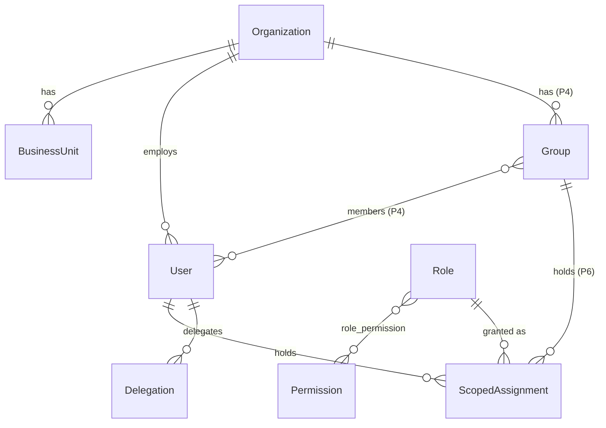
```mermaid
erDiagram
    Organization ||--o{ BusinessUnit : has
    Organization ||--o{ User : employs
    Organization ||--o{ Group : "has (P4)"
    Group }o--o{ User : "members (P4)"
    Role }o--o{ Permission : "role_permission"
    User ||--o{ ScopedAssignment : holds
    Group ||--o{ ScopedAssignment : "holds (P6)"
    Role ||--o{ ScopedAssignment : "granted as"
    User ||--o{ Delegation : delegates
```

| Entity | Table | Stage |
|---|---|---|
| Organization | `organization` | **P1** |
| BusinessUnit | `business_unit` | **P1** |
| User | `app_user` plus `user_identity` | **P1** |
| Group | `access_group`, `access_group_member` | **P4** (governed routing groups, `0029`; IdP group mapping stays P6) |
| Role | `role` | **P1** |
| Permission | `permission`, `role_permission` | **P1** |
| ScopedAssignment | `scoped_assignment` | **P1** |
| Delegation | `delegation` | **P1 table**; P4 columns, loop guard and API (`0029`, ADR-0026 §3) |
| (support) Session, login state | `session`, `oidc_login_state` | **P1** |

### 2.2 Transformation, methodology and gates (REQ-S16-012; DG5)

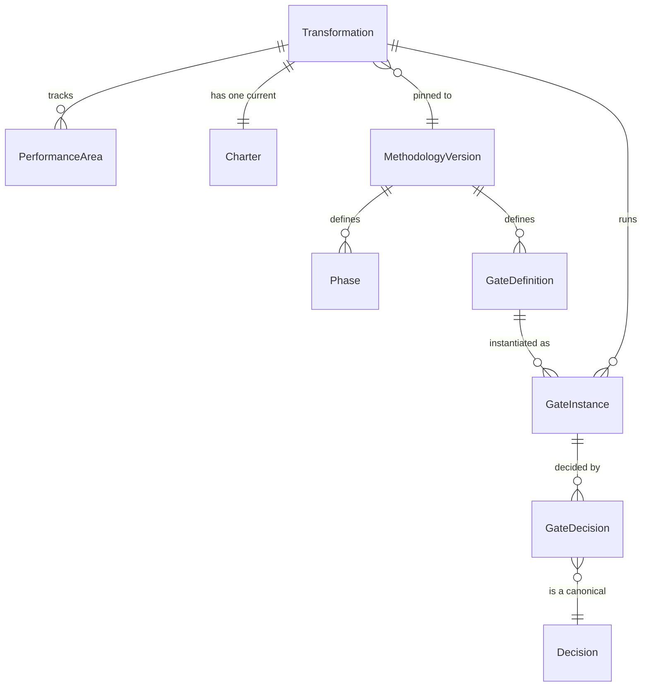
```mermaid
erDiagram
    Transformation ||--o{ PerformanceArea : "tracks"
    Transformation ||--|| Charter : "has one current"
    MethodologyVersion ||--o{ Phase : defines
    MethodologyVersion ||--o{ GateDefinition : defines
    Transformation }o--|| MethodologyVersion : "pinned to"
    Transformation ||--o{ GateInstance : "runs"
    GateDefinition ||--o{ GateInstance : "instantiated as"
    GateInstance ||--o{ GateDecision : "decided by"
    GateDecision }o--|| Decision : "is a canonical"
```

| Entity | Table | Stage |
|---|---|---|
| Transformation | `transformation` | **P1** (minimal fields) |
| PerformanceArea | `performance_area` | P4 |
| Charter | `charter` + `charter_version` (versioned, 14 source fields) | **P2** |
| MethodologyVersion | `methodology_version` (+ `transformation_config_pin`) | **P2** |
| Phase | `phase_definition` (per methodology version) | P5 (P2 keeps phases as CHECK values + `gate_definition.phase`) |
| GateDefinition | `gate_definition` + `gate_criterion_definition` | **P2** |
| GateInstance | `gate_instance` + `gate_submission` (versioned, evidence snapshot) + `gate_submission_criterion` | **P2** |
| GateDecision | `gate_decision` → references `decision` (kind `gate`) | **P2** |

### 2.3 Diagnosis and direction (REQ-S16-013; DG2)

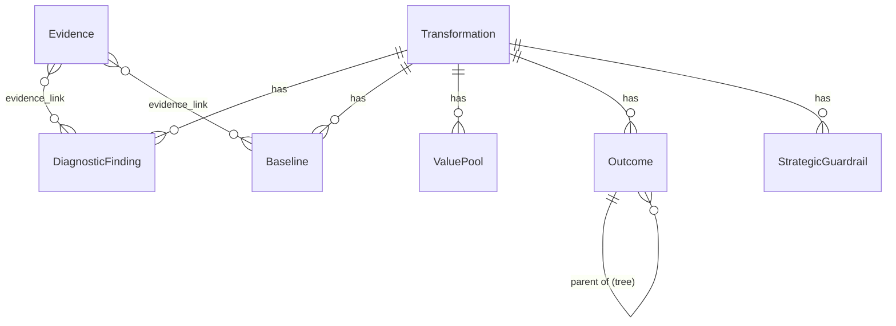
```mermaid
erDiagram
    Transformation ||--o{ DiagnosticFinding : has
    Transformation ||--o{ Baseline : has
    Transformation ||--o{ ValuePool : has
    Transformation ||--o{ Outcome : has
    Transformation ||--o{ StrategicGuardrail : has
    Outcome ||--o{ Outcome : "parent of (tree)"
    Evidence }o--o{ DiagnosticFinding : "evidence_link"
    Evidence }o--o{ Baseline : "evidence_link"
```

| Entity | Table | Stage |
|---|---|---|
| DiagnosticFinding | `diagnostic_finding` (+ T01 `diagnostic_item`, `diagnostic_workstream_output`) | **P2** |
| Baseline | `baseline` | **P2** |
| Evidence | `evidence`, `evidence_content` (revisions), `evidence_link` (polymorphic link, guarded) | **P2** (storage adapter ADR-0010, ADR-0018) |
| ValuePool | `value_pool` | **P2** |
| Outcome | `outcome` (hierarchy) + `north_star` + T02 `outcome_kpi` | **P2** |
| StrategicGuardrail | `strategic_guardrail` | **P2** |

### 2.4 KPI and calculation (REQ-S16-014; DG4)

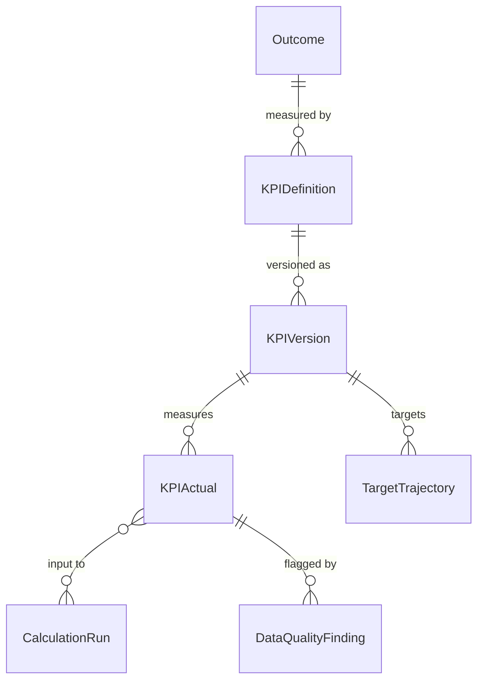
```mermaid
erDiagram
    KPIDefinition ||--o{ KPIVersion : "versioned as"
    KPIVersion ||--o{ KPIActual : measures
    KPIVersion ||--o{ TargetTrajectory : targets
    KPIActual }o--o{ CalculationRun : "input to"
    KPIActual ||--o{ DataQualityFinding : "flagged by"
    Outcome ||--o{ KPIDefinition : "measured by"
```

| Entity | Table | Stage |
|---|---|---|
| KPIDefinition | `kpi_definition` | **P2** (dictionary subset), P4 |
| KPIVersion | `kpi_version` | P4 |
| KPIActual | `kpi_actual` (observation period, business date, event timestamp) | P4 |
| TargetTrajectory | `target_trajectory` | P4 |
| CalculationRun | `calculation_run` (inputs, formula version, result) | P4 |
| DataQualityFinding | `data_quality_finding` | P4 |

### 2.5 Target operating model and procedures (REQ-S16-015; DG5)

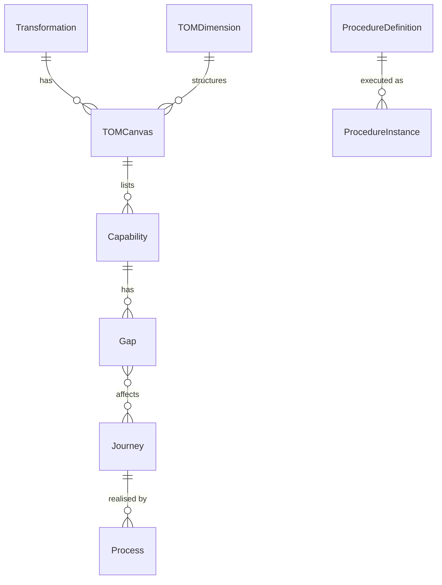
```mermaid
erDiagram
    Transformation ||--o{ TOMCanvas : has
    TOMDimension ||--o{ TOMCanvas : "structures"
    TOMCanvas ||--o{ Capability : lists
    Capability ||--o{ Gap : "has"
    Journey ||--o{ Process : "realised by"
    Gap }o--o{ Journey : affects
    ProcedureDefinition ||--o{ ProcedureInstance : "executed as"
```

| Entity | Table | Stage |
|---|---|---|
| TOMDimension | `tom_dimension` (the 10 seeded dimensions) | **P2** |
| TOMCanvas | `tom_canvas_cell` (ten cells per transformation) | **P2** |
| Capability | `capability` (heatmap entry) | **P2** |
| Gap | `tom_gap` (T03) | **P2** |
| Journey | `journey` (+ `journey_pain_point`) | **P2** |
| Process | `journey` with `kind = 'process'` | **P2** |
| ProcedureDefinition | `procedure_definition` (versioned) | P5 |
| ProcedureInstance | `procedure_instance` | P5 |

### 2.6 Portfolio and roadmap (REQ-S16-016; DG3)

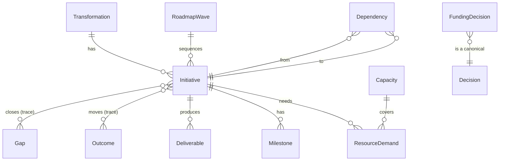
```mermaid
erDiagram
    Transformation ||--o{ Initiative : has
    Initiative }o--o{ Gap : "closes (trace)"
    Initiative }o--o{ Outcome : "moves (trace)"
    Initiative ||--o{ Deliverable : produces
    Initiative ||--o{ Milestone : has
    RoadmapWave ||--o{ Initiative : sequences
    Dependency }o--|| Initiative : "from"
    Dependency }o--|| Initiative : "to"
    Initiative ||--o{ ResourceDemand : needs
    Capacity ||--o{ ResourceDemand : "covers"
    FundingDecision }o--|| Decision : "is a canonical"
```

| Entity | Table | Stage |
|---|---|---|
| Initiative | `initiative` (T05) | P3 |
| Deliverable | `deliverable` | P3 |
| Milestone | `milestone` | P3 |
| RoadmapWave | `roadmap_wave` (T07) | P3 |
| Dependency | `dependency`: **canonical, shared by T08 and RAID** | **P2** (TOM-level subset), P3 |
| ResourceDemand | `resource_demand` | P3 |
| Capacity | `capacity` | P3 |
| FundingDecision | `funding_decision` → references `decision` | P3 |

All eight are implemented by migrations 0020–0022 (section 1c, **P3**).

### 2.7 Business case and benefits (REQ-S16-017; DG4)

```mermaid
erDiagram
    BusinessCase ||--o{ Scenario : has
    BusinessCase }o--o| Initiative : "for (or transformation-level)"
    Benefit ||--o{ BenefitAllocation : "allocated via"
    BenefitAllocation }o--|| Initiative : "to"
    Benefit }o--|| BenefitFormulaVersion : "calculated by"
    Benefit ||--o{ BenefitMeasurement : measured
    BenefitMeasurement ||--o{ FinanceValidation : "validated by"
```

| Entity | Table | Stage |
|---|---|---|
| BusinessCase | `business_case` | P3/P4 |
| Scenario | `business_case_scenario` | P4 |
| Benefit | `benefit`: **the one benefit register** (T14) | P4 |
| BenefitAllocation | `benefit_allocation` (shares sum to ≤ 100%, no double counting) | P4 |
| BenefitFormulaVersion | `benefit_formula_version` (T09, immutable once published) | P4 |
| BenefitMeasurement | `benefit_measurement` | P4 |
| FinanceValidation | `finance_validation` (FIN only) | P4 |

### 2.8 RAID, decisions and approvals (REQ-S16-018; DG4)

```mermaid
erDiagram
    Transformation ||--o{ Risk : has
    Transformation ||--o{ Assumption : has
    Transformation ||--o{ Issue : has
    Transformation ||--o{ Action : has
    Transformation ||--o{ Decision : has
    ChangeRequest ||--o{ Approval : "routed for"
    Decision ||--o{ Approval : "routed for"
    Risk }o--o{ Dependency : "references canonical"
```

| Entity | Table | Stage |
|---|---|---|
| Risk, Assumption, Issue | `risk`, `assumption`, `issue` (T15) | P3/P4 |
| Action | `action_item` (also corrective actions) | **P2** (workshop actions), P3/P4 |
| Decision | `decision` + `decision_option`: **the one decision model** (T04/T11/T16/gate/funding) | **P2** (design + gate decisions), P4 |
| ChangeRequest | `change_request` | P4 |
| Approval | P2: `gate_decision` (approver basis, submission number, rationale, timestamp; SoD). Generic `approval`: P4 | **P2** (gates), P4 |

### 2.9 Governance forums and meetings (REQ-S16-019; DG4)

```mermaid
erDiagram
    Forum ||--o{ Meeting : holds
    Meeting ||--o{ AgendaItem : has
    Meeting ||--o{ Attendance : records
    Meeting ||--o| Minutes : produces
    Meeting ||--o{ MeetingActionLink : "assigns"
    MeetingActionLink }o--|| Action : links
    AgendaItem }o--o| Decision : "brief for"
```

| Entity | Table | Stage |
|---|---|---|
| Forum | `forum` (five seeded forums) | P4 |
| Meeting | `meeting` | P4 |
| AgendaItem | `agenda_item` | P4 |
| Attendance | `attendance` | P4 |
| Minutes | `minutes` (versioned; approve/publish) | P4 |
| MeetingActionLink | `meeting_action_link` | P4 |

### 2.10 People and adoption (REQ-S16-020; DG4)

```mermaid
erDiagram
    Transformation ||--o{ StakeholderGroup : has
    StakeholderGroup ||--o{ AdoptionIntervention : targets
    StakeholderGroup ||--o{ TrainingAssessmentRecord : "assessed by"
    AdoptionMetricLink }o--|| KPIDefinition : "adoption indicator"
    AdoptionMetricLink }o--|| StakeholderGroup : for
```

| Entity | Table | Stage |
|---|---|---|
| StakeholderGroup | `stakeholder_group` (T13) | P4 |
| AdoptionIntervention | `adoption_intervention` | P4 |
| Training/AssessmentRecord | `training_assessment_record` | P4 |
| AdoptionMetricLink | `adoption_metric_link` | P4 |

### 2.11 Sustainment, improvement and health (REQ-S16-021; DG5)

```mermaid
erDiagram
    Transformation ||--o{ BAUHandover : "hands over"
    BAUHandover ||--o{ Control : establishes
    Control ||--o{ ControlCheck : "checked by"
    PerformanceArea ||--o{ ImprovementItem : backlog
    Transformation ||--o{ Lesson : records
    Transformation ||--o{ HealthAssessment : "assessed by"
```

| Entity | Table | Stage |
|---|---|---|
| BAUHandover | `bau_handover` (receiving-owner acceptance) | P4 |
| Control | `control` | P4 |
| ControlCheck | `control_check` | P4 |
| ImprovementItem | `improvement_item` | P4 |
| Lesson | `lesson` | P4/P5 |
| HealthAssessment | `health_assessment` (25-question check) | P5 |

### 2.12 Configuration, automation, integration, reporting and audit (REQ-S16-022; DG6)

```mermaid
erDiagram
    FormSchemaVersion ||--o{ TransformationConfigPin : "pinned by"
    AutomationRuleVersion ||--o{ Job : triggers
    OutboxEvent ||--o{ Job : "relayed as"
    Job ||--o{ Notification : "may create"
    IntegrationRun }o--|| Job : "runs as"
    ReportSnapshot }o--|| Transformation : "issued for"
    AuditEvent }o--o| Transformation : "scoped to"
```

| Entity | Table | Stage |
|---|---|---|
| FormSchemaVersion | `form_schema_version` | P2/P5 (ADR-0014) |
| AutomationRuleVersion | `automation_rule_version` | P5 |
| Job | `pgboss.job` (+ `pgboss.schedule`), plus `outbox_event` and `processed_message` | **P1** (queue, outbox, ledger) |
| Notification | `notification` (in-app inbox) | P4 |
| IntegrationRun | `integration_run` | P6 |
| ReportSnapshot | `report_snapshot` (immutable once issued) | P5 |
| AuditEvent | `audit_event` | **P1** |

## 3. Coverage check (REQ-S16-011…022)

Every entity named in master prompt §16 appears in section 2:

| Group | Entities | Count |
|---|---|---|
| Identity and access | Organization, BusinessUnit, User, Group, Role, Permission, ScopedAssignment, Delegation | 8 |
| Transformation, methodology and gates | Transformation, PerformanceArea, Charter, MethodologyVersion, Phase, GateDefinition, GateInstance, GateDecision | 8 |
| Diagnosis and direction | DiagnosticFinding, Baseline, Evidence, ValuePool, Outcome, StrategicGuardrail | 6 |
| KPI and calculation | KPIDefinition, KPIVersion, KPIActual, TargetTrajectory, CalculationRun, DataQualityFinding | 6 |
| Target operating model and procedures | TOMDimension, TOMCanvas, Capability, Gap, Journey, Process, ProcedureDefinition, ProcedureInstance | 8 |
| Portfolio and roadmap | Initiative, Deliverable, Milestone, RoadmapWave, Dependency, ResourceDemand, Capacity, FundingDecision | 8 |
| Business case and benefits | BusinessCase, Scenario, Benefit, BenefitAllocation, BenefitFormulaVersion, BenefitMeasurement, FinanceValidation | 7 |
| RAID, decisions and approvals | Risk, Assumption, Issue, Action, Decision, ChangeRequest, Approval | 7 |
| Governance forums and meetings | Forum, Meeting, AgendaItem, Attendance, Minutes, MeetingActionLink | 6 |
| People and adoption | StakeholderGroup, AdoptionIntervention, Training/AssessmentRecord, AdoptionMetricLink | 4 |
| Sustainment, improvement and health | BAUHandover, Control, ControlCheck, ImprovementItem, Lesson, HealthAssessment | 6 |
| Configuration, automation, integration, reporting and audit | FormSchemaVersion, AutomationRuleVersion, Job, Notification, IntegrationRun, ReportSnapshot, AuditEvent | 7 |

Total: 81 §16 entities.
