# Entity-relationship model

- **Task:** T-DG1-ARCH-01 (solution-architect), 2026-09-30.
- **Covers:** master prompt §16 "Minimum domain entities", all twelve groups (REQ-S16-011…022).
- **Detail:** the physical columns of the tables P1 implements are in `data-dictionary.md`.
- **Marking:**
  - **P1** means the table is created by P1 migrations.
  - `Px` names the stage that adds the table.
  - Entity names are conceptual. Table names are snake_case singular, and `User` becomes `app_user` because `user` is a reserved word.

## Conventions shared by every table (ADR-0003/0004)

- `id uuid` (UUIDv7, app-generated) primary key.
- `organization_id` on every tenant-scoped row.
- `version integer` (optimistic concurrency) on every mutable row.
- `created_at`/`updated_at timestamptz` and `created_by`/`updated_by`.
- Explicit status columns with CHECK-constrained values and documented transitions.
- `ON DELETE RESTRICT` foreign keys.
- No hard deletes of business records.
- Money is `numeric` plus `currency`.
- Extensible custom fields live in `custom_field_values jsonb`, validated against the pinned `form_schema_version` (ADR-0014).

**Canonical shared records:**
- **one `decision` model:** T04 design decisions, T11 decision-right decisions, T16 executive decisions and gate decisions all reference or specialise it;
- **one `dependency` record**, shared by T08 and RAID;
- **one benefit register:** `benefit` plus `benefit_allocation`, with no duplicated benefit rows per initiative.

## 1. P1 physical model (implemented at DG1)

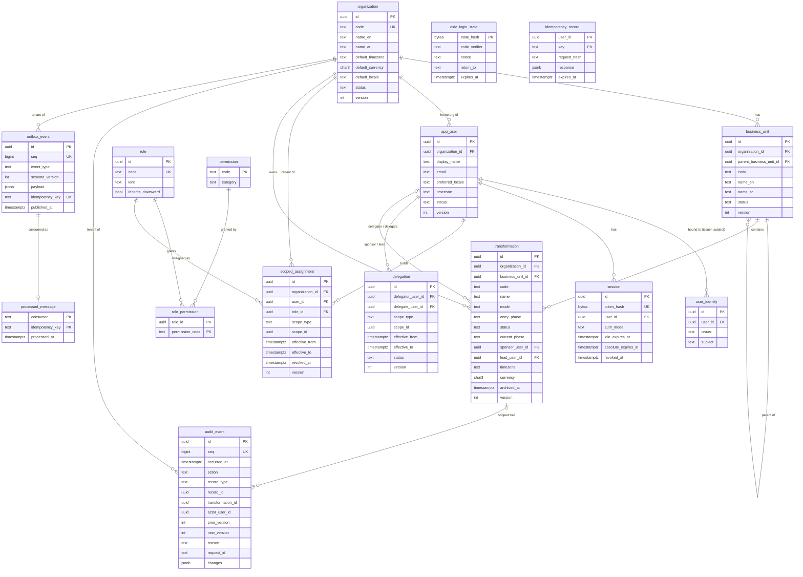

Also created in P1, not drawn above:
- `schema_migration`: migration bookkeeping.
- The `pgboss.*` schema: owned and migrated by pg-boss (ADR-0008). This is P1's "job tables as required by the queue choice", and the physical form of the §16 entity **Job**.

## 2. Conceptual model, all §16 entity groups

### 2.1 Identity and access (REQ-S16-011; final gate DG4)

| Entity | Table | Stage |
|---|---|---|
| Organization | `organization` | **P1** |
| BusinessUnit | `business_unit` | **P1** |
| User | `app_user` plus `user_identity` | **P1** |
| Group | `app_group`, `app_group_member` | P6 (IdP group mapping) |
| Role | `role` | **P1** |
| Permission | `permission`, `role_permission` | **P1** |
| ScopedAssignment | `scoped_assignment` | **P1** |
| Delegation | `delegation` | **P1 table**, logic P2/P4 |
| (support) Session, login state | `session`, `oidc_login_state` | **P1** |

### 2.2 Transformation, methodology and gates (REQ-S16-012; DG5)

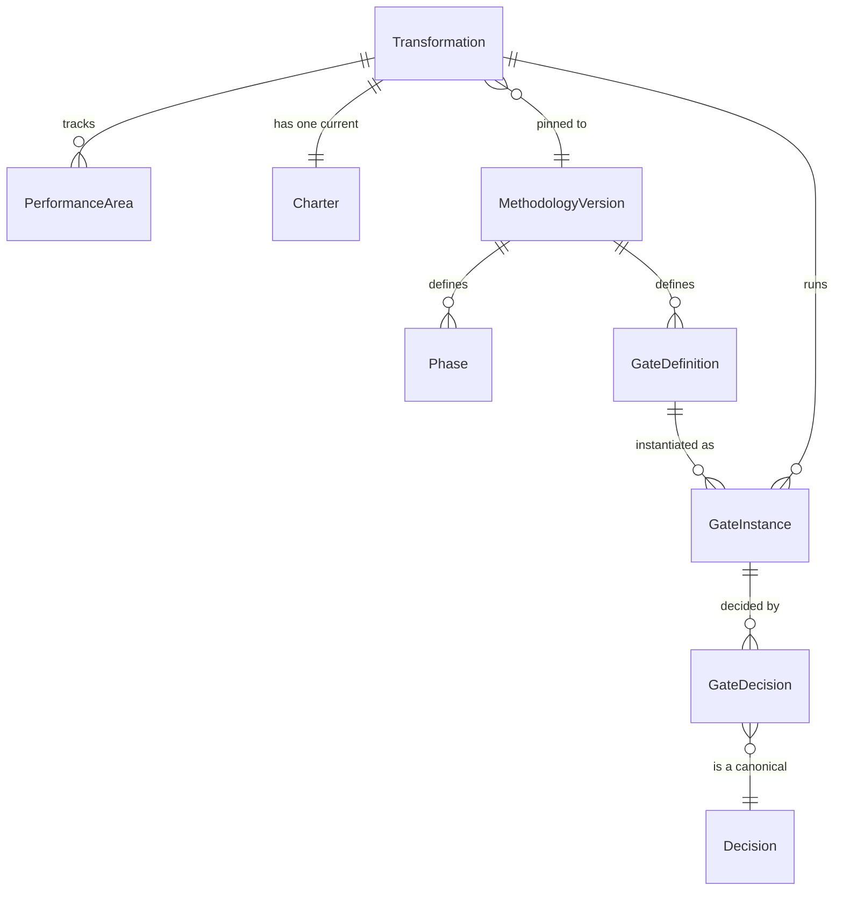

| Entity | Table | Stage |
|---|---|---|
| Transformation | `transformation` | **P1** (minimal fields) |
| PerformanceArea | `performance_area` | P4 |
| Charter | `charter` (versioned, 14 source fields) | P2 |
| MethodologyVersion | `methodology_version` | P2 |
| Phase | `phase_definition` (per methodology version) | P2 |
| GateDefinition | `gate_definition` | P2 |
| GateInstance | `gate_instance` (submission version, evidence snapshot) | P2 |
| GateDecision | `gate_decision` → references `decision` | P2 |

### 2.3 Diagnosis and direction (REQ-S16-013; DG2)

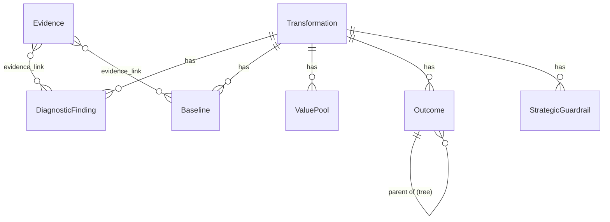

| Entity | Table | Stage |
|---|---|---|
| DiagnosticFinding | `diagnostic_finding` | P2 |
| Baseline | `baseline` | P2 |
| Evidence | `evidence`, `evidence_version`, `evidence_link` (polymorphic link to any record) | P2 (storage adapter ADR-0010) |
| ValuePool | `value_pool` | P2 |
| Outcome | `outcome` (North Star, outcome hierarchy) | P2 |
| StrategicGuardrail | `strategic_guardrail` | P2 |

### 2.4 KPI and calculation (REQ-S16-014; DG4)

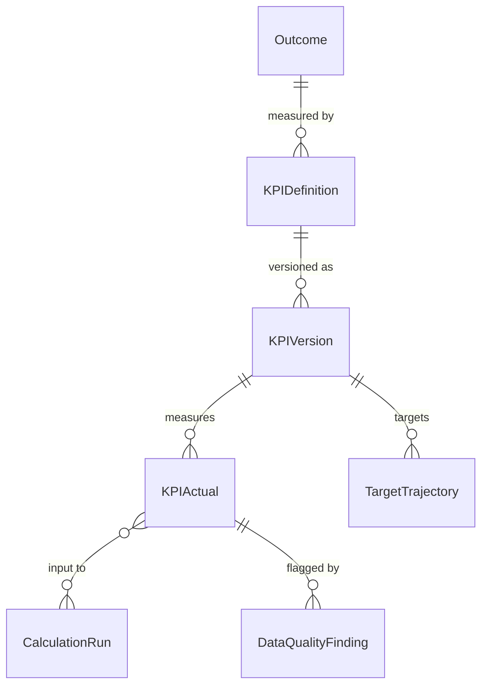

| Entity | Table | Stage |
|---|---|---|
| KPIDefinition | `kpi_definition` | P2 (dictionary), P4 |
| KPIVersion | `kpi_version` | P4 |
| KPIActual | `kpi_actual` (observation period, business date, event timestamp) | P4 |
| TargetTrajectory | `target_trajectory` | P4 |
| CalculationRun | `calculation_run` (inputs, formula version, result) | P4 |
| DataQualityFinding | `data_quality_finding` | P4 |

### 2.5 Target operating model and procedures (REQ-S16-015; DG5)

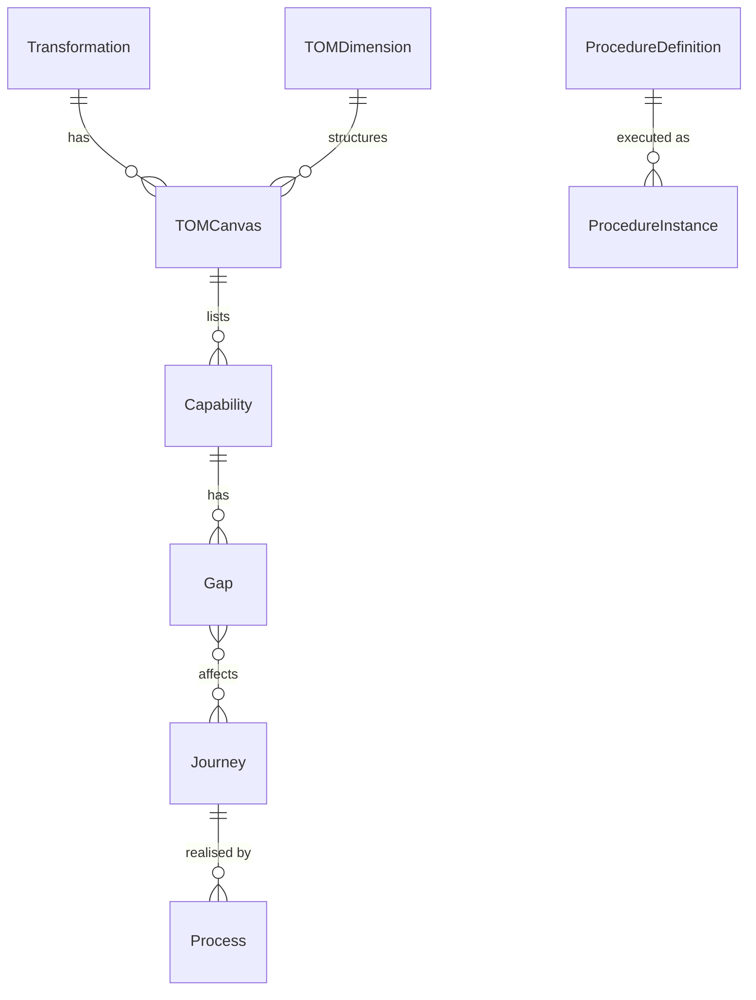

| Entity | Table | Stage |
|---|---|---|
| TOMDimension | `tom_dimension` (the 10 seeded dimensions) | P2 |
| TOMCanvas | `tom_canvas` | P2 |
| Capability | `capability` | P2 |
| Gap | `gap` (T03) | P2 |
| Journey | `journey` | P2 |
| Process | `process` | P2 |
| ProcedureDefinition | `procedure_definition` (versioned) | P5 |
| ProcedureInstance | `procedure_instance` | P5 |

### 2.6 Portfolio and roadmap (REQ-S16-016; DG3)

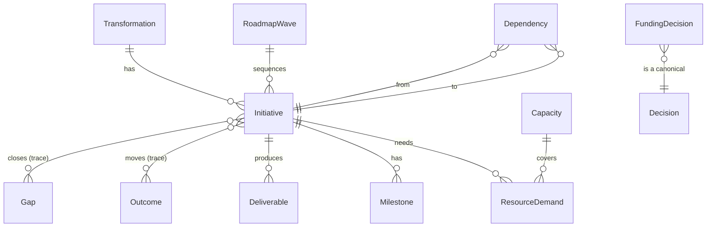

| Entity | Table | Stage |
|---|---|---|
| Initiative | `initiative` (T05) | P3 |
| Deliverable | `deliverable` | P3 |
| Milestone | `milestone` | P3 |
| RoadmapWave | `roadmap_wave` (T07) | P3 |
| Dependency | `dependency`: **canonical, shared by T08 and RAID** | P3 |
| ResourceDemand | `resource_demand` | P3 |
| Capacity | `capacity` | P3 |
| FundingDecision | `funding_decision` → references `decision` | P3 |

### 2.7 Business case and benefits (REQ-S16-017; DG4)

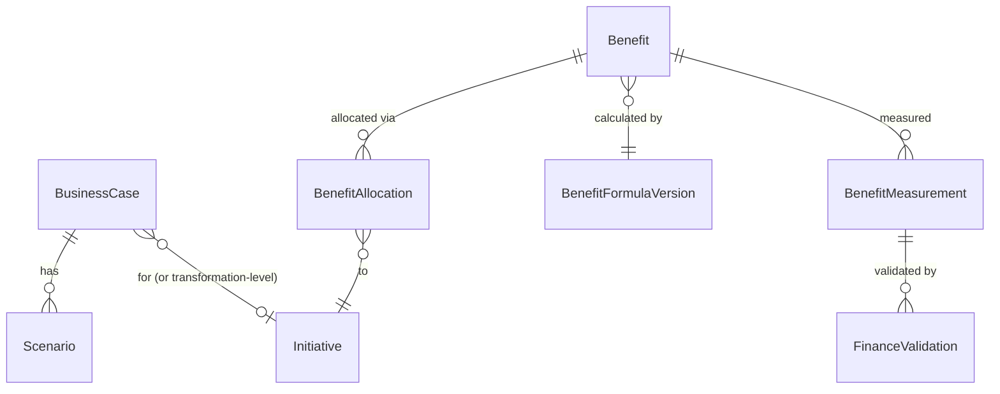

| Entity | Table | Stage |
|---|---|---|
| BusinessCase | `business_case` | P3/P4 |
| Scenario | `business_case_scenario` | P4 |
| Benefit | `benefit`: **the one benefit register** (T14) | P4 |
| BenefitAllocation | `benefit_allocation` (shares sum to ≤ 100%, no double counting) | P4 |
| BenefitFormulaVersion | `benefit_formula_version` (T09, immutable once published) | P4 |
| BenefitMeasurement | `benefit_measurement` | P4 |
| FinanceValidation | `finance_validation` (FIN only) | P4 |

### 2.8 RAID, decisions and approvals (REQ-S16-018; DG4)

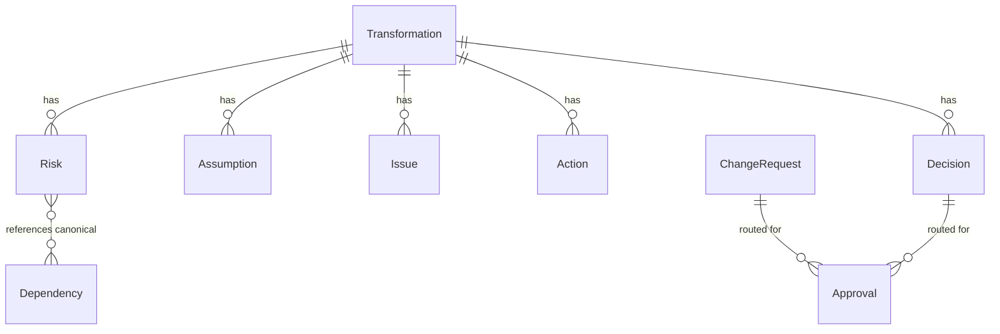

| Entity | Table | Stage |
|---|---|---|
| Risk, Assumption, Issue | `risk`, `assumption`, `issue` (T15) | P3/P4 |
| Action | `action` (also corrective actions) | P3/P4 |
| Decision | `decision`: **the one decision model** (T04/T11/T16/gate/funding) | P2 (design decisions), P4 |
| ChangeRequest | `change_request` | P4 |
| Approval | `approval` (assignee, request version, due, rationale, decision timestamp; SoD) | P2 (gates), P4 |

### 2.9 Governance forums and meetings (REQ-S16-019; DG4)

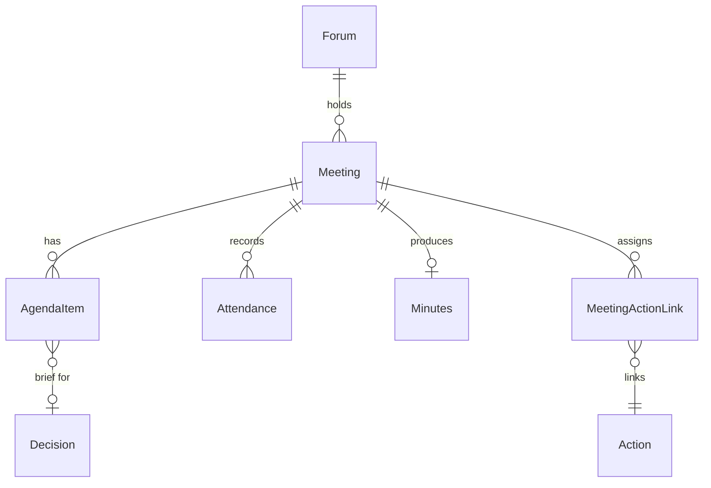

| Entity | Table | Stage |
|---|---|---|
| Forum | `forum` (five seeded forums) | P4 |
| Meeting | `meeting` | P4 |
| AgendaItem | `agenda_item` | P4 |
| Attendance | `attendance` | P4 |
| Minutes | `minutes` (versioned; approve/publish) | P4 |
| MeetingActionLink | `meeting_action_link` | P4 |

### 2.10 People and adoption (REQ-S16-020; DG4)

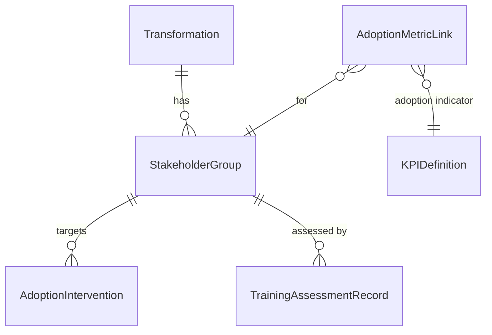

| Entity | Table | Stage |
|---|---|---|
| StakeholderGroup | `stakeholder_group` (T13) | P4 |
| AdoptionIntervention | `adoption_intervention` | P4 |
| Training/AssessmentRecord | `training_assessment_record` | P4 |
| AdoptionMetricLink | `adoption_metric_link` | P4 |

### 2.11 Sustainment, improvement and health (REQ-S16-021; DG5)

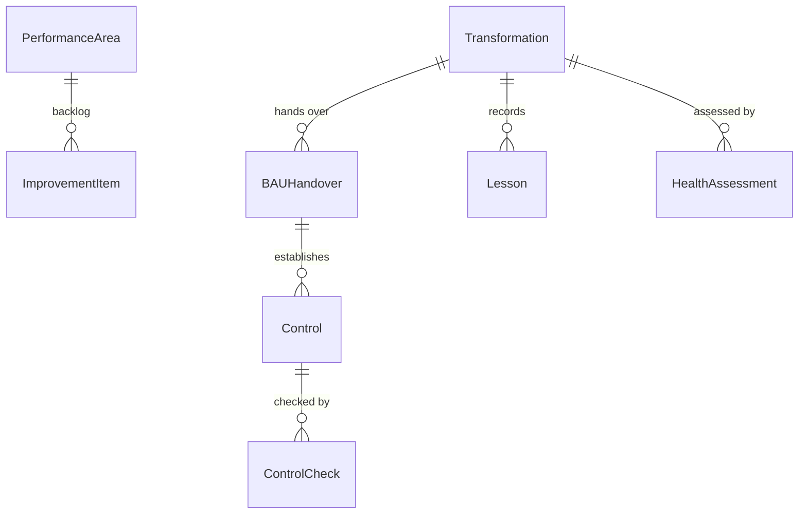

| Entity | Table | Stage |
|---|---|---|
| BAUHandover | `bau_handover` (receiving-owner acceptance) | P4 |
| Control | `control` | P4 |
| ControlCheck | `control_check` | P4 |
| ImprovementItem | `improvement_item` | P4 |
| Lesson | `lesson` | P4/P5 |
| HealthAssessment | `health_assessment` (25-question check) | P5 |

### 2.12 Configuration, automation, integration, reporting and audit (REQ-S16-022; DG6)

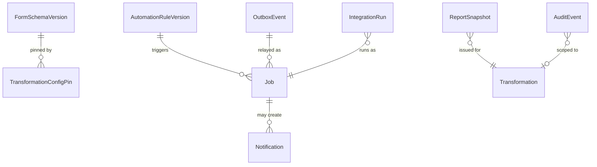

| Entity | Table | Stage |
|---|---|---|
| FormSchemaVersion | `form_schema_version` | P2/P5 (ADR-0014) |
| AutomationRuleVersion | `automation_rule_version` | P5 |
| Job | `pgboss.job` (+ `pgboss.schedule`), plus `outbox_event` and `processed_message` | **P1** (queue, outbox, ledger) |
| Notification | `notification` (in-app inbox) | P4 |
| IntegrationRun | `integration_run` | P6 |
| ReportSnapshot | `report_snapshot` (immutable once issued) | P5 |
| AuditEvent | `audit_event` | **P1** |

## 3. Coverage check (REQ-S16-011…022)

Every entity named in master prompt §16 appears in section 2:

| Group | Entities | Count |
|---|---|---|
| Identity and access | Organization, BusinessUnit, User, Group, Role, Permission, ScopedAssignment, Delegation | 8 |
| Transformation, methodology and gates | Transformation, PerformanceArea, Charter, MethodologyVersion, Phase, GateDefinition, GateInstance, GateDecision | 8 |
| Diagnosis and direction | DiagnosticFinding, Baseline, Evidence, ValuePool, Outcome, StrategicGuardrail | 6 |
| KPI and calculation | KPIDefinition, KPIVersion, KPIActual, TargetTrajectory, CalculationRun, DataQualityFinding | 6 |
| Target operating model and procedures | TOMDimension, TOMCanvas, Capability, Gap, Journey, Process, ProcedureDefinition, ProcedureInstance | 8 |
| Portfolio and roadmap | Initiative, Deliverable, Milestone, RoadmapWave, Dependency, ResourceDemand, Capacity, FundingDecision | 8 |
| Business case and benefits | BusinessCase, Scenario, Benefit, BenefitAllocation, BenefitFormulaVersion, BenefitMeasurement, FinanceValidation | 7 |
| RAID, decisions and approvals | Risk, Assumption, Issue, Action, Decision, ChangeRequest, Approval | 7 |
| Governance forums and meetings | Forum, Meeting, AgendaItem, Attendance, Minutes, MeetingActionLink | 6 |
| People and adoption | StakeholderGroup, AdoptionIntervention, Training/AssessmentRecord, AdoptionMetricLink | 4 |
| Sustainment, improvement and health | BAUHandover, Control, ControlCheck, ImprovementItem, Lesson, HealthAssessment | 6 |
| Configuration, automation, integration, reporting and audit | FormSchemaVersion, AutomationRuleVersion, Job, Notification, IntegrationRun, ReportSnapshot, AuditEvent | 7 |

Total: 81 §16 entities.
