# Entity-relationship diagrams

> Generated from the live schema. One diagram per module; relationships shown are real foreign keys
> (composite `(project_id, x)` keys are drawn once). Polymorphic links (evidence_link, approval_request,
> audit_event, record_version, source_claim targets) are enforced in services, not by FKs.

## Identity & access

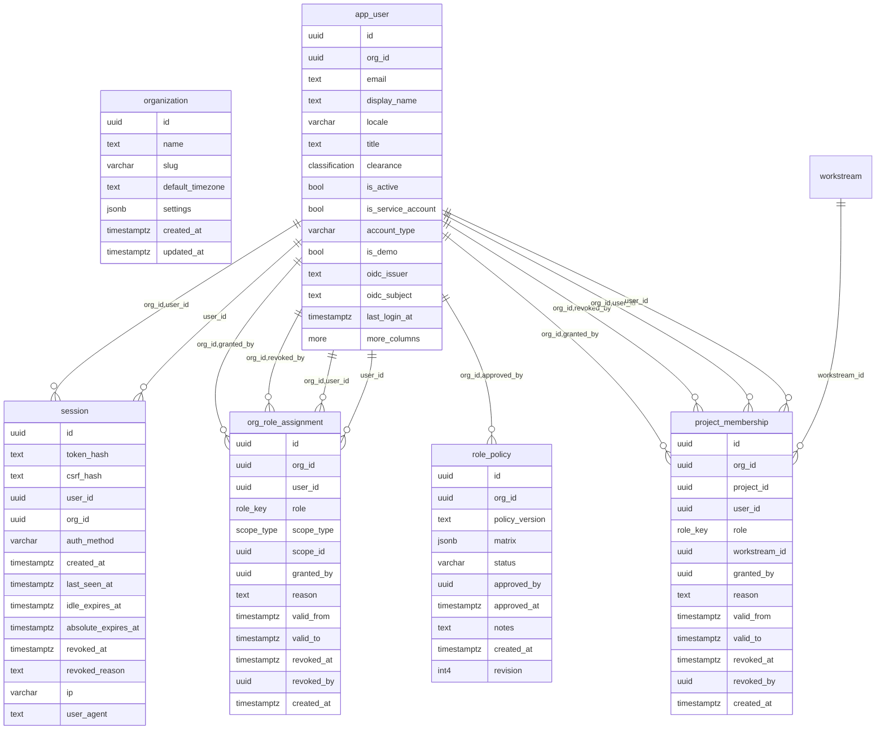

## Portfolio & configuration

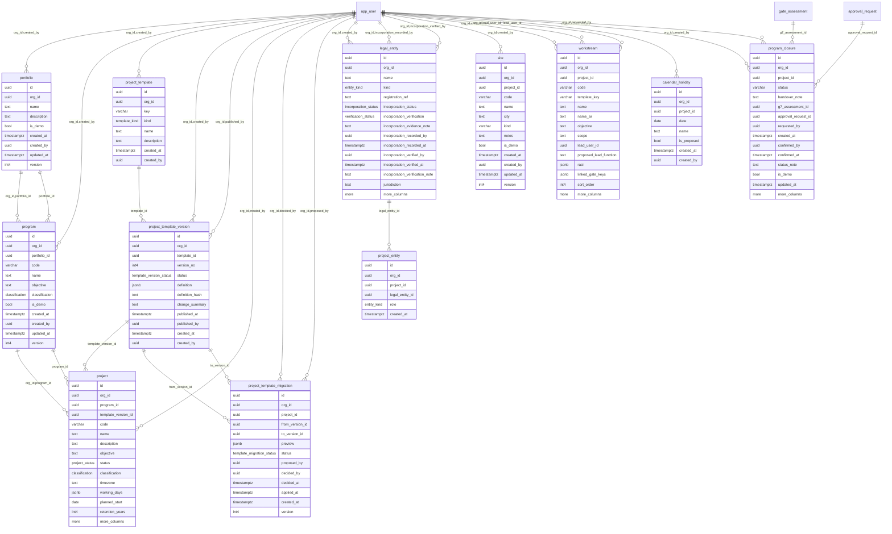

## Planning

```mermaid
erDiagram
  task {
    uuid id
    uuid org_id
    uuid project_id
    uuid workstream_id
    uuid parent_id
    varchar wbs_code
    text title
    text title_ar
    text description
    text description_ar
    task_status status
    uuid accountable_user_id
    text proposed_owner_function
    text output
    more more_columns
  }
  milestone {
    uuid id
    uuid org_id
    uuid project_id
    uuid workstream_id
    varchar code
    text title
    text title_ar
    milestone_status status
    date planned_date
    date forecast_date
    date actual_date
    varchar gate_key
    bool is_critical
    int4 weight
    more more_columns
  }
  deliverable {
    uuid id
    uuid org_id
    uuid project_id
    uuid workstream_id
    uuid task_id
    varchar code
    text title
    text title_ar
    deliverable_status status
    int4 weight
    bool weight_approved
    text acceptance_criteria
    date due_date
    uuid owner_user_id
    more more_columns
  }
  dependency {
    uuid id
    uuid org_id
    uuid project_id
    schedule_node_type predecessor_type
    uuid predecessor_id
    schedule_node_type successor_type
    uuid successor_id
    dependency_type type
    int4 lag_days
    text note
    timestamptz created_at
    uuid created_by
  }
  cross_project_dependency {
    uuid id
    uuid org_id
    uuid project_id
    uuid other_project_id
    schedule_node_type local_item_type
    uuid local_item_id
    schedule_node_type other_item_type
    uuid other_item_id
    text description
    date needed_by
    raid_status status
    text closed_reason
    uuid closed_by
    timestamptz closed_at
    more more_columns
  }
  raci_assignment {
    uuid id
    uuid org_id
    uuid project_id
    varchar entity_type
    uuid entity_id
    uuid user_id
    text function_label
    raci_value raci
    timestamptz created_at
    uuid created_by
  }
  baseline_version {
    uuid id
    uuid org_id
    uuid project_id
    int4 version_no
    baseline_status status
    jsonb snapshot
    text snapshot_hash
    uuid change_request_id
    uuid decision_id
    uuid proposed_by
    uuid approved_by
    timestamptz approved_at
    uuid rejected_by
    timestamptz rejected_at
    more more_columns
  }
  change_request {
    uuid id
    uuid org_id
    uuid project_id
    varchar code
    text title
    text rationale
    jsonb alternatives
    jsonb impacts
    change_request_status status
    numeric cost_impact_amount
    varchar cost_impact_currency
    int4 cost_impact_unit_scale
    uuid cost_impact_recorded_by
    varchar subject_type
    more more_columns
  }
  risk {
    uuid id
    uuid org_id
    uuid project_id
    uuid workstream_id
    varchar code
    text title
    text description
    uuid owner_user_id
    raid_status status
    int2 escalation_level
    date due_date
    varchar gate_key
    bool is_demo
    timestamptz created_at
    more more_columns
  }
  issue {
    uuid id
    uuid org_id
    uuid project_id
    uuid workstream_id
    varchar code
    text title
    text description
    uuid owner_user_id
    raid_status status
    int2 escalation_level
    date due_date
    varchar gate_key
    bool is_demo
    timestamptz created_at
    more more_columns
  }
  assumption {
    uuid id
    uuid org_id
    uuid project_id
    uuid workstream_id
    varchar code
    text title
    text description
    uuid owner_user_id
    raid_status status
    int2 escalation_level
    date due_date
    varchar gate_key
    bool is_demo
    timestamptz created_at
    more more_columns
  }
  raid_dependency {
    uuid id
    uuid org_id
    uuid project_id
    uuid workstream_id
    varchar code
    text title
    text description
    uuid owner_user_id
    raid_status status
    int2 escalation_level
    date due_date
    varchar gate_key
    bool is_demo
    timestamptz created_at
    more more_columns
  }
  status_update {
    uuid id
    uuid org_id
    uuid project_id
    uuid workstream_id
    date period_end
    text summary
    text achievements
    text next_steps
    text blockers
    rag_status rag_reported
    rag_status rag_calculated
    update_status status
    uuid submitted_by
    timestamptz submitted_at
    more more_columns
  }
  rag_override {
    uuid id
    uuid org_id
    uuid project_id
    varchar entity_type
    uuid entity_id
    rag_status calculated_status
    rag_status override_status
    text reason
    date expires_on
    uuid requested_by
    uuid reviewer_user_id
    bool approved
    timestamptz reviewed_at
    text review_note
    more more_columns
  }
  record_dependency {
    uuid id
    uuid org_id
    uuid project_id
    schedule_node_type successor_type
    uuid successor_id
    varchar predecessor_type
    uuid predecessor_id
    text note
    timestamptz created_at
    uuid created_by
  }
  app_user ||--o{ task : "org_id,accepted_by"
  app_user ||--o{ task : "org_id,accountable_user_id"
  app_user ||--o{ task : "org_id,created_by"
  app_user ||--o{ task : "org_id,submitted_by"
  app_user ||--o{ task : "accountable_user_id"
  task ||--o{ task : "parent_id"
  workstream ||--o{ task : "workstream_id"
  app_user ||--o{ milestone : "org_id,created_by"
  app_user ||--o{ milestone : "org_id,owner_user_id"
  app_user ||--o{ milestone : "org_id,reported_by"
  app_user ||--o{ milestone : "org_id,verified_by"
  app_user ||--o{ milestone : "owner_user_id"
  workstream ||--o{ milestone : "workstream_id"
  app_user ||--o{ deliverable : "owner_user_id"
  task ||--o{ deliverable : "task_id"
  workstream ||--o{ deliverable : "workstream_id"
  app_user ||--o{ deliverable : "org_id,accepted_by"
  app_user ||--o{ deliverable : "org_id,created_by"
  app_user ||--o{ deliverable : "org_id,owner_user_id"
  app_user ||--o{ deliverable : "org_id,submitted_by"
  app_user ||--o{ deliverable : "org_id,weight_approved_by"
  app_user ||--o{ deliverable : "org_id,weight_set_by"
  app_user ||--o{ dependency : "org_id,created_by"
  app_user ||--o{ cross_project_dependency : "org_id,closed_by"
  app_user ||--o{ cross_project_dependency : "org_id,created_by"
  app_user ||--o{ raci_assignment : "org_id,created_by"
  app_user ||--o{ raci_assignment : "org_id,user_id"
  app_user ||--o{ raci_assignment : "user_id"
  change_request ||--o{ baseline_version : "change_request_id"
  decision ||--o{ baseline_version : "decision_id"
  app_user ||--o{ baseline_version : "org_id,approved_by"
  app_user ||--o{ baseline_version : "org_id,proposed_by"
  app_user ||--o{ baseline_version : "org_id,rejected_by"
  decision ||--o{ change_request : "decision_id"
  app_user ||--o{ change_request : "org_id,cost_impact_recorded_by"
  app_user ||--o{ change_request : "org_id,decided_by"
  app_user ||--o{ change_request : "org_id,requested_by"
  app_user ||--o{ change_request : "org_id,reviewed_by"
  app_user ||--o{ risk : "org_id,created_by"
  app_user ||--o{ risk : "org_id,owner_user_id"
  app_user ||--o{ risk : "owner_user_id"
  workstream ||--o{ risk : "workstream_id"
  app_user ||--o{ issue : "org_id,created_by"
  app_user ||--o{ issue : "org_id,owner_user_id"
  app_user ||--o{ issue : "owner_user_id"
  risk ||--o{ issue : "raised_from_risk_id"
  workstream ||--o{ issue : "workstream_id"
  app_user ||--o{ assumption : "owner_user_id"
  workstream ||--o{ assumption : "workstream_id"
  app_user ||--o{ assumption : "org_id,created_by"
  app_user ||--o{ assumption : "org_id,owner_user_id"
  app_user ||--o{ raid_dependency : "org_id,created_by"
  app_user ||--o{ raid_dependency : "org_id,owner_user_id"
  app_user ||--o{ raid_dependency : "owner_user_id"
  workstream ||--o{ raid_dependency : "workstream_id"
  app_user ||--o{ status_update : "org_id,created_by"
  app_user ||--o{ status_update : "org_id,reviewed_by"
  app_user ||--o{ status_update : "org_id,submitted_by"
  workstream ||--o{ status_update : "workstream_id"
  app_user ||--o{ rag_override : "org_id,requested_by"
  app_user ||--o{ rag_override : "org_id,reviewer_user_id"
  app_user ||--o{ record_dependency : "org_id,created_by"
```

## Governance

```mermaid
erDiagram
  committee {
    uuid id
    uuid org_id
    uuid project_id
    uuid program_id
    committee_kind kind
    text name
    committee_status status
    jsonb charter
    uuid charter_document_id
    int4 charter_version_no
    int4 charter_approved_version_no
    uuid charter_approved_by
    timestamptz charter_approved_at
    classification classification
    more more_columns
  }
  committee_membership {
    uuid id
    uuid org_id
    uuid project_id
    uuid committee_id
    uuid user_id
    text role_label
    committee_member_role member_role
    bool voting
    date valid_from
    date valid_to
    uuid delegate_of_membership_id
    timestamptz created_at
    uuid created_by
    int4 version
  }
  authority_matrix_version {
    uuid id
    uuid org_id
    uuid project_id
    uuid committee_id
    int4 version_no
    authority_matrix_status status
    bool is_demo_policy
    jsonb policy
    text policy_hash
    date effective_from
    date effective_to
    uuid approved_by
    timestamptz approved_at
    text approval_reference
    more more_columns
  }
  meeting {
    uuid id
    uuid org_id
    uuid project_id
    uuid committee_id
    int4 number
    text title
    timestamptz scheduled_at
    text location
    meeting_status status
    bool is_circulation
    date response_deadline
    jsonb quorum_snapshot
    uuid pack_snapshot_id
    text minutes_text
    more more_columns
  }
  agenda_item {
    uuid id
    uuid org_id
    uuid project_id
    uuid committee_id
    uuid meeting_id
    int4 number
    text title
    agenda_item_kind kind
    uuid decision_id
    uuid requested_by
    agenda_screening_status screening_status
    text screening_note
    uuid screened_by
    uuid merged_into_agenda_item_id
    more more_columns
  }
  attendance {
    uuid id
    uuid org_id
    uuid project_id
    uuid meeting_id
    uuid membership_id
    uuid user_id
    attendance_status status
    uuid recorded_by
    timestamptz created_at
  }
  recusal {
    uuid id
    uuid org_id
    uuid project_id
    uuid decision_id
    uuid user_id
    text reason
    timestamptz created_at
    uuid recorded_by
  }
  decision {
    uuid id
    uuid org_id
    uuid project_id
    uuid committee_id
    varchar code
    text title
    varchar decision_type_key
    text issue
    text why_now
    jsonb alternatives
    text recommendation
    jsonb impacts
    numeric amount_amount
    varchar amount_currency
    more more_columns
  }
  vote {
    uuid id
    uuid org_id
    uuid project_id
    uuid decision_id
    uuid meeting_id
    uuid user_id
    uuid membership_id
    int4 round
    committee_member_role member_role_at_vote
    vote_choice choice
    text comment
    bool via_circulation
    uuid authority_matrix_version_id
    timestamptz created_at
  }
  action_item {
    uuid id
    uuid org_id
    uuid project_id
    varchar code
    text title
    uuid decision_id
    uuid meeting_id
    uuid issue_id
    uuid owner_user_id
    date due_date
    action_item_status status
    text closure_evidence_note
    uuid reported_done_by
    timestamptz reported_done_at
    more more_columns
  }
  escalation {
    uuid id
    uuid org_id
    uuid project_id
    varchar code
    text title
    varchar source_type
    uuid source_id
    text requested_action
    date decision_deadline
    jsonb options
    uuid raised_to_committee_id
    text target
    escalation_status status
    uuid resolution_decision_id
    more more_columns
  }
  approval_request {
    uuid id
    uuid org_id
    uuid project_id
    varchar subject_type
    uuid subject_id
    int4 subject_version
    varchar action
    jsonb payload
    text payload_hash
    varchar required_permission
    uuid requested_by
    approval_request_status status
    timestamptz expires_at
    text note
    more more_columns
  }
  approval_record {
    uuid id
    uuid org_id
    uuid project_id
    uuid approval_request_id
    uuid approver_user_id
    varchar decision
    text comment
    text authority_basis
    text payload_hash
    varchar method
    timestamptz created_at
  }
  conflict_declaration {
    uuid id
    uuid org_id
    uuid project_id
    uuid committee_id
    uuid meeting_id
    uuid decision_id
    uuid user_id
    varchar declaration
    text description
    timestamptz created_at
    uuid recorded_by
  }
  decision_use {
    uuid id
    uuid org_id
    uuid project_id
    uuid decision_id
    varchar use_kind
    varchar subject_type
    uuid subject_id
    timestamptz used_at
    uuid used_by
  }
  document ||--o{ committee : "charter_document_id"
  program ||--o{ committee : "program_id"
  program ||--o{ committee : "org_id,program_id"
  app_user ||--o{ committee : "org_id,charter_approved_by"
  app_user ||--o{ committee : "org_id,created_by"
  committee ||--o{ committee_membership : "committee_id"
  committee_membership ||--o{ committee_membership : "delegate_of_membership_id"
  app_user ||--o{ committee_membership : "user_id"
  app_user ||--o{ committee_membership : "org_id,created_by"
  app_user ||--o{ committee_membership : "org_id,user_id"
  document ||--o{ authority_matrix_version : "approval_document_id"
  document_version ||--o{ authority_matrix_version : "approval_document_version_id"
  committee ||--o{ authority_matrix_version : "committee_id"
  app_user ||--o{ authority_matrix_version : "org_id,approval_verified_by"
  app_user ||--o{ authority_matrix_version : "org_id,approved_by"
  app_user ||--o{ authority_matrix_version : "org_id,created_by"
  app_user ||--o{ meeting : "org_id,created_by"
  app_user ||--o{ meeting : "org_id,minutes_approved_by"
  app_user ||--o{ meeting : "org_id,minutes_drafted_by"
  committee ||--o{ meeting : "committee_id"
  authority_matrix_version ||--o{ meeting : "authority_matrix_version_id"
  report_snapshot ||--o{ meeting : "pack_snapshot_id"
  committee ||--o{ agenda_item : "committee_id"
  decision ||--o{ agenda_item : "decision_id"
  meeting ||--o{ agenda_item : "meeting_id"
  agenda_item ||--o{ agenda_item : "merged_into_agenda_item_id"
  app_user ||--o{ agenda_item : "org_id,created_by"
  app_user ||--o{ agenda_item : "org_id,presenter_user_id"
  app_user ||--o{ agenda_item : "org_id,requested_by"
  app_user ||--o{ agenda_item : "org_id,screened_by"
  meeting ||--o{ attendance : "meeting_id"
  committee_membership ||--o{ attendance : "membership_id"
  app_user ||--o{ attendance : "org_id,recorded_by"
  app_user ||--o{ attendance : "org_id,user_id"
  app_user ||--o{ recusal : "org_id,recorded_by"
  app_user ||--o{ recusal : "org_id,user_id"
  decision ||--o{ recusal : "decision_id"
  committee ||--o{ decision : "committee_id"
  evidence_link ||--o{ decision : "external_evidence_link_id"
  meeting ||--o{ decision : "meeting_id"
  app_user ||--o{ decision : "requester_user_id"
  decision ||--o{ decision : "superseded_by_decision_id"
  app_user ||--o{ decision : "org_id,created_by"
  app_user ||--o{ decision : "org_id,implementation_started_by"
  app_user ||--o{ decision : "org_id,implementation_verified_by"
  app_user ||--o{ decision : "org_id,outcome_recorded_by"
  app_user ||--o{ decision : "org_id,recommendation_recorded_by"
  app_user ||--o{ decision : "org_id,requester_user_id"
  app_user ||--o{ decision : "org_id,voting_closed_by"
  app_user ||--o{ vote : "org_id,user_id"
  decision ||--o{ vote : "decision_id"
  authority_matrix_version ||--o{ vote : "authority_matrix_version_id"
  meeting ||--o{ vote : "meeting_id"
  committee_membership ||--o{ vote : "membership_id"
  decision ||--o{ action_item : "decision_id"
  issue ||--o{ action_item : "issue_id"
  meeting ||--o{ action_item : "meeting_id"
  app_user ||--o{ action_item : "owner_user_id"
  app_user ||--o{ action_item : "org_id,created_by"
  app_user ||--o{ action_item : "org_id,owner_user_id"
  app_user ||--o{ action_item : "org_id,reported_done_by"
  app_user ||--o{ action_item : "org_id,verified_by"
  committee ||--o{ escalation : "raised_to_committee_id"
  decision ||--o{ escalation : "resolution_decision_id"
  app_user ||--o{ escalation : "org_id,raised_by"
  app_user ||--o{ escalation : "org_id,resolved_by"
  app_user ||--o{ approval_request : "org_id,requested_by"
  approval_request ||--o{ approval_record : "approval_request_id"
  app_user ||--o{ approval_record : "org_id,approver_user_id"
  committee ||--o{ conflict_declaration : "committee_id"
  decision ||--o{ conflict_declaration : "decision_id"
  meeting ||--o{ conflict_declaration : "meeting_id"
  app_user ||--o{ conflict_declaration : "org_id,recorded_by"
  app_user ||--o{ conflict_declaration : "org_id,user_id"
  decision ||--o{ decision_use : "decision_id"
  app_user ||--o{ decision_use : "org_id,used_by"
```

## Gates

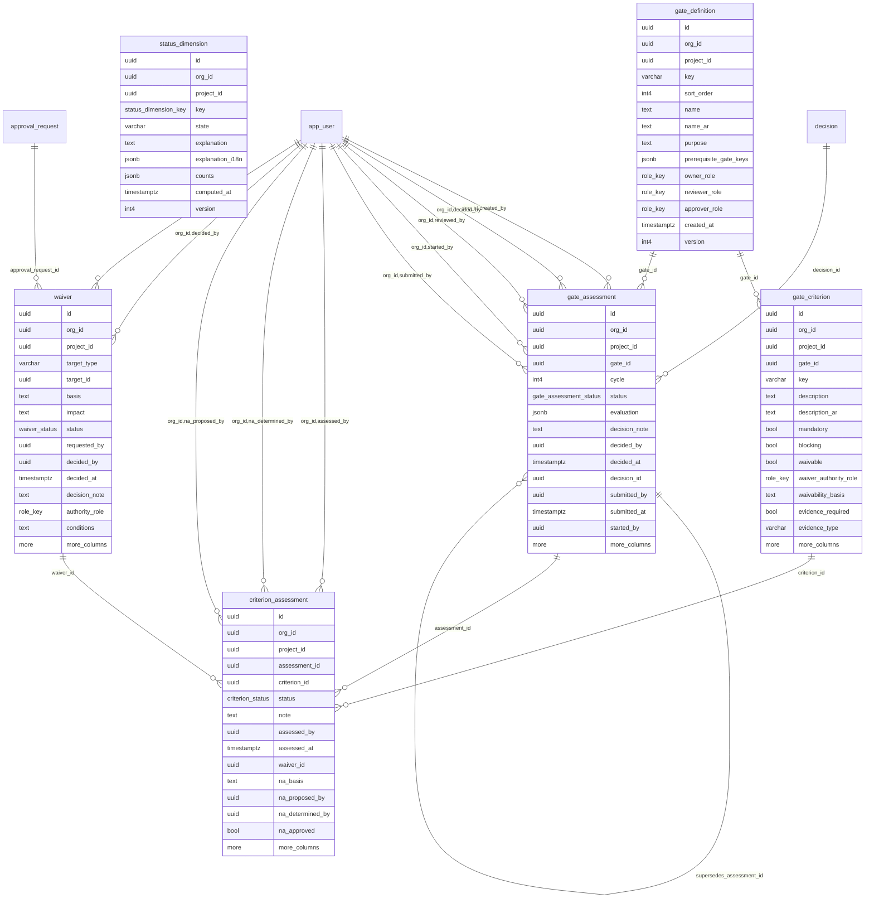

## Carve-out, NewCo, readiness & TSA

```mermaid
erDiagram
  perimeter_item {
    uuid id
    uuid org_id
    uuid project_id
    varchar code
    perimeter_item_type type
    text name
    text description
    uuid site_id
    uuid workstream_id
    uuid owner_user_id
    uuid current_entity_id
    uuid target_entity_id
    perimeter_disposition disposition
    text resolution_path
    more more_columns
  }
  transfer_record {
    uuid id
    uuid org_id
    uuid project_id
    uuid perimeter_item_id
    varchar aspect
    varchar command
    transfer_status from_status
    transfer_status to_status
    text mechanism
    date effective_date
    text note
    int4 evidence_count
    uuid reviews_record_id
    uuid recorded_by
    more more_columns
  }
  agreement {
    uuid id
    uuid org_id
    uuid project_id
    varchar code
    varchar kind_label
    text kind_expansion
    bool kind_expansion_confirmed
    uuid kind_expansion_confirmed_by
    timestamptz kind_expansion_confirmed_at
    text kind_expansion_basis
    text title
    jsonb parties
    text scope
    uuid owner_user_id
    more more_columns
  }
  consent {
    uuid id
    uuid org_id
    uuid project_id
    varchar code
    uuid perimeter_item_id
    uuid agreement_id
    varchar kind
    text counterparty
    text contract_ref
    uuid owner_user_id
    consent_status status
    date requested_on
    date responded_on
    text conditions
    more more_columns
  }
  regulatory_requirement {
    uuid id
    uuid org_id
    uuid project_id
    varchar code
    approval_register_category category
    text authority
    text title
    text description
    varchar origin
    text source_reference
    applicability_status applicability
    uuid applicability_assessed_by
    timestamptz applicability_assessed_at
    text applicability_note
    more more_columns
  }
  tsa_service {
    uuid id
    uuid org_id
    uuid project_id
    varchar code
    text name
    uuid agreement_id
    uuid provider_entity_id
    uuid recipient_entity_id
    text scope
    text dependent_services
    text sla
    text metric_method
    text charge_basis
    numeric charge_amount
    more more_columns
  }
  readiness_check {
    uuid id
    uuid org_id
    uuid project_id
    varchar code
    readiness_area area
    text title
    text title_ar
    uuid site_id
    uuid workstream_id
    uuid cutover_plan_id
    uuid owner_user_id
    varchar template_key
    bool mandatory
    bool blocker
    more more_columns
  }
  readiness_test_run {
    uuid id
    uuid org_id
    uuid project_id
    uuid readiness_check_id
    readiness_status result
    text note
    uuid recorded_by
    timestamptz created_at
    int4 seq
  }
  cutover_plan {
    uuid id
    uuid org_id
    uuid project_id
    varchar code
    text title
    uuid site_id
    uuid workstream_id
    uuid runbook_document_id
    text runbook_summary
    timestamptz window_start
    timestamptz window_end
    text service_impact
    uuid accountable_user_id
    bool communications_approved
    more more_columns
  }
  agreement_version {
    uuid id
    uuid org_id
    uuid project_id
    uuid agreement_id
    varchar version_label
    uuid document_id
    uuid document_version_id
    text note
    uuid recorded_by
    timestamptz created_at
  }
  perimeter_version {
    uuid id
    uuid org_id
    uuid project_id
    int4 version_no
    varchar status
    jsonb snapshot
    text snapshot_hash
    int4 item_count
    text note
    uuid proposed_by
    uuid decided_by
    timestamptz decided_at
    uuid decision_id
    text decision_note
    more more_columns
  }
  perimeter_category_review {
    uuid id
    uuid org_id
    uuid project_id
    perimeter_item_type category
    text conclusion
    uuid reviewed_by
    timestamptz reviewed_at
    bool is_demo
    timestamptz created_at
    timestamptz updated_at
    int4 version
  }
  perimeter_impact_assessment {
    uuid id
    uuid org_id
    uuid project_id
    uuid perimeter_item_id
    uuid change_request_id
    varchar trigger
    jsonb entries
    jsonb narrative
    uuid assessed_by
    timestamptz created_at
  }
  cutover_decision_record {
    uuid id
    uuid org_id
    uuid project_id
    uuid cutover_plan_id
    varchar kind
    cutover_status from_status
    cutover_status to_status
    uuid actor_user_id
    text rationale
    uuid go_decision_id
    jsonb evaluation
    bool is_demo
    timestamptz created_at
  }
  operating_model_definition {
    uuid id
    uuid org_id
    uuid project_id
    varchar version_label
    text definition
    jsonb independence_criteria
    text permitted_enduring_arrangements
    varchar status
    uuid approved_by
    timestamptz approved_at
    uuid decision_id
    bool is_demo
    timestamptz created_at
    uuid created_by
    more more_columns
  }
  tsa_extension_terms {
    uuid id
    uuid org_id
    uuid project_id
    uuid decision_id
    uuid tsa_service_id
    date proposed_end_date
    text continuity_plan
    uuid requested_by
    bool is_demo
    timestamptz created_at
    timestamptz updated_at
    int4 version
  }
  app_user ||--o{ perimeter_item : "org_id,billing_accountable_user_id"
  app_user ||--o{ perimeter_item : "org_id,created_by"
  app_user ||--o{ perimeter_item : "org_id,owner_user_id"
  app_user ||--o{ perimeter_item : "org_id,service_accountable_user_id"
  app_user ||--o{ perimeter_item : "org_id,sla_accountable_user_id"
  app_user ||--o{ perimeter_item : "org_id,transfer_class_assessed_by"
  agreement ||--o{ perimeter_item : "agreement_id"
  app_user ||--o{ perimeter_item : "billing_accountable_user_id"
  legal_entity ||--o{ perimeter_item : "current_entity_id"
  app_user ||--o{ perimeter_item : "owner_user_id"
  change_request ||--o{ perimeter_item : "pending_change_request_id"
  app_user ||--o{ perimeter_item : "service_accountable_user_id"
  site ||--o{ perimeter_item : "site_id"
  app_user ||--o{ perimeter_item : "sla_accountable_user_id"
  legal_entity ||--o{ perimeter_item : "target_entity_id"
  workstream ||--o{ perimeter_item : "workstream_id"
  app_user ||--o{ transfer_record : "org_id,recorded_by"
  perimeter_item ||--o{ transfer_record : "perimeter_item_id"
  transfer_record ||--o{ transfer_record : "reviews_record_id"
  document ||--o{ agreement : "executed_document_id"
  app_user ||--o{ agreement : "legal_reviewer_user_id"
  app_user ||--o{ agreement : "owner_user_id"
  app_user ||--o{ agreement : "org_id,created_by"
  app_user ||--o{ agreement : "org_id,kind_expansion_confirmed_by"
  app_user ||--o{ agreement : "org_id,legal_reviewer_user_id"
  app_user ||--o{ agreement : "org_id,owner_user_id"
  agreement ||--o{ consent : "agreement_id"
  perimeter_item ||--o{ consent : "perimeter_item_id"
  app_user ||--o{ consent : "owner_user_id"
  document ||--o{ consent : "response_document_id"
  app_user ||--o{ consent : "org_id,created_by"
  app_user ||--o{ consent : "org_id,owner_user_id"
  app_user ||--o{ consent : "org_id,response_recorded_by"
  app_user ||--o{ regulatory_requirement : "org_id,applicability_assessed_by"
  app_user ||--o{ regulatory_requirement : "org_id,conditions_satisfied_by"
  app_user ||--o{ regulatory_requirement : "org_id,created_by"
  app_user ||--o{ regulatory_requirement : "org_id,outcome_recorded_by"
  app_user ||--o{ regulatory_requirement : "org_id,owner_user_id"
  legal_entity ||--o{ regulatory_requirement : "legal_entity_id"
  app_user ||--o{ regulatory_requirement : "owner_user_id"
  app_user ||--o{ tsa_service : "org_id,created_by"
  app_user ||--o{ tsa_service : "org_id,exit_approved_by"
  app_user ||--o{ tsa_service : "org_id,extension_requested_by"
  app_user ||--o{ tsa_service : "org_id,owner_user_id"
  app_user ||--o{ tsa_service : "org_id,replacement_accepted_by"
  agreement ||--o{ tsa_service : "agreement_id"
  decision ||--o{ tsa_service : "approval_decision_id"
  escalation ||--o{ tsa_service : "escalation_id"
  approval_request ||--o{ tsa_service : "exit_approval_request_id"
  decision ||--o{ tsa_service : "extension_decision_id"
  app_user ||--o{ tsa_service : "owner_user_id"
  legal_entity ||--o{ tsa_service : "provider_entity_id"
  legal_entity ||--o{ tsa_service : "recipient_entity_id"
  workstream ||--o{ tsa_service : "workstream_id"
  app_user ||--o{ readiness_check : "org_id,created_by"
  app_user ||--o{ readiness_check : "org_id,owner_user_id"
  app_user ||--o{ readiness_check : "org_id,signed_off_by"
  app_user ||--o{ readiness_check : "org_id,waivability_determined_by"
  cutover_plan ||--o{ readiness_check : "cutover_plan_id"
  app_user ||--o{ readiness_check : "owner_user_id"
  site ||--o{ readiness_check : "site_id"
  waiver ||--o{ readiness_check : "waiver_id"
  workstream ||--o{ readiness_check : "workstream_id"
  app_user ||--o{ readiness_test_run : "org_id,recorded_by"
  readiness_check ||--o{ readiness_test_run : "readiness_check_id"
  app_user ||--o{ cutover_plan : "accountable_user_id"
  decision ||--o{ cutover_plan : "go_decision_id"
  document ||--o{ cutover_plan : "runbook_document_id"
  site ||--o{ cutover_plan : "site_id"
  workstream ||--o{ cutover_plan : "workstream_id"
  app_user ||--o{ cutover_plan : "org_id,accountable_user_id"
  app_user ||--o{ cutover_plan : "org_id,created_by"
  app_user ||--o{ cutover_plan : "org_id,executed_by"
  app_user ||--o{ cutover_plan : "org_id,go_no_go_decided_by"
  app_user ||--o{ cutover_plan : "org_id,post_transition_accepted_by"
  app_user ||--o{ cutover_plan : "org_id,submitted_for_decision_by"
  agreement ||--o{ agreement_version : "agreement_id"
  document ||--o{ agreement_version : "document_id"
  document_version ||--o{ agreement_version : "document_version_id"
  app_user ||--o{ agreement_version : "org_id,recorded_by"
  app_user ||--o{ perimeter_version : "org_id,decided_by"
  app_user ||--o{ perimeter_version : "org_id,proposed_by"
  decision ||--o{ perimeter_version : "decision_id"
  app_user ||--o{ perimeter_category_review : "org_id,reviewed_by"
  app_user ||--o{ perimeter_impact_assessment : "org_id,assessed_by"
  change_request ||--o{ perimeter_impact_assessment : "change_request_id"
  perimeter_item ||--o{ perimeter_impact_assessment : "perimeter_item_id"
  decision ||--o{ cutover_decision_record : "go_decision_id"
  cutover_plan ||--o{ cutover_decision_record : "cutover_plan_id"
  app_user ||--o{ cutover_decision_record : "org_id,actor_user_id"
  app_user ||--o{ operating_model_definition : "org_id,approved_by"
  app_user ||--o{ operating_model_definition : "org_id,created_by"
  decision ||--o{ operating_model_definition : "decision_id"
  app_user ||--o{ tsa_extension_terms : "org_id,requested_by"
  decision ||--o{ tsa_extension_terms : "decision_id"
  tsa_service ||--o{ tsa_extension_terms : "tsa_service_id"
```

## Finance

```mermaid
erDiagram
  financial_snapshot {
    uuid id
    uuid org_id
    uuid project_id
    financial_kind kind
    financial_category category
    varchar line_ref
    text label
    varchar period
    numeric amount
    varchar currency
    int4 unit_scale
    source_type source_type
    text source_ref
    uuid source_document_id
    more more_columns
  }
  budget_line {
    uuid id
    uuid org_id
    uuid project_id
    uuid workstream_id
    varchar code
    text name
    financial_category category
    numeric proposed_amount
    numeric approved_amount
    numeric committed_amount
    numeric spent_amount
    varchar currency
    int4 unit_scale
    date actuals_as_of
    more more_columns
  }
  financial_model {
    uuid id
    uuid org_id
    uuid project_id
    varchar code
    model_kind kind
    text name
    text description
    classification classification
    bool is_demo
    timestamptz created_at
    uuid created_by
    timestamptz updated_at
    int4 version
  }
  financial_model_version {
    uuid id
    uuid org_id
    uuid project_id
    uuid model_id
    model_kind kind
    int4 version_no
    varchar version_label
    model_case model_case
    uuid based_on_version_id
    uuid superseded_by_id
    jsonb assumptions
    jsonb outputs
    value_basis headline_basis
    source_type source_type
    more more_columns
  }
  benefit {
    uuid id
    uuid org_id
    uuid project_id
    varchar code
    text title
    text measurement_definition
    text baseline_value
    text target_value
    text actual_value
    varchar unit
    numeric value_amount
    varchar value_currency
    int4 value_unit_scale
    numeric realized_amount
    more more_columns
  }
  kpi {
    uuid id
    uuid org_id
    uuid project_id
    varchar key
    text name
    text name_ar
    text definition
    text formula
    varchar unit
    varchar period
    varchar owner_role
    uuid owner_user_id
    uuid benefit_id
    text source
    more more_columns
  }
  kpi_observation {
    uuid id
    uuid org_id
    uuid project_id
    uuid kpi_id
    varchar period
    numeric value
    numeric numerator
    numeric denominator
    varchar data_quality
    jsonb source_refs
    text source_ref
    text note
    timestamptz created_at
    varchar computed_by
    more more_columns
  }
  intercompany_reconciliation {
    uuid id
    uuid org_id
    uuid project_id
    varchar code
    uuid financial_snapshot_id
    text counterparty_label
    varchar period
    numeric our_balance
    numeric their_balance
    varchar currency
    int4 unit_scale
    varchar status
    text explanation
    text source_ref
    more more_columns
  }
  decision ||--o{ financial_snapshot : "approval_decision_id"
  document ||--o{ financial_snapshot : "source_document_id"
  document_version ||--o{ financial_snapshot : "source_document_version_id"
  import_batch ||--o{ financial_snapshot : "import_batch_id"
  approval_request ||--o{ financial_snapshot : "approval_request_id"
  tsa_service ||--o{ financial_snapshot : "tsa_service_id"
  workstream ||--o{ financial_snapshot : "workstream_id"
  app_user ||--o{ financial_snapshot : "org_id,approved_by"
  app_user ||--o{ financial_snapshot : "org_id,created_by"
  app_user ||--o{ financial_snapshot : "org_id,prepared_by"
  app_user ||--o{ financial_snapshot : "org_id,validated_by"
  decision ||--o{ budget_line : "approval_decision_id"
  tsa_service ||--o{ budget_line : "tsa_service_id"
  workstream ||--o{ budget_line : "workstream_id"
  app_user ||--o{ budget_line : "org_id,approved_by"
  app_user ||--o{ budget_line : "org_id,created_by"
  app_user ||--o{ financial_model : "org_id,created_by"
  financial_model_version ||--o{ financial_model_version : "based_on_version_id"
  decision ||--o{ financial_model_version : "approval_decision_id"
  document ||--o{ financial_model_version : "source_document_id"
  document_version ||--o{ financial_model_version : "source_document_version_id"
  import_batch ||--o{ financial_model_version : "import_batch_id"
  approval_request ||--o{ financial_model_version : "approval_request_id"
  financial_model_version ||--o{ financial_model_version : "superseded_by_id"
  financial_model ||--o{ financial_model_version : "model_id"
  app_user ||--o{ financial_model_version : "org_id,approved_by"
  app_user ||--o{ financial_model_version : "org_id,created_by"
  app_user ||--o{ financial_model_version : "org_id,prepared_by"
  app_user ||--o{ financial_model_version : "org_id,validated_by"
  app_user ||--o{ benefit : "owner_user_id"
  workstream ||--o{ benefit : "workstream_id"
  app_user ||--o{ benefit : "org_id,approved_by"
  app_user ||--o{ benefit : "org_id,created_by"
  app_user ||--o{ benefit : "org_id,owner_user_id"
  app_user ||--o{ benefit : "org_id,realization_recorded_by"
  app_user ||--o{ benefit : "org_id,verified_by"
  app_user ||--o{ kpi : "org_id,created_by"
  app_user ||--o{ kpi : "org_id,owner_user_id"
  benefit ||--o{ kpi : "benefit_id"
  app_user ||--o{ kpi : "owner_user_id"
  app_user ||--o{ kpi_observation : "org_id,recorded_by"
  kpi ||--o{ kpi_observation : "kpi_id"
  app_user ||--o{ intercompany_reconciliation : "org_id,created_by"
  app_user ||--o{ intercompany_reconciliation : "org_id,prepared_by"
  app_user ||--o{ intercompany_reconciliation : "org_id,reviewer_user_id"
  financial_snapshot ||--o{ intercompany_reconciliation : "financial_snapshot_id"
```

## JV & diligence

```mermaid
erDiagram
  partner {
    uuid id
    uuid org_id
    uuid project_id
    varchar code
    text name
    text description
    uuid legal_entity_id
    partner_stage stage
    timestamptz stage_changed_at
    bool shortlisted
    uuid outreach_request_id
    uuid outreach_approved_by
    timestamptz outreach_approved_at
    nda_status nda_status
    more more_columns
  }
  partner_room {
    uuid id
    uuid org_id
    uuid project_id
    uuid partner_id
    text name
    text description
    bool is_clean_team
    classification classification
    timestamptz locked_at
    uuid locked_by
    text lock_reason
    bool is_demo
    timestamptz created_at
    uuid created_by
    more more_columns
  }
  room_grant {
    uuid id
    uuid org_id
    uuid project_id
    uuid room_id
    uuid user_id
    varchar access_level
    role_key role
    text reason
    text attestation_ref
    uuid granted_by
    timestamptz created_at
    timestamptz expires_at
    timestamptz revoked_at
    uuid revoked_by
    more more_columns
  }
  deal_scenario {
    uuid id
    uuid org_id
    uuid project_id
    uuid partner_id
    varchar code
    text name
    int4 version_no
    varchar version_label
    jsonb ownership
    jsonb contributions
    text governance_terms
    text assumptions
    approval_state approval_state
    uuid approved_by
    more more_columns
  }
  negotiation_issue {
    uuid id
    uuid org_id
    uuid project_id
    uuid partner_id
    uuid agreement_id
    varchar code
    text issue
    jsonb positions
    text alternatives
    text required_approval
    bool requires_approval
    uuid decision_id
    uuid document_id
    text document_ref
    more more_columns
  }
  diligence_request {
    uuid id
    uuid org_id
    uuid project_id
    uuid partner_id
    uuid room_id
    int4 number
    varchar origin
    text question
    varchar domain
    text requester_label
    uuid assignee_user_id
    date due_date
    text answer_draft
    uuid drafted_by
    more more_columns
  }
  diligence_finding {
    uuid id
    uuid org_id
    uuid project_id
    uuid partner_id
    uuid room_id
    uuid diligence_request_id
    varchar code
    text title
    text description
    materiality materiality
    uuid risk_id
    text remediation
    uuid remediation_owner_user_id
    date remediation_due_date
    more more_columns
  }
  closing {
    uuid id
    uuid org_id
    uuid project_id
    uuid partner_id
    closing_kind kind
    varchar code
    int4 sequence
    text name
    text description
    uuid signing_id
    date target_date
    closing_status status
    uuid confirmation_request_id
    uuid executed_document_id
    more more_columns
  }
  closing_condition {
    uuid id
    uuid org_id
    uuid project_id
    uuid closing_id
    condition_kind kind
    varchar reference
    text title
    text description
    uuid owner_user_id
    text parties
    bool blocking
    bool waivable
    role_key waiver_authority_role
    text waiver_authority_note
    more more_columns
  }
  closing_deliverable {
    uuid id
    uuid org_id
    uuid project_id
    uuid closing_id
    varchar code
    text title
    text responsible_party
    uuid owner_user_id
    date due_date
    uuid decision_id
    closing_deliverable_status status
    uuid document_id
    uuid executed_version_id
    uuid delivered_by
    more more_columns
  }
  funds_flow_item {
    uuid id
    uuid org_id
    uuid project_id
    uuid closing_id
    varchar code
    text description
    text payer
    text payee
    numeric amount
    varchar currency
    int4 unit_scale
    date value_date
    funds_flow_status status
    uuid confirmed_by
    more more_columns
  }
  post_close_obligation {
    uuid id
    uuid org_id
    uuid project_id
    varchar code
    post_close_kind kind
    text title
    text description
    text responsible_party
    uuid owner_user_id
    date due_date
    post_close_status status
    text evidence_note
    uuid completion_reported_by
    timestamptz completion_reported_at
    more more_columns
  }
  partner_criteria_set {
    uuid id
    uuid org_id
    uuid project_id
    jsonb criteria
    text note
    bool is_demo
    timestamptz created_at
    uuid created_by
    timestamptz updated_at
    uuid updated_by
    int4 version
  }
  partner_assessment_entry {
    uuid id
    uuid org_id
    uuid project_id
    uuid partner_id
    uuid proposal_id
    varchar criterion_key
    varchar basis
    text statement
    numeric score
    text source_reference
    uuid document_id
    bool is_demo
    timestamptz created_at
    uuid created_by
  }
  partner_conflict {
    uuid id
    uuid org_id
    uuid project_id
    uuid partner_id
    uuid declarant_user_id
    text description
    text mitigation
    varchar status
    bool is_demo
    timestamptz created_at
    uuid created_by
    timestamptz updated_at
    int4 version
  }
  partner_contact {
    uuid id
    uuid org_id
    uuid project_id
    uuid partner_id
    uuid user_id
    text note
    timestamptz created_at
    uuid created_by
    timestamptz revoked_at
    uuid revoked_by
  }
  partner_proposal {
    uuid id
    uuid org_id
    uuid project_id
    uuid partner_id
    varchar code
    text title
    date received_on
    text scope
    text terms_summary
    uuid document_id
    uuid supersedes_proposal_id
    classification classification
    bool is_demo
    timestamptz created_at
    more more_columns
  }
  deal_scenario_version {
    uuid id
    uuid org_id
    uuid project_id
    uuid scenario_id
    int4 version_no
    varchar version_label
    jsonb ownership
    jsonb contributions
    text governance_terms
    text assumptions
    text change_note
    timestamptz created_at
    uuid created_by
  }
  room_disclosure {
    uuid id
    uuid org_id
    uuid project_id
    uuid room_id
    uuid document_id
    uuid document_version_id
    uuid diligence_request_id
    varchar status
    text request_note
    uuid requested_by
    uuid released_by
    timestamptz released_at
    uuid rejected_by
    uuid revoked_by
    more more_columns
  }
  room_access_event {
    uuid id
    uuid org_id
    uuid project_id
    uuid room_id
    varchar kind
    uuid actor_user_id
    uuid subject_user_id
    uuid grant_id
    uuid disclosure_id
    uuid diligence_request_id
    uuid document_version_id
    text note
    timestamptz created_at
  }
  app_user ||--o{ partner : "org_id,created_by"
  app_user ||--o{ partner : "org_id,materials_access_approved_by"
  app_user ||--o{ partner : "org_id,nda_recorded_by"
  app_user ||--o{ partner : "org_id,outreach_approved_by"
  legal_entity ||--o{ partner : "legal_entity_id"
  document ||--o{ partner : "nda_document_id"
  approval_request ||--o{ partner : "nda_request_id"
  approval_request ||--o{ partner : "outreach_request_id"
  app_user ||--o{ partner_room : "org_id,created_by"
  app_user ||--o{ partner_room : "org_id,locked_by"
  partner ||--o{ partner_room : "partner_id"
  app_user ||--o{ room_grant : "org_id,granted_by"
  app_user ||--o{ room_grant : "org_id,revoked_by"
  app_user ||--o{ room_grant : "org_id,user_id"
  partner_room ||--o{ room_grant : "room_id"
  app_user ||--o{ room_grant : "user_id"
  partner ||--o{ deal_scenario : "partner_id"
  app_user ||--o{ deal_scenario : "org_id,approved_by"
  app_user ||--o{ deal_scenario : "org_id,created_by"
  app_user ||--o{ negotiation_issue : "org_id,created_by"
  agreement ||--o{ negotiation_issue : "agreement_id"
  decision ||--o{ negotiation_issue : "decision_id"
  document ||--o{ negotiation_issue : "document_id"
  partner ||--o{ negotiation_issue : "partner_id"
  app_user ||--o{ diligence_request : "assignee_user_id"
  partner ||--o{ diligence_request : "partner_id"
  app_user ||--o{ diligence_request : "reviewer_user_id"
  partner_room ||--o{ diligence_request : "room_id"
  app_user ||--o{ diligence_request : "org_id,assignee_user_id"
  app_user ||--o{ diligence_request : "org_id,created_by"
  app_user ||--o{ diligence_request : "org_id,drafted_by"
  app_user ||--o{ diligence_request : "org_id,release_approved_by"
  app_user ||--o{ diligence_request : "org_id,released_by"
  app_user ||--o{ diligence_request : "org_id,reviewer_user_id"
  app_user ||--o{ diligence_request : "org_id,submitted_for_review_by"
  closing_condition ||--o{ diligence_finding : "condition_id"
  partner ||--o{ diligence_finding : "partner_id"
  diligence_request ||--o{ diligence_finding : "diligence_request_id"
  risk ||--o{ diligence_finding : "risk_id"
  partner_room ||--o{ diligence_finding : "room_id"
  app_user ||--o{ diligence_finding : "org_id,created_by"
  app_user ||--o{ diligence_finding : "org_id,remediation_owner_user_id"
  approval_request ||--o{ closing : "confirmation_request_id"
  decision ||--o{ closing : "confirmation_decision_id"
  document ||--o{ closing : "executed_document_id"
  partner ||--o{ closing : "partner_id"
  closing ||--o{ closing : "signing_id"
  app_user ||--o{ closing : "org_id,confirmed_by"
  app_user ||--o{ closing : "org_id,created_by"
  closing ||--o{ closing_condition : "closing_id"
  decision ||--o{ closing_condition : "long_stop_extension_decision_id"
  app_user ||--o{ closing_condition : "owner_user_id"
  waiver ||--o{ closing_condition : "waiver_id"
  app_user ||--o{ closing_condition : "org_id,created_by"
  app_user ||--o{ closing_condition : "org_id,evidence_submitted_by"
  app_user ||--o{ closing_condition : "org_id,long_stop_extended_by"
  app_user ||--o{ closing_condition : "org_id,owner_user_id"
  app_user ||--o{ closing_condition : "org_id,verified_by"
  app_user ||--o{ closing_condition : "org_id,waivability_determined_by"
  closing ||--o{ closing_deliverable : "closing_id"
  decision ||--o{ closing_deliverable : "decision_id"
  document ||--o{ closing_deliverable : "document_id"
  app_user ||--o{ closing_deliverable : "owner_user_id"
  document_version ||--o{ closing_deliverable : "executed_version_id"
  app_user ||--o{ closing_deliverable : "org_id,created_by"
  app_user ||--o{ closing_deliverable : "org_id,delivered_by"
  app_user ||--o{ closing_deliverable : "org_id,owner_user_id"
  app_user ||--o{ closing_deliverable : "org_id,verified_by"
  closing ||--o{ funds_flow_item : "closing_id"
  app_user ||--o{ funds_flow_item : "org_id,confirmed_by"
  app_user ||--o{ funds_flow_item : "org_id,created_by"
  app_user ||--o{ funds_flow_item : "org_id,settlement_reported_by"
  app_user ||--o{ post_close_obligation : "org_id,completion_reported_by"
  app_user ||--o{ post_close_obligation : "org_id,created_by"
  app_user ||--o{ post_close_obligation : "org_id,owner_user_id"
  app_user ||--o{ post_close_obligation : "org_id,verified_by"
  closing ||--o{ post_close_obligation : "closing_id"
  escalation ||--o{ post_close_obligation : "escalation_id"
  app_user ||--o{ post_close_obligation : "owner_user_id"
  app_user ||--o{ partner_criteria_set : "org_id,created_by"
  app_user ||--o{ partner_criteria_set : "org_id,updated_by"
  app_user ||--o{ partner_assessment_entry : "org_id,created_by"
  document ||--o{ partner_assessment_entry : "document_id"
  partner ||--o{ partner_assessment_entry : "partner_id"
  partner_proposal ||--o{ partner_assessment_entry : "proposal_id"
  app_user ||--o{ partner_conflict : "org_id,created_by"
  app_user ||--o{ partner_conflict : "org_id,declarant_user_id"
  partner ||--o{ partner_conflict : "partner_id"
  app_user ||--o{ partner_contact : "org_id,created_by"
  app_user ||--o{ partner_contact : "org_id,revoked_by"
  app_user ||--o{ partner_contact : "org_id,user_id"
  partner ||--o{ partner_contact : "partner_id"
  app_user ||--o{ partner_proposal : "org_id,created_by"
  document ||--o{ partner_proposal : "document_id"
  partner ||--o{ partner_proposal : "partner_id"
  partner_proposal ||--o{ partner_proposal : "supersedes_proposal_id"
  deal_scenario ||--o{ deal_scenario_version : "scenario_id"
  app_user ||--o{ deal_scenario_version : "org_id,created_by"
  app_user ||--o{ room_disclosure : "org_id,rejected_by"
  app_user ||--o{ room_disclosure : "org_id,released_by"
  app_user ||--o{ room_disclosure : "org_id,requested_by"
  app_user ||--o{ room_disclosure : "org_id,revoked_by"
  diligence_request ||--o{ room_disclosure : "diligence_request_id"
  document ||--o{ room_disclosure : "document_id"
  partner_room ||--o{ room_disclosure : "room_id"
  document_version ||--o{ room_disclosure : "document_version_id"
  app_user ||--o{ room_access_event : "org_id,actor_user_id"
  app_user ||--o{ room_access_event : "org_id,subject_user_id"
  diligence_request ||--o{ room_access_event : "diligence_request_id"
  room_disclosure ||--o{ room_access_event : "disclosure_id"
  room_grant ||--o{ room_access_event : "grant_id"
  partner_room ||--o{ room_access_event : "room_id"
  document_version ||--o{ room_access_event : "document_version_id"
```

## Documents & sources

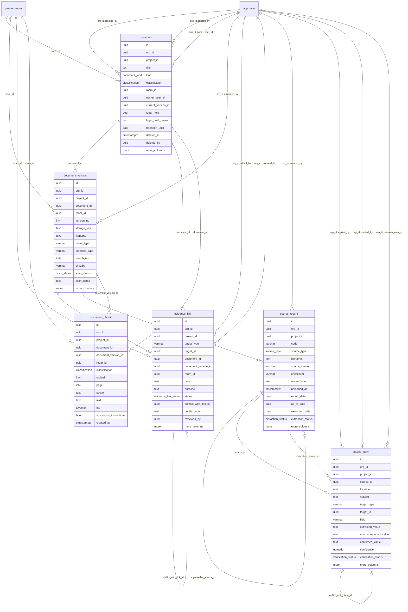

## Reporting & imports

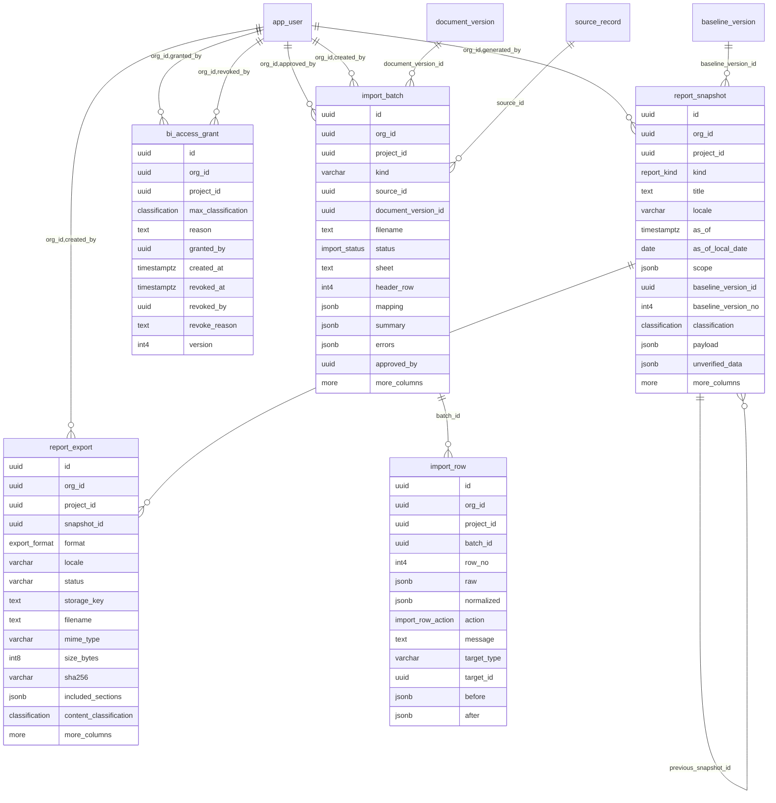

## Platform, jobs & audit

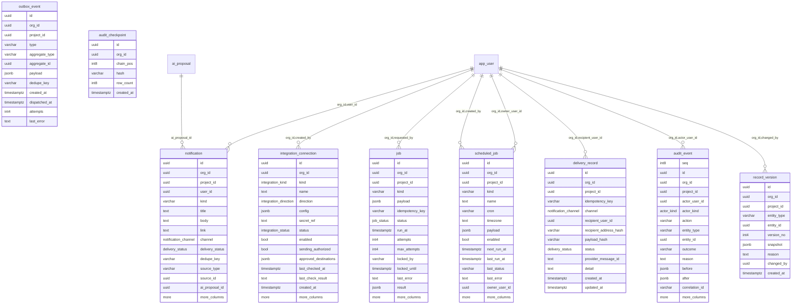

## AI runtime

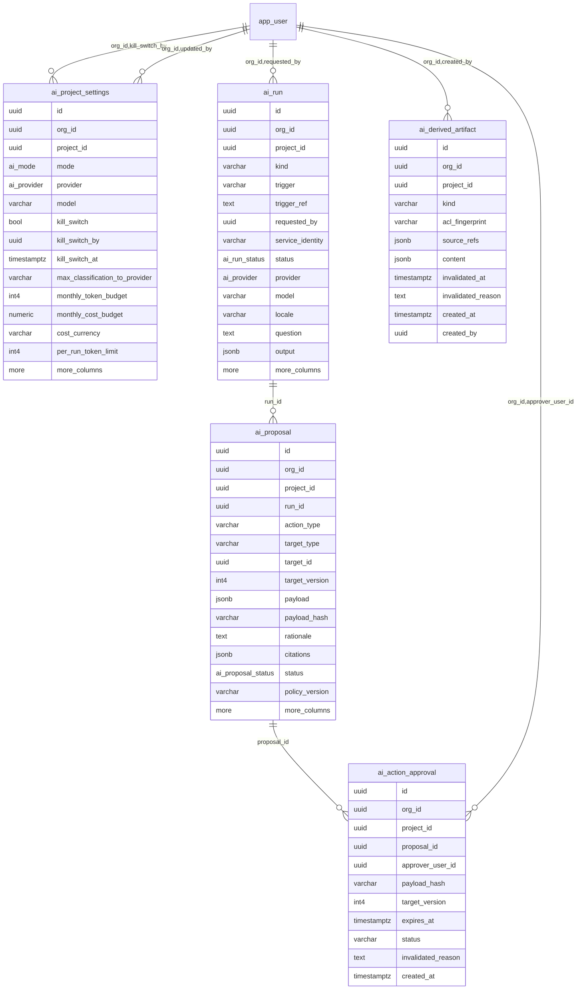
