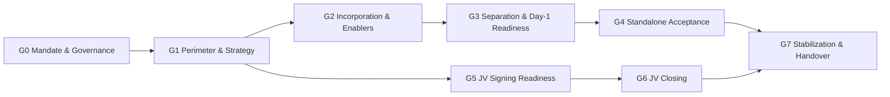
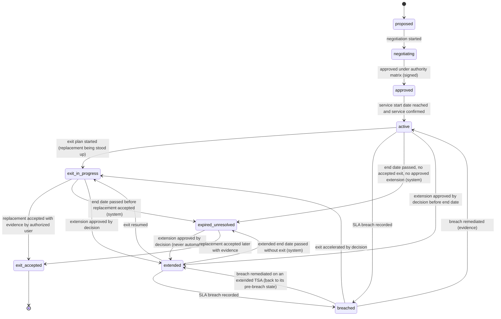

# Business Gates G0–G7, Status Dimensions, TSA, CP and Partner Rules

# بوابات الأعمال وأبعاد الحالة وقواعد الخدمات الانتقالية والشروط المسبقة والشركاء

> **Status: proposed business rules (P0).** Source: `docs/MASTER_PROMPT.md` §3, §7.3, §8, §20. The machine-readable
> definitions are in `packages/db/seed/templates/dc-carveout.v1.json`; the per-gate criteria tables in §3 are generated
> from that file. **All deliverables and criteria are a proposed template: authorized legal, financial and operational
> owners determine actual applicability** (every criterion carries `applicability: "proposed"`). Rules marked
> **[server]** are enforced by the API/domain layer.

These are **business (transaction) gates**, separate from the software implementation phases P0–P8.

## 1. Four independent status dimensions (أبعاد الحالة الأربعة المستقلة)

The program status is never a single value. Each dimension moves on its own evidence and is displayed separately in
the Executive Cockpit. No dimension is derived from another, and no dimension is derived from task completion.

| Dimension | Arabic | States (in order) | What moves it |
|---|---|---|---|
| `incorporation` | التأسيس | `not_started` / `unconfirmed` → `in_progress` → `incorporated_evidence_pending` → `incorporated_verified`; or `not_applicable` | Verified incorporation documents (G2-C01) |
| `perimeter_transfer` | نقل النطاق | `perimeter_draft` → `not_started` → `perimeter_approved` → `transfer_in_progress` → `partially_transferred` → `transferred_evidence_pending` → `transferred_verified`; exception `blocked` | Perimeter register transfer evidence and reconciliation, perimeter-version approval |
| `operational_readiness` | الجاهزية والاستقلال التشغيلي | `not_assessed` → `readiness_in_progress` → `day1_go_approved` → `operating_with_transitional_services` → `standalone_accepted` → `transitional_services_exited`; exception `blocked` | Readiness sign-offs, go/no-go decision, post-transition acceptance, TSA exits |
| `jv_transaction` | توقيع وإتمام المشروع المشترك | `not_started` → `partner_preparation` → `diligence_and_negotiation` → `signing_ready` → `signed` → `closing_conditions_in_progress` → `partially_closed` → `closed`; or `terminated` | Partner process, signing record, CP verification, closing confirmations |

Rules:

1. **Independence (AT-06).** NewCo may be `incorporated_verified` while `perimeter_transfer` is `transfer_in_progress` and
   `operational_readiness` is `readiness_in_progress`. The cockpit shows all four; the carve-out is never shown as
   "complete" because one dimension is complete **[server: no aggregate "complete" status exists]**.
2. **`unconfirmed` is the default** for incorporation until evidence is recorded; the setup wizard offers incorporated /
   incorporation in progress / unconfirmed, each requiring evidence or an explicit "unconfirmed" flag.
3. **Evidence-pending states** exist so that a reported fact (e.g. from a source document) is visible without being
   treated as verified.
4. **`operating_with_transitional_services` is a normal state**, not a failure. Operational independence is judged
   against the approved definition of independence, which may include approved enduring arrangements.
5. **Multiple closings.** `partially_closed` applies while at least one closing is confirmed and at least one remains.
6. Each state change is an explicit command with actor, timestamp, evidence reference and reason, and is audited.
7. **`jv_transaction` as implemented (DOM-P4-10) [server].** Computed from the partner process, gate G5 and the signing /
   closing events: `partner_preparation` while an active partner is before due diligence; `diligence_and_negotiation`
   when a partner is at DD or later, or a signing / closing event is being prepared; `signing_ready` when the current G5
   cycle is approved and not flagged for reassessment and no signing is recorded; `signed` once a signing is confirmed;
   `closing_conditions_in_progress` while a closing of a confirmed signing is in preparation or ready for confirmation;
   `partially_closed` / `closed` from the confirmed closings; `terminated` when every partner has withdrawn and every
   event was aborted. **Aborted events are not counted** (one confirmed and one aborted closing is `closed`); the
   explanation states how many were excluded. Partner and event changes trigger the recompute.
8. **`incorporation`, `perimeter_transfer`, `operational_readiness` as implemented (DOM-P3-08, -11, -12) [server].** The rule
   (`computeStatusDimensions`, `packages/domain/src/carveout.ts`) produces only the states of the table above and of the
   template's `statusDimensions` (`DIMENSION_STATES`; a unit test compares the template with it). Until a dimension is first
   computed it shows `not_assessed` ("Not yet assessed").
   - `incorporation`: `not_started` while no NewCo legal entity is recorded; otherwise the entity's status —
     `unconfirmed` (default), `in_progress`, `not_applicable` (a determination with its basis) — and `incorporated` reads
     `incorporated_verified` only while the verification is confirmed **and** its evidence is still active in the owning
     project; otherwise `incorporated_evidence_pending`. Evidence of a confirmed incorporation that is rejected, superseded
     or conflicting returns the verification to "proposed" (audited, history kept) and asks Legal to re-verify (DOM-P3-08).
   - `perimeter_transfer` (legal and economic transfer combined, the least advanced counts): `perimeter_draft` while no item
     is Included / Shared; `blocked` while an in-scope item is blocked; `transferred_verified` when every in-scope item is
     transferred with verified evidence (no pending disposition); `transferred_evidence_pending` when every in-scope item is
     reported transferred and some still await verification; `partially_transferred` when some in-scope items are
     transferred (reported or verified) and others are not; `transfer_in_progress` when transfer work started but nothing is
     transferred yet; `perimeter_approved` once a perimeter version is approved and no transfer started; otherwise
     `not_started`. An in-scope item whose two aspects are "not applicable" never counts as transferred (it is shown
     separately and reported by reconciliation — DOM-P3-05); one aspect "not applicable" is disclosed.
   - `operational_readiness`: before standalone acceptance — `blocked` while a TSA is breached or expired-unresolved or a
     blocker check failed / is improperly waived; `not_assessed` while no mandatory / blocking check exists;
     `day1_go_approved` when every mandatory / blocking check is cleared (passed — a passed check whose sign-off evidence
     becomes invalid is returned to in progress, §5 —, not applicable, or waived with an effective waiver) **and every transition plan has a Day-1 GO** that is not flagged (§5);
     `operating_with_transitional_services` when, in addition, every plan was executed and accepted; otherwise
     `readiness_in_progress` — **never "Day-1 ready" without a GO decision**. After G4 (approved, not under reassessment):
     `transitional_services_exited` when no transitional service is left running (approved enduring arrangements
     excepted), otherwise `standalone_accepted`, with any breached / expired-unresolved TSA still stated in the explanation
     (DOM-P3-11). An enduring arrangement counts as "approved" only once its terms are approved (DOM-P3-15).
   - `blocked` is an exception state shown instead of the progression while a blocker is open (P0 decision D-15); it is not
     a step of the machine.
   - **Carve-out complete** (`carveOutComplete`) only when incorporation is `incorporated_verified`, the perimeter
     `transferred_verified` and operational readiness `transitional_services_exited` — never while a TSA is running,
     breached or expired-unresolved (DOM-P3-11).
   - Recomputes of a project's dimensions are serialized by the transaction advisory lock `hub_dimensions:<projectId>`
     (DOM-P3-14), so a recompute with an older snapshot cannot commit last and no history row is dropped. Every cutover
     state command (GO / NO-GO, withdrawal, execution, rollback, acceptance) and the plan's site change trigger the
     recompute (`readiness.changed`, DOM-P34R-03), so the stored dimension follows the GO and its withdrawal.
   - A verified transfer aspect counts as verified only while the item's transfer evidence is still active and uncontested
     (otherwise "evidence pending"), and the evidence reaction returns such aspects to `in_progress` (system entry
     `reject_evidence` in the transfer history) for a new report and verification (DOM-P34R-06). A "not applicable" aspect
     recorded while the item was out of the transferring scope is reset to `not_started` when the item enters the scope
     (classification, or an applied change request after the baseline — transfer-history entry `scope_reset`), to be
     planned or determined by the specialist (DOM-P34R-05).
   - Amended at the P3 fixes (domain owner to confirm, `docs/assumptions-and-open-questions.md`): the `blocked` exception
     state, `not_applicable` for incorporation, `perimeter_draft` before `not_started` (the draft has no in-scope item yet;
     `not_started` = in-scope items defined, perimeter not approved, no transfer started) and the label of
     `partially_transferred` ("other in-scope items pending" — the platform does not know whether interim arrangements
     cover them; the Day-1 positions record those).

## 2. Gate model (نموذج البوابة)

Each gate has: key, purpose, prerequisite gates, owner, reviewer, approver, criteria, evidence, decision (with
timestamps), and exceptions (waivers, not-applicable determinations, observations).

### 2.1 Criterion flags

| Flag | Meaning |
|---|---|
| `mandatory` | Must be **Met** (evidence accepted and criterion approved), **Waived** (only if waivable), or determined **Not applicable** by an authorized specialist, for the gate to pass |
| `blocking` | An unmet blocking criterion is an active blocker: it forces the gate RAG to red regardless of task progress, appears in the cockpit's top blockers, and prevents the gate from being submitted for decision. Every blocking criterion is also mandatory |
| `waivable` | Default `false`. Only authorized specialists determine waivability; where `true`, `waiverAuthorityRole` names who may approve and `waivabilityBasis` records that the flag is a proposal to be confirmed. **As implemented (DOM-P2-15):** the determination is made only by the criterion's designated specialist — its reviewer role when that role holds `gates.criterion.set_waivability`, otherwise the functional approver — and only while the gate cycle is being assessed (never on a gate that is ready for decision or decided) |
| `evidenceRequired`, `evidenceType` | The kind of evidence needed (approved document, signed agreement, regulatory record, committee decision, test report, reconciliation, sign-off, register extract, board resolution) |
| `applicability` | Always `proposed` in the template; set to `applicable` or `not_applicable` only by an authorized owner with a recorded basis. **As implemented (DOM-P2-15):** set by the criterion reviewer's recorded not-applicable determination — `not_applicable` when a proposal is approved, `applicable` when it is rejected (versioned and audited) |

### 2.2 Criterion states

`pending` → `evidence_submitted` → `under_review` → `met` | `not_met` (returned) · `waived` (via approved waiver) ·
`not_applicable` (via authorized determination) · `reopened` (after defective evidence).

### 2.3 Gate assessment states

`not_started` → `in_assessment` → `ready_for_decision` → `passed` | `not_passed` | `deferred` ·
`recommended_pending_external_authority` (when the gate decision is outside delegation) · `reopened`.

### 2.4 Gate roles: owner, reviewer, approver (as implemented — DOM-P2-16, REQ-LCY-010)

Each gate names three **different** roles (template `ownerRole`, `reviewerRole`, `approverRole`; a cycle cannot start
when one is missing, when two coincide or when a role lacks its gate permission — 422 `gates.definition.roles_incomplete`).

| Step | Who | Server rule |
|---|---|---|
| Start the cycle, link the backing decision, submit it for decision (mark ready), send it back to assessment | The gate's **owner role** — or the **project manager** (access-matrix §2.4 `own_workstream`, `gates.assessment.submit` with `ownerRoles: [ownerRole]`). A `workstream_lead` owner acts through the workstream it leads. | Anyone else holding `gates.assessment.submit` → 403 `gates.not_gate_owner` (e.g. a workstream lead can submit G1, not the legal-owned G2). The person who starts the cycle is recorded (`started_by`). |
| **Gate-level review**: endorse or return the owner's assessment, with a note (`POST …/assessment/review`) | The gate's **reviewer role** (`gates.assessment.review` + designated role; otherwise 403 `gates.not_designated_gate_reviewer`), never the person who started the cycle (`not_self`; unknown starter → 403 `policy.sod_subject_unknown`) | Only while the cycle is `in_assessment` (422 `gates.review.invalid_state`). An **endorsement** needs every criterion satisfied (no criterion / evidence-conflict blocker; prerequisites aside — 422 `gates.review.criteria_incomplete`); a **return** sends the cycle back for rework. Recorded on the cycle (`reviewed_by/at`, outcome, note, and the fingerprint of the criterion state reviewed); audited `gates.assessment.review_endorse` / `review_return`. |
| Submit for decision (mark ready) | Owner (as above) | The evaluation must be ready (422 `gates.assessment.not_ready`) **and** the cycle must carry an **endorsement recorded after its last criterion change** — any later change of evidence (added, verified, rejected, conflicting, superseded), criterion status (including the not-applicable steps and working notes), waiver or applicability makes it stale: 422 `gates.assessment.review_required` / `review_returned` / `review_stale`. The submitter is never the endorsing reviewer (403 `gates.assessment.reviewer_cannot_submit`). |
| Decide | The gate's **approver role** (authority) | `not_self` against the **submitter and the gate reviewer** of the cycle (403); the decision snapshot records the review relied upon. |

DC template: owners `secretary_cpmo` (G0), `workstream_lead` (G1, G4, G5, G6), `legal_restricted` (G2), `project_manager`
(G3, G7); reviewers `project_manager` (G0, G1), `functional_approver` (G2, G3, G4), `finance_restricted` (G5),
`legal_restricted` (G6), `secretary_cpmo` (G7). Because the PM reviews G0 and G1, the PM may act as their owner (override)
only when another PM reviews: a PM who started or submits a cycle is never its reviewer. My Work offers `gate_review` to the
designated reviewer role once every criterion of a cycle in assessment is satisfied and its current state has not been
reviewed (never to the person who started it).

## 3. Gates G0–G7 (البوابات)

Prerequisite graph (only genuinely sequential dependencies):

- **G5 depends only on G1**, not on G2, G3 or G4: partner preparation, valuation and diligence may run in parallel
  with separation where authorized (AT-11). The WBS enforces the same: JV signing (WS12-A06) has no upstream activity
  linked to G3 or G4 (checked by the template validator).
- **G6 depends on G5.** Whether closing also requires separation outcomes (e.g. assets transferred into NewCo) is
  transaction-specific and is modelled as **CPs**, not as a fixed gate dependency.
- **G7 depends on G4 and G6**: stabilization needs both standalone acceptance and closing.
- **G2 depends on G1** because the applicability of licences and registrations depends on the approved purpose and
  target structure. The `incorporation` status dimension can still show NewCo as incorporated before G1 or G2 pass.

### G0 — Mandate & Governance (التفويض والحوكمة)

- **Purpose:** Establish the mandate, committee scope and governance. Approved by the sponsor on behalf of the delegating authority, because the committee cannot approve its own mandate.
- **Phase:** Mandate & Governance · **Prerequisite gates:** none
- **Owner / Reviewer / Approver:** `secretary_cpmo` / `project_manager` / `sponsor`
- **Linked WBS:** 10 activities; milestones: WS01-A04, WS01-A06

| Criterion | Summary | Mandatory | Blocking | Waivable (authority) | Evidence |
|---|---|---|---|---|---|
| G0-C01 | Program charter (objectives, scope boundaries, success measures, assumptions) approved by the authorized sponsor. | Yes | Yes | No | `approved_document` |
| G0-C02 | Committee charter approved by the delegating authority, including purpose, scope, delegated authority, exclusions and matters reserved for higher authorities. | Yes | Yes | No | `approved_document` |
| G0-C03 | Delegation of authority matrix approved and the approved version loaded in the platform; production approval authority is not activated before this. | Yes | Yes | No | `approved_document` |
| G0-C04 | Committee membership confirmed by role (chair, sponsor, secretary, voting and advisory members) through authorized appointment records. | Yes | Yes | No | `approved_document` |
| G0-C05 | Initial integrated plan and budget approved as Baseline version 1, with gates linked to activities. | Yes | Yes | No | `committee_decision` |
| G0-C06 | Information classification, access model (including partner rooms and clean team) and records retention approach confirmed for the program. | Yes | No | No | `approved_document` |
| G0-C07 | RAID register initiated with top risks assessed, owners assigned and escalation paths defined. | Yes | No | No | `register_extract` |
| G0-C08 | Stakeholder map and communication approach documented. | No | No | No | `register_extract` |

### G1 — Perimeter & Strategy (النطاق والاستراتيجية)

- **Purpose:** Define what transfers, what remains and how: approved perimeter, exclusions, NewCo strategy, target structure and dependency maps.
- **Phase:** Perimeter & Strategy · **Prerequisite gates:** G0
- **Owner / Reviewer / Approver:** `workstream_lead` / `project_manager` / `committee_chair`
- **Linked WBS:** 15 activities; milestones: WS02-A08

| Criterion | Summary | Mandatory | Blocking | Waivable (authority) | Evidence |
|---|---|---|---|---|---|
| G1-C01 | Data center strategy and NewCo strategic rationale approved. | Yes | Yes | No | `committee_decision` |
| G1-C02 | Transaction Perimeter Register baselined: every item classified Included / Excluded / Shared / Pending with legal owner, operator and economic beneficiary, covering assets, liabilities, receivables/payables, contracts, employees, data, IP, licences, financing, guarantees and shared services. | Yes | Yes | No | `register_extract` |
| G1-C03 | Every Pending perimeter item has an owner, a resolution path and a target resolution gate. | Yes | Yes | No | `register_extract` |
| G1-C04 | Separation model and target legal and operating structure approved, with legal, tax/zakat and accounting implications specialist-assessed. | Yes | Yes | No | `committee_decision` |
| G1-C05 | Exclusions and retained items documented with rationale. | Yes | No | No | `approved_document` |
| G1-C06 | Shared-service and dependency maps (systems, sites, contracts, people) completed for the perimeter. | Yes | No | No | `approved_document` |
| G1-C07 | Target Operating Model and go-to-market outline approved. | Yes | No | No | `approved_document` |
| G1-C08 | Preliminary impact of the perimeter on financial statements, valuation, agreements, TSAs, readiness, schedule and budget recorded. | Yes | No | No | `approved_document` |

### G2 — Incorporation & Enablers (التأسيس والممكّنات)

- **Purpose:** Verify incorporation and the enabling requirements assessed as applicable: licensing, authorizations, registrations, accounts and NewCo governance.
- **Phase:** Incorporation & Enablers · **Prerequisite gates:** G1
- **Owner / Reviewer / Approver:** `legal_restricted` / `functional_approver` / `committee_chair`
- **Linked WBS:** 7 activities; milestones: WS03-A10

| Criterion | Summary | Mandatory | Blocking | Waivable (authority) | Evidence |
|---|---|---|---|---|---|
| G2-C01 | Incorporation documents obtained and verified by Legal against authoritative records; incorporation status recorded with evidence. | Yes | Yes | No | `regulatory_record` |
| G2-C02 | Company purpose and activities in the constitutive documents are consistent with the approved target structure and operating model. | Yes | Yes | No | `approved_document` |
| G2-C03 | Applicability of licences, authorizations and registrations for NewCo activities assessed by authorized Legal and Regulatory specialists, with basis and required timing recorded for each item. | Yes | Yes | No | `approved_document` |
| G2-C04 | Each item assessed as applicable before Day 1 is obtained, or an approved interim arrangement is recorded with conditions and validity. | Yes | Yes | No | `regulatory_record` |
| G2-C05 | NewCo governance established: board and management appointed by role per the constitutive documents and authorized signatories defined. | Yes | Yes | No | `board_resolution` |
| G2-C06 | NewCo bank accounts and statutory, tax and zakat registrations: applicability specialist-assessed and status recorded. | Yes | No | No | `regulatory_record` |
| G2-C07 | NewCo delegation of authority and core policies adopted, or an approved interim reliance arrangement recorded. | Yes | No | No | `board_resolution` |

### G3 — Separation & Day-1 Readiness (الفصل وجاهزية اليوم الأول)

- **Purpose:** Verify the perimeter is ready for transfer and operation: transfer evidence or interim arrangements, contracts and consents, operational, IT, people and finance readiness, approved transition plan and the Day-1 go/no-go decision.
- **Phase:** Separation & Day-1 Readiness · **Prerequisite gates:** G2
- **Owner / Reviewer / Approver:** `project_manager` / `functional_approver` / `committee_chair`
- **Linked WBS:** 43 activities; milestones: WS03-A09, WS07-A09

| Criterion | Summary | Mandatory | Blocking | Waivable (authority) | Evidence |
|---|---|---|---|---|---|
| G3-C01 | Perimeter reconciliation shows no Day-1 item without an executed transfer instrument or an approved interim arrangement. | Yes | Yes | No | `reconciliation` |
| G3-C02 | Contracts classified as consent or novation required have consent obtained, or an approved interim arrangement with service, billing and SLA accountability and a remediation plan. | Yes | Yes | No | `register_extract` |
| G3-C03 | Day-1 readiness checklists signed off for each site by the designated specialists, with all mandatory blockers cleared. | Yes | Yes | No | `sign_off` |
| G3-C04 | IT, data, identity, connectivity and security readiness tested, including access and incident-response tests. | Yes | Yes | No | `test_report` |
| G3-C05 | People readiness: employee transfer, allocation or secondment arrangements approved per specialist-assessed requirements and communicated. | Yes | Yes | No | `approved_document` |
| G3-C06 | Finance Day-1 readiness tested: banking, invoicing, payments, payroll and intercompany processes. | Yes | Yes | No | `test_report` |
| G3-C07 | TSAs for Day-1 transitional services approved with SLAs, charge basis, term and exit plans. | Yes | Yes | No | `signed_agreement` |
| G3-C08 | Cutover runbooks approved and cutover rehearsal completed with results and remediation accepted. | Yes | No | Yes (`committee_chair`) — Proposed — to be confirmed by Operations specialist | `test_report` |
| G3-C09 | Day-1 go/no-go decision recorded by the authorized body, with contingency and rollback plans approved. | Yes | Yes | No | `committee_decision` |

### G4 — Standalone Acceptance (قبول التشغيل المستقل)

- **Purpose:** Accept operations and independence under the approved model: operating acceptance, responsibilities, approved opening balance sheet where required, residual dependencies, TSAs and exit plans.
- **Phase:** Standalone Operation · **Prerequisite gates:** G3
- **Owner / Reviewer / Approver:** `workstream_lead` / `functional_approver` / `committee_chair`
- **Linked WBS:** 8 activities; milestones: WS07-A11

| Criterion | Summary | Mandatory | Blocking | Waivable (authority) | Evidence |
|---|---|---|---|---|---|
| G4-C01 | Post-transition acceptance completed for each transition, with hypercare exit criteria met. | Yes | Yes | No | `sign_off` |
| G4-C02 | NewCo operating responsibilities (operations, maintenance, NOC, incident management) accepted by accountable owners. | Yes | Yes | No | `sign_off` |
| G4-C03 | Opening balance sheet approved where required, after human financial validation; applicability specialist-assessed. | Yes | Yes | No | `approved_document` |
| G4-C04 | Perimeter transfer reconciliation: every Included item transferred with evidence, or tracked under an approved interim arrangement with owner and end condition. | Yes | Yes | No | `reconciliation` |
| G4-C05 | Residual dependencies register: every remaining shared service classified as TSA, approved enduring arrangement or exit in progress, and reflected in the approved definition of independence. | Yes | Yes | No | `register_extract` |
| G4-C06 | Approved exit plan for every active TSA, with replacement service owner, exit milestones and acceptance evidence defined. | Yes | Yes | No | `approved_document` |
| G4-C07 | Intercompany balances reconciled and the settlement mechanism agreed. | Yes | No | No | `reconciliation` |
| G4-C08 | Standalone cost baseline (recurring standalone costs, stranded costs and TSA charges, without double counting) validated by Finance. | Yes | No | No | `approved_document` |

### G5 — JV Signing Readiness (جاهزية توقيع المشروع المشترك)

- **Purpose:** Establish readiness to sign with the partner: valuation, diligence and material findings, negotiated terms, approval matrix and signing package. Does not require G3 or G4: partner preparation may run in parallel with separation where authorized. Signing approvals beyond the committee's delegated authority are escalated to the authorized body (to be confirmed).
- **Phase:** JV Preparation & Signing · **Prerequisite gates:** G1
- **Owner / Reviewer / Approver:** `workstream_lead` / `finance_restricted` / `committee_chair`
- **Linked WBS:** 21 activities; milestones: WS11-A12, WS12-A06

| Criterion | Summary | Mandatory | Blocking | Waivable (authority) | Evidence |
|---|---|---|---|---|---|
| G5-C01 | Comparative assessment of partner proposals documented against approved criteria and weights, with conflict disclosures, separating facts from team judgment. | Yes | No | Yes (`committee_chair`) — Proposed — to be confirmed by Corporate Development specialist | `approved_document` |
| G5-C02 | Preferred partner approved by the authorized body under the authority matrix. | Yes | Yes | No | `committee_decision` |
| G5-C03 | Due diligence completed and material findings assessed for remediation, valuation, document and CP implications. | Yes | Yes | No | `approved_document` |
| G5-C04 | Business plan and valuation approved after human financial validation, with base, downside and upside cases and a stated enterprise-value versus equity-value basis. | Yes | Yes | No | `committee_decision` |
| G5-C05 | All negotiation issues closed, or escalated with approved positions recorded. | Yes | Yes | No | `register_extract` |
| G5-C06 | Applicability of regulatory, competition and other external approvals for the transaction assessed by specialists, and required filings planned. | Yes | Yes | No | `approved_document` |
| G5-C07 | CP list, long-stop date approach and closing checklist agreed and loaded in the CP register. | Yes | Yes | No | `register_extract` |
| G5-C08 | Signing package complete in agreed form with Legal review sign-off. | Yes | Yes | No | `sign_off` |
| G5-C09 | Signing authority confirmed under the approved authority matrix; approvals beyond the committee's delegation obtained from the authorized body. | Yes | Yes | No | `board_resolution` |

### G6 — JV Closing (إتمام صفقة المشروع المشترك)

- **Purpose:** Verify closing conditions and effectiveness: CPs, required approvals, completed closing documents and deliverables, and authorized closing confirmation. Supports multiple closings; each closing is confirmed separately. Completing a task list never closes the transaction.
- **Phase:** JV Closing · **Prerequisite gates:** G5
- **Owner / Reviewer / Approver:** `workstream_lead` / `legal_restricted` / `committee_chair`
- **Linked WBS:** 3 activities; milestones: WS12-A09

| Criterion | Summary | Mandatory | Blocking | Waivable (authority) | Evidence |
|---|---|---|---|---|---|
| G6-C01 | Every CP for the closing is verified as satisfied with evidence, or waived by the party entitled to waive it under the agreement and within approved authority. | Yes | Yes | No | `register_extract` |
| G6-C02 | Required regulatory, external-party and internal approvals obtained and valid at the closing date, including their conditions. | Yes | Yes | No | `regulatory_record` |
| G6-C03 | No CP is past its long-stop date without an approved extension recorded. | Yes | Yes | No | `register_extract` |
| G6-C04 | Closing deliverables and executed documents complete per the closing checklist. | Yes | Yes | No | `signed_agreement` |
| G6-C05 | Closing funds flow approved by Finance; the platform tracks financial flows and does not execute payments. | Yes | Yes | No | `approved_document` |
| G6-C06 | Authorized closing confirmation recorded by the authorized body for this closing. | Yes | Yes | No | `board_resolution` |
| G6-C07 | JV governance appointments effective as required by the agreements. | Yes | No | No | `board_resolution` |

### G7 — Stabilization & Handover (الاستقرار والتسليم)

- **Purpose:** Track obligations and hand over operations: conditions subsequent, post-close plan, performance and benefits, TSA exit, handover acceptance and administrative closure.
- **Phase:** Stabilization & Handover · **Prerequisite gates:** G4, G6
- **Owner / Reviewer / Approver:** `project_manager` / `secretary_cpmo` / `committee_chair`
- **Linked WBS:** 6 activities; milestones: WS12-A13

| Criterion | Summary | Mandatory | Blocking | Waivable (authority) | Evidence |
|---|---|---|---|---|---|
| G7-C01 | Conditions Subsequent and post-close obligations register complete with owners; items due are satisfied and verified with evidence. | Yes | Yes | No | `register_extract` |
| G7-C02 | 100-day post-close plan executed and outcomes accepted. | Yes | No | No | `sign_off` |
| G7-C03 | Every TSA has exit accepted or has been converted into an approved enduring arrangement; no TSA is in Expired-unresolved state. | Yes | Yes | No | `sign_off` |
| G7-C04 | Benefits register baselined with measurement definitions, targets, owners and verification sources, and handed to business-as-usual owners. | Yes | Yes | No | `approved_document` |
| G7-C05 | Operational handover accepted by business-as-usual owners. | Yes | Yes | No | `sign_off` |
| G7-C06 | Open RAID items, actions and decisions closed or transferred to accepting owners. | Yes | Yes | No | `register_extract` |
| G7-C07 | Program records archived under the approved retention policy and administrative closure approved. | Yes | Yes | No | `committee_decision` |
| G7-C08 | Lessons learned captured and shared. | No | No | No | `approved_document` |

> **Note on G7-C02 (DOM-P4-17).** Spec §3 names the G7 deliverable a "post-close plan"; the "100-day" wording comes from spec
> §6 (workstream 12 "JV Execution & Post-close": "…closing/deliverables, 100-day plan, benefits"), not from the G7 row. The
> duration is a template label, **not** a confirmed plan length: the actual post-close plan period is to be confirmed by
> the owning function (Proposed — to be confirmed).

## 4. Gate evaluation rules (قواعد تقييم البوابات)

1. **Task progress never passes a gate [server].** 100% task or deliverable completion is not an input to gate status.
   A gate passes only when all of the following hold at decision time:
   - every prerequisite gate is `passed`;
   - every mandatory criterion is `met` (evidence of the required type accepted by the criterion reviewer, who is not
     the evidence owner), `waived` (approved waiver), or `not_applicable` (authorized determination with basis);
   - no blocking criterion is unmet;
   - the decision is recorded by the approver role under the active authority matrix, with quorum, recusal and
     self-approval checks (`decision-workflow.md`); outside delegation → `recommended_pending_external_authority` and
     the gate stays blocked (AT-04);
   - **the backing governance decision was raised for this gate and is of a decision type that the deciding committee's
     approved authority matrix assigns to this gate** (`gateKeys`, authority-matrix.md §3 step 10); a type reserved to a
     higher authority counts only with the authorized body's recorded approval. G0 has its own reserved type
     (`gate_decision_mandate` in the DEMO matrix): the committee cannot approve its own mandate (DOM-P2-01).
2. **Non-waivable criteria cannot be waived [server].** A waiver request on a criterion with `waivable = false` is
   rejected and logged; the criterion stays unmet (AT-13). An exception never overrides a non-waivable condition.
3. **Waivers record basis, approval and impact.** A waiver needs: the criterion, the reason and basis, the specialist
   assessment named in `waivabilityBasis`, the impact (schedule, cost, risk, transaction), any conditions and expiry,
   and approval by a holder of `waiverAuthorityRole` who is not the requester. The AI assistant cannot create,
   approve or recommend-to-approve waivers (AT-12).
4. **Not applicable is not a waiver.** Setting a proposed criterion to `not_applicable` requires an authorized specialist
   determination with a recorded basis and is reviewed at the gate decision.
5. **Non-mandatory criteria** are recorded as observations with owner and due date if unmet; they do not block the gate.
6. **Controlled reopen on defective evidence [server].** If evidence relied upon is found defective or conflicts with
   newer evidence, an authorized user reopens the criterion with a reason. A new assessment version is created; the
   previous status, evidence and decision remain in history. Downstream gates that relied on it are flagged for
   review, not silently reverted (AT-14). **As implemented (DOM-P2-05, REQ-DAT-014):** the decision snapshot records the
   evidence links each criterion relied upon. When one of them later becomes conflicting, is **rejected as defective**
   in evidence verification, or is **superseded**, the approved cycle (never modified) is flagged for controlled
   reassessment with the reason, an escalation, notifications to the reopen authorities and a `gate.blocked` event;
   downstream approved gates are flagged for review, the gate RAG turns red and a flagged G4 approval no longer counts as
   standalone acceptance in the status dimensions. On a cycle not yet decided, a criterion accepted as met whose accepted
   evidence is later rejected as defective returns to `unmet` for a fresh review (audited). **Decision evidence (P2
   re-review DOM-P2R-04):** the same applies to the evidence of the governance decision behind the approval — when the
   decision was approved by the external authority and the evidence link of that approval is later rejected as defective,
   superseded or marked conflicting, the approved cycle is flagged (`reassessment.decisionEvidence` with the decision and
   the reason; escalation, notifications, `gate.blocked`, downstream review flags, status dimensions recomputed). While the
   evidence does not stand, the decision backs no new gate approval (blocker `gate.blocker.decision_external_evidence_*`,
   decide refused with `gates.decide.decision_evidence_invalid`). The recorded decision and the approved cycle are never
   modified.
7. **Evidence conflicts** between sources are flagged as `conflicting` and must be resolved before the criterion can be
   `met` again.
8. **Parallel preparation.** Gates control approvals, not the start of preparatory work. Activities may start before
   their gate passes where authorized; actions that need specific approvals (e.g. partner outreach, materials access)
   require those approvals regardless of gate status.
9. **Evidence verification (DOM-P2-21) — where it is decisive and where it is advisory.** For gate criteria the checker
   is the criterion's **designated reviewer**, who is never the evidence owner (`not_self`): a criterion becomes `met`
   only through that review, whatever the documents module's verification says. The documents module's separate
   evidence verification (`documents.evidence.verify`, never by the linker or the uploader) is therefore **advisory for
   accepting** a criterion, but **decisive when it rejects**: a rejected (defective) link stops counting as active
   evidence at once, returns an accepted criterion of an undecided cycle to `unmet`, and flags an approved gate for
   controlled reassessment (rule 6). The same holds for task / deliverable acceptance (the acceptor, holding the
   designated approver role, is the checker). A future matrix may require prior verification for specific evidence
   types (`approved_document`, `board_resolution`, `regulatory_record`); that would be a template/criterion parameter.
10. **Gate RAG** is computed from criteria and blockers, shown separately from the average of workstream RAGs, so a green
   average never hides a red gate or CP (spec §9 measurement rule 3).
11. **Owner, reviewer and approver are three people [server] (DOM-P2-16).** The owner role (or the project manager) runs
   the cycle; the gate's reviewer role endorses the assessment before it can be submitted, and a criterion change after
   the endorsement requires a fresh one; the approver decides. The reviewer never started the cycle and never submits it;
   the approver is neither the submitter nor the reviewer (§2.4). **QA-P2-03:** the endorsement is re-checked when the
   approver decides an approval — if evidence, status, waiver or applicability of a criterion changed after the
   submission, the decision is refused (`422 gates.assessment.review_stale`); the owner sends the cycle back to assessment
   for a fresh review. A rejection is not affected.
12. **A fresh decision per cycle (O-1 of the P2 QA review; proposed, pending the governance owner).** A governance
   decision linked to any earlier cycle of the same gate — approved or **rejected** — cannot back a later cycle
   (`gates.decide.decision_reused`).

## 5. Day-1 readiness and go/no-go (جاهزية اليوم الأول)

- Readiness checklists exist per site and workstream across the 14 readiness areas in the template (power, cooling,
  connectivity, physical access, operations, maintenance, spares, NOC, incident management, billing, support, employees,
  security, backup/recovery). Each check has `mandatory`, `blocker` and `signoffRole`.
- **Any open blocker check forces a no-go [server]**: the go/no-go decision cannot be recorded as "go" while a blocker
  check for the affected site is not signed off (AT-09). The decision record links the contingency runbook and history.
- Each transition needs a runbook, window, service-impact assessment, accountable owner, approved communications,
  testing, go/no-go decision, contingency/rollback and post-transition acceptance.
- The platform documents work; it does not control data center devices, networks or power.

A Day-1 blocker keeps blocking go-live (P3 domain review fixes) **[server]**:

1. **Which plans a check gates is not a description (DOM-P3-01).** `cutoverPlanId` / `siteId` of a check change only through
   `POST …/readiness-checks/:checkId/rebind` (reason required); the descriptive PATCH refuses them (400). Re-binding is
   refused for a FAILED gating check (`readiness.check.rebind_failed`) and for an open (not cleared) gating check that would
   LEAVE a plan at `ready_for_decision` / `approved_go` (`readiness.check.rebind_plan_locked`); an open gating check that
   ENTERS a plan at `approved_go` flags that GO (rule 5 — a `go_flagged` entry; entering a plan under decision simply adds it
   to that plan's GO evaluation) (DOM-P34R-07). Every plan left or entered gets a decision-history entry with the reason.
   **The plan's side of the same relation (DOM-P34R-01):** the plan's `siteId` is not a PATCH field either (400); it changes
   only through `POST …/cutover-plans/:planId/site` with a reason, before the go/no-go (planning / rehearsal; otherwise
   `readiness.cutover.locked`), and is refused while a FAILED gating check of the plan's current scope would stop gating it
   (`readiness.cutover.site_change_failed_check`). The plan's decision history records the change (`site_changed`, with the
   checks leaving and entering its scope); the command takes the readiness lock (rule 4).
2. **Signed off on evidence, while the evidence holds (DOM-P3-09).** A passed check clears the GO only while its evidence
   has at least one ACTIVE link and no conflicting one (blocker `evidenceInvalid` in the GO evaluation). When the documents
   module rejects, supersedes or contests that evidence, the `evidence.changed` reaction returns the check to
   `in_progress` (audited, the earlier sign-off kept in history) and flags any GO it gated (rule 5).
3. **A determination never releases an open blocker (DOM-P3-02).** The specialist determination cannot lower `blocker` /
   `mandatory` of a FAILED check, nor of an open check gating a plan under decision or with a GO
   (`readiness.determination.release_not_allowed`); a waivable check is released only through the waiver register (basis,
   impact, the waiver authority set by the specialist, not the requester); a non-waivable one cannot be released.
   **The same rule on the sign-off path (DOM-P34R-02):** the sign-off as "not applicable" is refused for a FAILED gating
   check (status or latest test) and for an open gating check of a plan under decision or with a GO
   (`readiness.signoff.na_release_not_allowed`); a non-gating check, or an open one of a plan still in planning, may be
   determined not applicable with a basis. Operations specialist to confirm (Q-P3-02).
4. **One writer of a project's readiness state at a time (DOM-P3-03).** The GO and the execution record take the
   transaction advisory lock `hub_readiness:<projectId>` before evaluating; every command that changes a gating input
   (check creation / instantiation, test run, sign-off, determination, reopen, waiver application, re-binding, the plan's
   site change, the evidence reaction) takes the same lock first. Lock order: `hub_readiness` → decision row (GO reliance). A GO therefore never
   commits on an evaluation that missed a concurrently committed failure.
5. **A blocker failing after the GO stops go-live (DOM-P3-04).** A gating check that is open again after the GO (failed test,
   reopen, invalid evidence) flags the GO: a `go_flagged` decision-history entry and an audit row. Recording the execution is
   refused (`readiness.execution_blocked`; the refusal is recorded) until the check is cleared again (passed on valid evidence
   or waived with an effective waiver) or the GO is withdrawn (`return_to_planning` is allowed from `approved_go`; the
   consumed decision cannot back a new GO).
6. **Separation of duties (DOM-P3-10 / SEC-P34-01).** The sign-off is not by the owner or creator of the check, the
   recorder of its latest test, nor anyone who linked its active (or conflicting) evidence.
7. **Summary = GO evaluation (DOM-P3-16).** The Day-1 summary counts a waived blocker as cleared only with an effective
   waiver (approved, not expired) and a passed one only with valid evidence, as the GO does.
8. **Recorded test result (DOM-P3-15).** The test result text is written only by the test-run command (not a PATCH field).

## 6. TSA state machine (آلة حالات اتفاقيات الخدمات الانتقالية)

Rules **[server]**:

1. **End date ≠ exit.** Reaching the end date never moves a TSA to `exit_accepted`. Only an authorized user can record
   `exit_accepted`, with evidence that the replacement service is accepted (AT-10).
2. **No automatic extension.** `extended` is reachable only through an approved decision (decision type
   `tsa_approval_or_extension` in the authority matrix). The system never extends a contract.
3. **Escalation.** Entering `expired_unresolved`, `breached`, or the end-date warning window without an accepted
   replacement raises an escalation with the requested action, deadline and options (extend, accelerate replacement,
   interim continuity arrangement); continuity planning is triggered.
4. Every TSA records provider/recipient, scope, dependent services/assets/systems, SLA and metric, charge basis, start and
   end dates, extension/termination terms, owner, replacement service, exit milestones, acceptance evidence and residual
   risks. Charges are money values with currency and unit.
5. **An extension decision is bound to the terms it approved (DOM-P3-06, DOM-P34R-04).** The terms belong to the
   DECISION, not to the TSA row's current link: each `tsa_approval_or_extension` decision carries at most ONE extension —
   one TSA, one end date, one continuity plan (`tsa_extension_terms`) — written when the extension is first requested on it.
   While the decision is a draft its terms may change; once it has left draft (submitted to the committee or decided), a
   request with another end date or continuity plan is refused (`tsa.extension.terms_bound`) and a request for another TSA
   too (`tsa.extension.decision_other_tsa`), whatever decision the TSA was linked to in between — a new date needs a new
   decision. Re-sending the bound terms is accepted. `record-extension` applies only the terms bound to the linked decision
   (`tsa.extension.terms_mismatch` otherwise). **The terms are bound for the first time only while the paper is still
   before the committee** — the decision is `draft`, `submitted` or `under_review` (DOM-P34R2-01): an extension request
   linked to a decision that already has an outcome is refused (`tsa.extension.terms_after_outcome`), so the committee
   always decides on a paper that carries the end date and continuity plan it approves.
6. **A decision backs one TSA (DOM-P3-13, conservative option — governance owner to confirm).** A
   `tsa_approval_or_extension` decision already used for TSA A (its terms or its extension) never backs a use for another
   TSA B (`tsa.extension.decision_other_tsa` / `tsa.approve.decision_other_tsa`); the same decision may still approve the
   terms of A and one extension of A, but only when the extension was requested on it while its paper was before the
   committee (rule 5): the decision that approved A's terms cannot later be reused for an extension it never showed.
   Open question Q-P3-13 in `docs/assumptions-and-open-questions.md` (governance owner to confirm both points).
7. **Extension to a future date (DOM-P3-07).** The new end date must follow the current one **and** be after today (project
   timezone), at the request and again when the extension is recorded (`tsa.extension.end_date_past`).
8. **Guards (DOM-P3-15, DOM-P3-17).** `activate` needs the service start date reached (`tsa.activate.not_started`);
   `remedy_breach` returns the TSA to the state it had before the breach (`active` or `extended`); `accelerate_exit`
   (`breached → exit_in_progress`) records the decision that accelerates the exit in its note (a linked decision record is
   not yet required); `isEnduringArrangement` is locked once the terms are approved (`tsa.enduring_locked`) and the status
   dimension calls an enduring arrangement "approved" only from then on.
9. **Access (SEC-P34-06, SEC-P34-08).** The charge and its basis are shown only to a caller with the finance-domain
   clearance and finance reach over the TSA's workstream (otherwise redacted); a TSA cannot be relabelled above the editor's
   clearance (403 `readiness.classification_above_clearance`, record unchanged).
10. **Accepted on evidence, while the evidence holds (DOM-P34R-06, the DOM-P3-09 residual).** When the acceptance evidence
    of a TSA is rejected, superseded or contested, the evidence reaction withdraws an accepted replacement of a TSA not yet
    exited (audited; it must be accepted again on valid evidence before the exit approval); an exit already accepted stays
    recorded but is not counted as exited in the operational dimension while its evidence is invalid.

## 7. Conditions precedent (CP) semantics (الشروط المسبقة)

| Attribute | Rule |
|---|---|
| Reference, owner, parties | Required; owner is one accountable user |
| Closing | Each CP belongs to a specific closing; multiple closings each have their own CP set and checklist |
| Evidence | Required for verification; evidence type per CP |
| `blocking` | A blocking CP that is not verified or validly waived prevents the closing confirmation **[server]** (AT-12). **As implemented (DOM-P34R-08) [server]:** the CP manager creates conditions blocking; only the Legal specialist (`jv.cp.set_waivability`) creates a non-blocking CP (403 `jv.cp.non_blocking_requires_specialist`) — Legal to confirm |
| Waivability and authority | Set only by authorized legal specialists per the agreement; records which party may waive and within which approved authority. **As implemented (DOM-P4-03) [server]:** permission `jv.cp.set_waivability`, held by `legal_restricted` only (human only, documented basis, audited). A determination never **releases** a blocking CP: a non-waivable blocking CP stays blocking (spec §3 "an exception cannot override a non-waivable condition"); a waivable one is released only through the waiver register (basis, impact, approval by the designated authority, not the requester) — 422 `jv.cp.blocking_release_not_allowed`. Raising a CP to blocking is a recorded determination |
| Validity | Approvals that satisfy CPs carry validity periods; an expired approval re-opens the CP. **As implemented (DOM-P4-04) [server]:** a verified or waived CP whose validity has passed blocks its closing (`jv.closing.cp_validity_lapsed`); its validity date changes only after the CP is reopened (explicit command with a reason) and verified again (422 `jv.cp.validity_locked`) |
| Long-stop date | Business date from the agreement; approaching it without evidence raises an escalation; passing it without an approved extension makes the CP `lapsed` and blocks closing. **As implemented (DOM-P4-04) [server]:** a long-stop date is set, or brought forward, by the CP manager; moving it later, clearing it or changing it on a lapsed CP needs an **approved extension** (`extend-long-stop`: a later date, a FINAL decision — *Proposed:* type `jv_closing_confirmation` of the closing authority until Legal confirms the authority —, never the decision of the current extension; 422 `jv.cp.long_stop_extension_required`). A daily worker scan (project timezone) moves an open / evidence-submitted CP past its long-stop date to `lapsed` (audited, service identity) and raises one system-generated escalation per CP and long-stop date — also for an open CP without evidence inside a *Proposed* 30-day warning window (the specification gives no window). A lapsed CP is open again only through an approved extension |
| States | `open` → `evidence_submitted` → `verified` · `waived` (by the entitled party, with evidence) · `lapsed` · `at_risk` (derived flag) |
| Verification | By a reviewer other than the evidence submitter; AI and task completion cannot change CP state |

**Closing** requires authorized confirmation per closing (G6-C06); completing a generic task list never closes the
transaction. **Conditions subsequent** are tracked after closing with owners, due dates from the agreements and
verification evidence (G7-C01).

## 8. Partner stage rules (قواعد مراحل الشركاء)

Stages: `identified` → `approved_for_contact` → `nda` → `materials_access` → `dd` → `proposal` → `negotiation` →
`signing` → `closing`; `withdrawn` from any stage.

1. **Outreach needs approval [server].** No contact may be logged before `approved_for_contact` (decision type
   `partner_outreach_and_access`).
2. **NDA ≠ materials access [server].** Reaching `nda` grants no document access. `materials_access` requires a separate
   approved access grant per partner, scoped to VDR folders/classification, with expiry. Each grant and revocation is
   logged.
3. **Clean team.** Competitively sensitive material is visible only to clean-team members; partner users never see
   internal deliberations, other partners' data or counts that reveal them.
4. **Forward progression [server].** Stages advance one at a time, in order; **no stage can be skipped** (stricter than a
   skip with a recorded reason: the only way forward is through each stage and its own approval, e.g. an NDA cannot be
   skipped to reach materials access — `jv.partner.stage_skipped`). *As implemented (DOM-P4-15, open):* the move to
   `materials_access` records the person who moved the stage (`materialsAccessApprovedBy`); it is not a separate
   authority check — actual document access still needs a room grant by another person (rule 2).
5. **Signing and closing [server] (DOM-P4-02, DOM-P4-17).** The partner stages mark the phase: `signing` = the signing is
   being prepared; `closing` needs a **confirmed signing** of this partner (`jv.partner.signing_not_confirmed`). The
   **signing itself** is recorded on the signing event, and only while the **current cycle of gate G5 is approved and not
   flagged for reassessment**, on **the decision that approved that cycle** (`jv_signing_authorization` is the decision
   type the authority matrix assigns to G5, so the decision that passes G5 is the signing authorization) — checked at the
   request and again inside the recording transaction (422 `jv.signing.g5_not_passed`, `jv.signing.g5_under_reassessment`,
   `jv.signing.decision_not_g5`). Each closing is confirmed separately by the authorized body (G6-C06). **As implemented
   (DOM-P4-01, DOM-P4-08) [server]:** one `jv_closing_confirmation` decision confirms ONE closing (decision-use registry,
   kind `closing`): a decision that already confirmed another closing is refused at the request and inside the
   confirmation (422 `jv.closing.decision_already_used`; a concurrent confirmation on the same decision is 409), and a
   decision raised for another record never confirms a closing (`jv.closing.decision_other_subject` — a paper cannot yet be
   raised for a closing; *open:* whether it must be, governance owner). The signing relies on the decision that approved
   the current G5 cycle — part of that gate approval — and adds no registry row of its own. Signing, closing, long-stop
   extension and negotiation agreement re-check the evidence of an external approval: a rejected, superseded or
   conflicting link refuses them (`…decision_evidence_invalid`), and a confirmed event on such a decision shows it
   (`evidence_invalid`), the event itself unchanged.
6. **Withdrawal** revokes all active access grants for that partner immediately and keeps the history.
7. Partner longlists contain no default real names; comparisons separate facts from team judgment.

### 8.1 Open points recorded at the P4 domain review (documented, not changed)

- **Negotiation issues (DOM-P4-13).** Spec §8 requires "required approval" per issue; neither the specification nor the
  authority matrix names a decision type for negotiation positions, and nothing says one decision may not approve the
  positions of several issues. As implemented, an issue that requires approval is agreed only on a FINAL approved decision
  of any type, and one decision may back several issues (the issue does not consume the decision in the decision-use
  registry); since DOM-P4-08 the evidence of an external approval is re-checked when the issue is agreed or closed
  (`jv.negotiation.decision_evidence_invalid`). *Proposed — to be confirmed:* a dedicated decision type (or the
  `valuation_and_ownership_terms` / `jv_signing_authorization` types) for negotiated terms.
- **Single-person steps (DOM-P4-14).** *Updated (DOM-P34R-07):* a closing checklist item is no longer set `not_required`
  by one person — since SEC-P34-10 the checklist manager requests it (documented reason, bound to the item version) and a
  second person holding `jv.cp.verify` (never the requester) confirms it; the request and the decision are visible to the
  confirmer and in the confirmation snapshot. The funds-flow steps (create / confirm / report settled, record-only) are
  still not subject to a separation-of-duties rule in the access matrix (`jv.funds_flow.manage` carries no `not_self`); the
  specification does not require one (§15: "separate request creation from approval **where policy requires**").
  *Proposed — to be confirmed:* G6-C05 "approved by Finance" read as a second Finance person confirming a funds-flow line.

## 9. Acceptance tests covered (اختبارات القبول)

| Test | Section |
|---|---|
| AT-04 decision outside delegation keeps gate blocked | §4 rule 1 |
| AT-06 incorporation confirmed, other dimensions pending | §1 |
| AT-07 site added after baseline → change request with impacts | WBS WS02-A09 and change control |
| AT-08 customer contract cannot transfer on Day 1 | G3-C02, WS09-A03 |
| AT-09 readiness test fails → go-live blocked | §5 |
| AT-10 TSA expires before replacement acceptance | §6 |
| AT-11 partner preparation during separation | §3 prerequisite graph |
| AT-12 all green but mandatory CP lacks evidence | §4 rule 9, §7 |
| AT-13 non-waivable condition / unauthorized waiver | §4 rules 2–3 |
| AT-14 conflicting evidence → controlled reassessment | §4 rules 6–7 |
