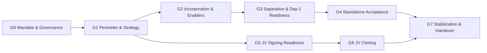
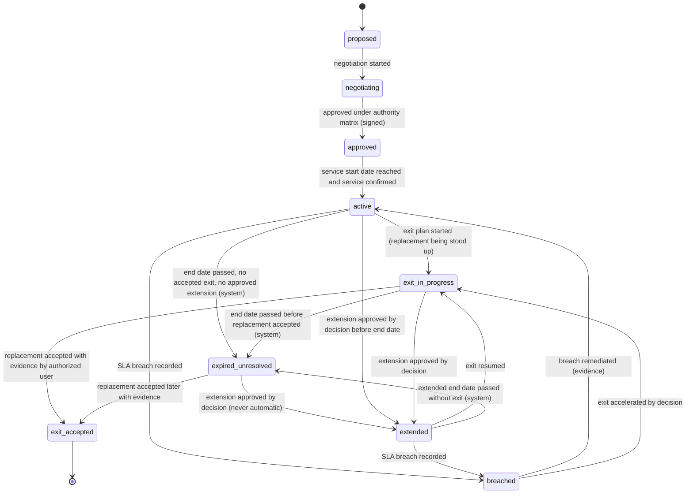

# Business Gates G0–G7, Status Dimensions, TSA, CP and Partner Rules

# بوابات الأعمال وأبعاد الحالة وقواعد الخدمات الانتقالية والشروط المسبقة والشركاء

> **Status: proposed business rules (P0).** Source: `docs/MASTER_PROMPT.md` §3, §7.3, §8, §20. The machine-readable
> definitions are in `packages/db/seed/templates/dc-carveout.v1.json`; the per-gate criteria tables in §3 are generated
> from that file. **All deliverables and criteria are a proposed template: authorized legal, financial and operational
> owners determine actual applicability** (every criterion carries `applicability: "proposed"`). Rules marked
> **[server]** are enforced by the API/domain layer.

These are **business (transaction) gates**, separate from the software implementation phases P0–P8.

## 1. Four independent status dimensions (أبعاد الحالة الأربعة المستقلة)

The program status is never a single value. Each dimension moves on its own evidence and is displayed separately in
the Executive Cockpit. No dimension is derived from another, and no dimension is derived from task completion.

| Dimension | Arabic | States (in order) | What moves it |
|---|---|---|---|
| `incorporation` | التأسيس | `unconfirmed` → `not_started` → `in_progress` → `incorporated_evidence_pending` → `incorporated_verified` | Verified incorporation documents (G2-C01) |
| `perimeter_transfer` | نقل النطاق | `not_started` → `perimeter_draft` → `perimeter_approved` → `transfer_in_progress` → `partially_transferred` → `transferred_evidence_pending` → `transferred_verified` | Perimeter register transfer evidence and reconciliation |
| `operational_readiness` | الجاهزية والاستقلال التشغيلي | `not_assessed` → `readiness_in_progress` → `day1_go_approved` → `operating_with_transitional_services` → `standalone_accepted` → `transitional_services_exited` | Readiness sign-offs, go/no-go decision, post-transition acceptance, TSA exits |
| `jv_transaction` | توقيع وإتمام المشروع المشترك | `not_started` → `partner_preparation` → `diligence_and_negotiation` → `signing_ready` → `signed` → `closing_conditions_in_progress` → `partially_closed` → `closed`; or `terminated` | Partner process, signing record, CP verification, closing confirmations |

Rules:

1. **Independence (AT-06).** NewCo may be `incorporated_verified` while `perimeter_transfer` is `transfer_in_progress` and
   `operational_readiness` is `readiness_in_progress`. The cockpit shows all four; the carve-out is never shown as
   "complete" because one dimension is complete **[server: no aggregate "complete" status exists]**.
2. **`unconfirmed` is the default** for incorporation until evidence is recorded; the setup wizard offers incorporated /
   incorporation in progress / unconfirmed, each requiring evidence or an explicit "unconfirmed" flag.
3. **Evidence-pending states** exist so that a reported fact (e.g. from a source document) is visible without being
   treated as verified.
4. **`operating_with_transitional_services` is a normal state**, not a failure. Operational independence is judged
   against the approved definition of independence, which may include approved enduring arrangements.
5. **Multiple closings.** `partially_closed` applies while at least one closing is confirmed and at least one remains.
6. Each state change is an explicit command with actor, timestamp, evidence reference and reason, and is audited.

## 2. Gate model (نموذج البوابة)

Each gate has: key, purpose, prerequisite gates, owner, reviewer, approver, criteria, evidence, decision (with
timestamps), and exceptions (waivers, not-applicable determinations, observations).

### 2.1 Criterion flags

| Flag | Meaning |
|---|---|
| `mandatory` | Must be **Met** (evidence accepted and criterion approved), **Waived** (only if waivable), or determined **Not applicable** by an authorized specialist, for the gate to pass |
| `blocking` | An unmet blocking criterion is an active blocker: it forces the gate RAG to red regardless of task progress, appears in the cockpit's top blockers, and prevents the gate from being submitted for decision. Every blocking criterion is also mandatory |
| `waivable` | Default `false`. Only authorized specialists determine waivability; where `true`, `waiverAuthorityRole` names who may approve and `waivabilityBasis` records that the flag is a proposal to be confirmed. **As implemented (DOM-P2-15):** the determination is made only by the criterion's designated specialist — its reviewer role when that role holds `gates.criterion.set_waivability`, otherwise the functional approver — and only while the gate cycle is being assessed (never on a gate that is ready for decision or decided) |
| `evidenceRequired`, `evidenceType` | The kind of evidence needed (approved document, signed agreement, regulatory record, committee decision, test report, reconciliation, sign-off, register extract, board resolution) |
| `applicability` | Always `proposed` in the template; set to `applicable` or `not_applicable` only by an authorized owner with a recorded basis. **As implemented (DOM-P2-15):** set by the criterion reviewer's recorded not-applicable determination — `not_applicable` when a proposal is approved, `applicable` when it is rejected (versioned and audited) |

### 2.2 Criterion states

`pending` → `evidence_submitted` → `under_review` → `met` | `not_met` (returned) · `waived` (via approved waiver) ·
`not_applicable` (via authorized determination) · `reopened` (after defective evidence).

### 2.3 Gate assessment states

`not_started` → `in_assessment` → `ready_for_decision` → `passed` | `not_passed` | `deferred` ·
`recommended_pending_external_authority` (when the gate decision is outside delegation) · `reopened`.

### 2.4 Gate roles: owner, reviewer, approver (as implemented — DOM-P2-16, REQ-LCY-010)

Each gate names three **different** roles (template `ownerRole`, `reviewerRole`, `approverRole`; a cycle cannot start
when one is missing, when two coincide or when a role lacks its gate permission — 422 `gates.definition.roles_incomplete`).

| Step | Who | Server rule |
|---|---|---|
| Start the cycle, link the backing decision, submit it for decision (mark ready), send it back to assessment | The gate's **owner role** — or the **project manager** (access-matrix §2.4 `own_workstream`, `gates.assessment.submit` with `ownerRoles: [ownerRole]`). A `workstream_lead` owner acts through the workstream it leads. | Anyone else holding `gates.assessment.submit` → 403 `gates.not_gate_owner` (e.g. a workstream lead can submit G1, not the legal-owned G2). The person who starts the cycle is recorded (`started_by`). |
| **Gate-level review**: endorse or return the owner's assessment, with a note (`POST …/assessment/review`) | The gate's **reviewer role** (`gates.assessment.review` + designated role; otherwise 403 `gates.not_designated_gate_reviewer`), never the person who started the cycle (`not_self`; unknown starter → 403 `policy.sod_subject_unknown`) | Only while the cycle is `in_assessment` (422 `gates.review.invalid_state`). An **endorsement** needs every criterion satisfied (no criterion / evidence-conflict blocker; prerequisites aside — 422 `gates.review.criteria_incomplete`); a **return** sends the cycle back for rework. Recorded on the cycle (`reviewed_by/at`, outcome, note, and the fingerprint of the criterion state reviewed); audited `gates.assessment.review_endorse` / `review_return`. |
| Submit for decision (mark ready) | Owner (as above) | The evaluation must be ready (422 `gates.assessment.not_ready`) **and** the cycle must carry an **endorsement recorded after its last criterion change** — any later change of evidence (added, verified, rejected, conflicting, superseded), criterion status (including the not-applicable steps and working notes), waiver or applicability makes it stale: 422 `gates.assessment.review_required` / `review_returned` / `review_stale`. The submitter is never the endorsing reviewer (403 `gates.assessment.reviewer_cannot_submit`). |
| Decide | The gate's **approver role** (authority) | `not_self` against the **submitter and the gate reviewer** of the cycle (403); the decision snapshot records the review relied upon. |

DC template: owners `secretary_cpmo` (G0), `workstream_lead` (G1, G4, G5, G6), `legal_restricted` (G2), `project_manager`
(G3, G7); reviewers `project_manager` (G0, G1), `functional_approver` (G2, G3, G4), `finance_restricted` (G5),
`legal_restricted` (G6), `secretary_cpmo` (G7). Because the PM reviews G0 and G1, the PM may act as their owner (override)
only when another PM reviews: a PM who started or submits a cycle is never its reviewer. My Work offers `gate_review` to the
designated reviewer role once every criterion of a cycle in assessment is satisfied and its current state has not been
reviewed (never to the person who started it).

## 3. Gates G0–G7 (البوابات)

Prerequisite graph (only genuinely sequential dependencies):

- **G5 depends only on G1**, not on G2, G3 or G4: partner preparation, valuation and diligence may run in parallel
  with separation where authorized (AT-11). The WBS enforces the same: JV signing (WS12-A06) has no upstream activity
  linked to G3 or G4 (checked by the template validator).
- **G6 depends on G5.** Whether closing also requires separation outcomes (e.g. assets transferred into NewCo) is
  transaction-specific and is modelled as **CPs**, not as a fixed gate dependency.
- **G7 depends on G4 and G6**: stabilization needs both standalone acceptance and closing.
- **G2 depends on G1** because the applicability of licences and registrations depends on the approved purpose and
  target structure. The `incorporation` status dimension can still show NewCo as incorporated before G1 or G2 pass.

### G0 — Mandate & Governance (التفويض والحوكمة)

- **Purpose:** Establish the mandate, committee scope and governance. Approved by the sponsor on behalf of the delegating authority, because the committee cannot approve its own mandate.
- **Phase:** Mandate & Governance · **Prerequisite gates:** none
- **Owner / Reviewer / Approver:** `secretary_cpmo` / `project_manager` / `sponsor`
- **Linked WBS:** 10 activities; milestones: WS01-A04, WS01-A06

| Criterion | Summary | Mandatory | Blocking | Waivable (authority) | Evidence |
|---|---|---|---|---|---|
| G0-C01 | Program charter (objectives, scope boundaries, success measures, assumptions) approved by the authorized sponsor. | Yes | Yes | No | `approved_document` |
| G0-C02 | Committee charter approved by the delegating authority, including purpose, scope, delegated authority, exclusions and matters reserved for higher authorities. | Yes | Yes | No | `approved_document` |
| G0-C03 | Delegation of authority matrix approved and the approved version loaded in the platform; production approval authority is not activated before this. | Yes | Yes | No | `approved_document` |
| G0-C04 | Committee membership confirmed by role (chair, sponsor, secretary, voting and advisory members) through authorized appointment records. | Yes | Yes | No | `approved_document` |
| G0-C05 | Initial integrated plan and budget approved as Baseline version 1, with gates linked to activities. | Yes | Yes | No | `committee_decision` |
| G0-C06 | Information classification, access model (including partner rooms and clean team) and records retention approach confirmed for the program. | Yes | No | No | `approved_document` |
| G0-C07 | RAID register initiated with top risks assessed, owners assigned and escalation paths defined. | Yes | No | No | `register_extract` |
| G0-C08 | Stakeholder map and communication approach documented. | No | No | No | `register_extract` |

### G1 — Perimeter & Strategy (النطاق والاستراتيجية)

- **Purpose:** Define what transfers, what remains and how: approved perimeter, exclusions, NewCo strategy, target structure and dependency maps.
- **Phase:** Perimeter & Strategy · **Prerequisite gates:** G0
- **Owner / Reviewer / Approver:** `workstream_lead` / `project_manager` / `committee_chair`
- **Linked WBS:** 15 activities; milestones: WS02-A08

| Criterion | Summary | Mandatory | Blocking | Waivable (authority) | Evidence |
|---|---|---|---|---|---|
| G1-C01 | Data center strategy and NewCo strategic rationale approved. | Yes | Yes | No | `committee_decision` |
| G1-C02 | Transaction Perimeter Register baselined: every item classified Included / Excluded / Shared / Pending with legal owner, operator and economic beneficiary, covering assets, liabilities, receivables/payables, contracts, employees, data, IP, licences, financing, guarantees and shared services. | Yes | Yes | No | `register_extract` |
| G1-C03 | Every Pending perimeter item has an owner, a resolution path and a target resolution gate. | Yes | Yes | No | `register_extract` |
| G1-C04 | Separation model and target legal and operating structure approved, with legal, tax/zakat and accounting implications specialist-assessed. | Yes | Yes | No | `committee_decision` |
| G1-C05 | Exclusions and retained items documented with rationale. | Yes | No | No | `approved_document` |
| G1-C06 | Shared-service and dependency maps (systems, sites, contracts, people) completed for the perimeter. | Yes | No | No | `approved_document` |
| G1-C07 | Target Operating Model and go-to-market outline approved. | Yes | No | No | `approved_document` |
| G1-C08 | Preliminary impact of the perimeter on financial statements, valuation, agreements, TSAs, readiness, schedule and budget recorded. | Yes | No | No | `approved_document` |

### G2 — Incorporation & Enablers (التأسيس والممكّنات)

- **Purpose:** Verify incorporation and the enabling requirements assessed as applicable: licensing, authorizations, registrations, accounts and NewCo governance.
- **Phase:** Incorporation & Enablers · **Prerequisite gates:** G1
- **Owner / Reviewer / Approver:** `legal_restricted` / `functional_approver` / `committee_chair`
- **Linked WBS:** 7 activities; milestones: WS03-A10

| Criterion | Summary | Mandatory | Blocking | Waivable (authority) | Evidence |
|---|---|---|---|---|---|
| G2-C01 | Incorporation documents obtained and verified by Legal against authoritative records; incorporation status recorded with evidence. | Yes | Yes | No | `regulatory_record` |
| G2-C02 | Company purpose and activities in the constitutive documents are consistent with the approved target structure and operating model. | Yes | Yes | No | `approved_document` |
| G2-C03 | Applicability of licences, authorizations and registrations for NewCo activities assessed by authorized Legal and Regulatory specialists, with basis and required timing recorded for each item. | Yes | Yes | No | `approved_document` |
| G2-C04 | Each item assessed as applicable before Day 1 is obtained, or an approved interim arrangement is recorded with conditions and validity. | Yes | Yes | No | `regulatory_record` |
| G2-C05 | NewCo governance established: board and management appointed by role per the constitutive documents and authorized signatories defined. | Yes | Yes | No | `board_resolution` |
| G2-C06 | NewCo bank accounts and statutory, tax and zakat registrations: applicability specialist-assessed and status recorded. | Yes | No | No | `regulatory_record` |
| G2-C07 | NewCo delegation of authority and core policies adopted, or an approved interim reliance arrangement recorded. | Yes | No | No | `board_resolution` |

### G3 — Separation & Day-1 Readiness (الفصل وجاهزية اليوم الأول)

- **Purpose:** Verify the perimeter is ready for transfer and operation: transfer evidence or interim arrangements, contracts and consents, operational, IT, people and finance readiness, approved transition plan and the Day-1 go/no-go decision.
- **Phase:** Separation & Day-1 Readiness · **Prerequisite gates:** G2
- **Owner / Reviewer / Approver:** `project_manager` / `functional_approver` / `committee_chair`
- **Linked WBS:** 43 activities; milestones: WS03-A09, WS07-A09

| Criterion | Summary | Mandatory | Blocking | Waivable (authority) | Evidence |
|---|---|---|---|---|---|
| G3-C01 | Perimeter reconciliation shows no Day-1 item without an executed transfer instrument or an approved interim arrangement. | Yes | Yes | No | `reconciliation` |
| G3-C02 | Contracts classified as consent or novation required have consent obtained, or an approved interim arrangement with service, billing and SLA accountability and a remediation plan. | Yes | Yes | No | `register_extract` |
| G3-C03 | Day-1 readiness checklists signed off for each site by the designated specialists, with all mandatory blockers cleared. | Yes | Yes | No | `sign_off` |
| G3-C04 | IT, data, identity, connectivity and security readiness tested, including access and incident-response tests. | Yes | Yes | No | `test_report` |
| G3-C05 | People readiness: employee transfer, allocation or secondment arrangements approved per specialist-assessed requirements and communicated. | Yes | Yes | No | `approved_document` |
| G3-C06 | Finance Day-1 readiness tested: banking, invoicing, payments, payroll and intercompany processes. | Yes | Yes | No | `test_report` |
| G3-C07 | TSAs for Day-1 transitional services approved with SLAs, charge basis, term and exit plans. | Yes | Yes | No | `signed_agreement` |
| G3-C08 | Cutover runbooks approved and cutover rehearsal completed with results and remediation accepted. | Yes | No | Yes (`committee_chair`) — Proposed — to be confirmed by Operations specialist | `test_report` |
| G3-C09 | Day-1 go/no-go decision recorded by the authorized body, with contingency and rollback plans approved. | Yes | Yes | No | `committee_decision` |

### G4 — Standalone Acceptance (قبول التشغيل المستقل)

- **Purpose:** Accept operations and independence under the approved model: operating acceptance, responsibilities, approved opening balance sheet where required, residual dependencies, TSAs and exit plans.
- **Phase:** Standalone Operation · **Prerequisite gates:** G3
- **Owner / Reviewer / Approver:** `workstream_lead` / `functional_approver` / `committee_chair`
- **Linked WBS:** 8 activities; milestones: WS07-A11

| Criterion | Summary | Mandatory | Blocking | Waivable (authority) | Evidence |
|---|---|---|---|---|---|
| G4-C01 | Post-transition acceptance completed for each transition, with hypercare exit criteria met. | Yes | Yes | No | `sign_off` |
| G4-C02 | NewCo operating responsibilities (operations, maintenance, NOC, incident management) accepted by accountable owners. | Yes | Yes | No | `sign_off` |
| G4-C03 | Opening balance sheet approved where required, after human financial validation; applicability specialist-assessed. | Yes | Yes | No | `approved_document` |
| G4-C04 | Perimeter transfer reconciliation: every Included item transferred with evidence, or tracked under an approved interim arrangement with owner and end condition. | Yes | Yes | No | `reconciliation` |
| G4-C05 | Residual dependencies register: every remaining shared service classified as TSA, approved enduring arrangement or exit in progress, and reflected in the approved definition of independence. | Yes | Yes | No | `register_extract` |
| G4-C06 | Approved exit plan for every active TSA, with replacement service owner, exit milestones and acceptance evidence defined. | Yes | Yes | No | `approved_document` |
| G4-C07 | Intercompany balances reconciled and the settlement mechanism agreed. | Yes | No | No | `reconciliation` |
| G4-C08 | Standalone cost baseline (recurring standalone costs, stranded costs and TSA charges, without double counting) validated by Finance. | Yes | No | No | `approved_document` |

### G5 — JV Signing Readiness (جاهزية توقيع المشروع المشترك)

- **Purpose:** Establish readiness to sign with the partner: valuation, diligence and material findings, negotiated terms, approval matrix and signing package. Does not require G3 or G4: partner preparation may run in parallel with separation where authorized. Signing approvals beyond the committee's delegated authority are escalated to the authorized body (to be confirmed).
- **Phase:** JV Preparation & Signing · **Prerequisite gates:** G1
- **Owner / Reviewer / Approver:** `workstream_lead` / `finance_restricted` / `committee_chair`
- **Linked WBS:** 21 activities; milestones: WS11-A12, WS12-A06

| Criterion | Summary | Mandatory | Blocking | Waivable (authority) | Evidence |
|---|---|---|---|---|---|
| G5-C01 | Comparative assessment of partner proposals documented against approved criteria and weights, with conflict disclosures, separating facts from team judgment. | Yes | No | Yes (`committee_chair`) — Proposed — to be confirmed by Corporate Development specialist | `approved_document` |
| G5-C02 | Preferred partner approved by the authorized body under the authority matrix. | Yes | Yes | No | `committee_decision` |
| G5-C03 | Due diligence completed and material findings assessed for remediation, valuation, document and CP implications. | Yes | Yes | No | `approved_document` |
| G5-C04 | Business plan and valuation approved after human financial validation, with base, downside and upside cases and a stated enterprise-value versus equity-value basis. | Yes | Yes | No | `committee_decision` |
| G5-C05 | All negotiation issues closed, or escalated with approved positions recorded. | Yes | Yes | No | `register_extract` |
| G5-C06 | Applicability of regulatory, competition and other external approvals for the transaction assessed by specialists, and required filings planned. | Yes | Yes | No | `approved_document` |
| G5-C07 | CP list, long-stop date approach and closing checklist agreed and loaded in the CP register. | Yes | Yes | No | `register_extract` |
| G5-C08 | Signing package complete in agreed form with Legal review sign-off. | Yes | Yes | No | `sign_off` |
| G5-C09 | Signing authority confirmed under the approved authority matrix; approvals beyond the committee's delegation obtained from the authorized body. | Yes | Yes | No | `board_resolution` |

### G6 — JV Closing (إتمام صفقة المشروع المشترك)

- **Purpose:** Verify closing conditions and effectiveness: CPs, required approvals, completed closing documents and deliverables, and authorized closing confirmation. Supports multiple closings; each closing is confirmed separately. Completing a task list never closes the transaction.
- **Phase:** JV Closing · **Prerequisite gates:** G5
- **Owner / Reviewer / Approver:** `workstream_lead` / `legal_restricted` / `committee_chair`
- **Linked WBS:** 3 activities; milestones: WS12-A09

| Criterion | Summary | Mandatory | Blocking | Waivable (authority) | Evidence |
|---|---|---|---|---|---|
| G6-C01 | Every CP for the closing is verified as satisfied with evidence, or waived by the party entitled to waive it under the agreement and within approved authority. | Yes | Yes | No | `register_extract` |
| G6-C02 | Required regulatory, external-party and internal approvals obtained and valid at the closing date, including their conditions. | Yes | Yes | No | `regulatory_record` |
| G6-C03 | No CP is past its long-stop date without an approved extension recorded. | Yes | Yes | No | `register_extract` |
| G6-C04 | Closing deliverables and executed documents complete per the closing checklist. | Yes | Yes | No | `signed_agreement` |
| G6-C05 | Closing funds flow approved by Finance; the platform tracks financial flows and does not execute payments. | Yes | Yes | No | `approved_document` |
| G6-C06 | Authorized closing confirmation recorded by the authorized body for this closing. | Yes | Yes | No | `board_resolution` |
| G6-C07 | JV governance appointments effective as required by the agreements. | Yes | No | No | `board_resolution` |

### G7 — Stabilization & Handover (الاستقرار والتسليم)

- **Purpose:** Track obligations and hand over operations: conditions subsequent, post-close plan, performance and benefits, TSA exit, handover acceptance and administrative closure.
- **Phase:** Stabilization & Handover · **Prerequisite gates:** G4, G6
- **Owner / Reviewer / Approver:** `project_manager` / `secretary_cpmo` / `committee_chair`
- **Linked WBS:** 6 activities; milestones: WS12-A13

| Criterion | Summary | Mandatory | Blocking | Waivable (authority) | Evidence |
|---|---|---|---|---|---|
| G7-C01 | Conditions Subsequent and post-close obligations register complete with owners; items due are satisfied and verified with evidence. | Yes | Yes | No | `register_extract` |
| G7-C02 | 100-day post-close plan executed and outcomes accepted. | Yes | No | No | `sign_off` |
| G7-C03 | Every TSA has exit accepted or has been converted into an approved enduring arrangement; no TSA is in Expired-unresolved state. | Yes | Yes | No | `sign_off` |
| G7-C04 | Benefits register baselined with measurement definitions, targets, owners and verification sources, and handed to business-as-usual owners. | Yes | Yes | No | `approved_document` |
| G7-C05 | Operational handover accepted by business-as-usual owners. | Yes | Yes | No | `sign_off` |
| G7-C06 | Open RAID items, actions and decisions closed or transferred to accepting owners. | Yes | Yes | No | `register_extract` |
| G7-C07 | Program records archived under the approved retention policy and administrative closure approved. | Yes | Yes | No | `committee_decision` |
| G7-C08 | Lessons learned captured and shared. | No | No | No | `approved_document` |

## 4. Gate evaluation rules (قواعد تقييم البوابات)

1. **Task progress never passes a gate [server].** 100% task or deliverable completion is not an input to gate status.
   A gate passes only when all of the following hold at decision time:
   - every prerequisite gate is `passed`;
   - every mandatory criterion is `met` (evidence of the required type accepted by the criterion reviewer, who is not
     the evidence owner), `waived` (approved waiver), or `not_applicable` (authorized determination with basis);
   - no blocking criterion is unmet;
   - the decision is recorded by the approver role under the active authority matrix, with quorum, recusal and
     self-approval checks (`decision-workflow.md`); outside delegation → `recommended_pending_external_authority` and
     the gate stays blocked (AT-04);
   - **the backing governance decision was raised for this gate and is of a decision type that the deciding committee's
     approved authority matrix assigns to this gate** (`gateKeys`, authority-matrix.md §3 step 10); a type reserved to a
     higher authority counts only with the authorized body's recorded approval. G0 has its own reserved type
     (`gate_decision_mandate` in the DEMO matrix): the committee cannot approve its own mandate (DOM-P2-01).
2. **Non-waivable criteria cannot be waived [server].** A waiver request on a criterion with `waivable = false` is
   rejected and logged; the criterion stays unmet (AT-13). An exception never overrides a non-waivable condition.
3. **Waivers record basis, approval and impact.** A waiver needs: the criterion, the reason and basis, the specialist
   assessment named in `waivabilityBasis`, the impact (schedule, cost, risk, transaction), any conditions and expiry,
   and approval by a holder of `waiverAuthorityRole` who is not the requester. The AI assistant cannot create,
   approve or recommend-to-approve waivers (AT-12).
4. **Not applicable is not a waiver.** Setting a proposed criterion to `not_applicable` requires an authorized specialist
   determination with a recorded basis and is reviewed at the gate decision.
5. **Non-mandatory criteria** are recorded as observations with owner and due date if unmet; they do not block the gate.
6. **Controlled reopen on defective evidence [server].** If evidence relied upon is found defective or conflicts with
   newer evidence, an authorized user reopens the criterion with a reason. A new assessment version is created; the
   previous status, evidence and decision remain in history. Downstream gates that relied on it are flagged for
   review, not silently reverted (AT-14). **As implemented (DOM-P2-05, REQ-DAT-014):** the decision snapshot records the
   evidence links each criterion relied upon. When one of them later becomes conflicting, is **rejected as defective**
   in evidence verification, or is **superseded**, the approved cycle (never modified) is flagged for controlled
   reassessment with the reason, an escalation, notifications to the reopen authorities and a `gate.blocked` event;
   downstream approved gates are flagged for review, the gate RAG turns red and a flagged G4 approval no longer counts as
   standalone acceptance in the status dimensions. On a cycle not yet decided, a criterion accepted as met whose accepted
   evidence is later rejected as defective returns to `unmet` for a fresh review (audited).
7. **Evidence conflicts** between sources are flagged as `conflicting` and must be resolved before the criterion can be
   `met` again.
8. **Parallel preparation.** Gates control approvals, not the start of preparatory work. Activities may start before
   their gate passes where authorized; actions that need specific approvals (e.g. partner outreach, materials access)
   require those approvals regardless of gate status.
9. **Evidence verification (DOM-P2-21) — where it is decisive and where it is advisory.** For gate criteria the checker
   is the criterion's **designated reviewer**, who is never the evidence owner (`not_self`): a criterion becomes `met`
   only through that review, whatever the documents module's verification says. The documents module's separate
   evidence verification (`documents.evidence.verify`, never by the linker or the uploader) is therefore **advisory for
   accepting** a criterion, but **decisive when it rejects**: a rejected (defective) link stops counting as active
   evidence at once, returns an accepted criterion of an undecided cycle to `unmet`, and flags an approved gate for
   controlled reassessment (rule 6). The same holds for task / deliverable acceptance (the acceptor, holding the
   designated approver role, is the checker). A future matrix may require prior verification for specific evidence
   types (`approved_document`, `board_resolution`, `regulatory_record`); that would be a template/criterion parameter.
10. **Gate RAG** is computed from criteria and blockers, shown separately from the average of workstream RAGs, so a green
   average never hides a red gate or CP (spec §9 measurement rule 3).
11. **Owner, reviewer and approver are three people [server] (DOM-P2-16).** The owner role (or the project manager) runs
   the cycle; the gate's reviewer role endorses the assessment before it can be submitted, and a criterion change after
   the endorsement requires a fresh one; the approver decides. The reviewer never started the cycle and never submits it;
   the approver is neither the submitter nor the reviewer (§2.4).

## 5. Day-1 readiness and go/no-go (جاهزية اليوم الأول)

- Readiness checklists exist per site and workstream across the 14 readiness areas in the template (power, cooling,
  connectivity, physical access, operations, maintenance, spares, NOC, incident management, billing, support, employees,
  security, backup/recovery). Each check has `mandatory`, `blocker` and `signoffRole`.
- **Any open blocker check forces a no-go [server]**: the go/no-go decision cannot be recorded as "go" while a blocker
  check for the affected site is not signed off (AT-09). The decision record links the contingency runbook and history.
- Each transition needs a runbook, window, service-impact assessment, accountable owner, approved communications,
  testing, go/no-go decision, contingency/rollback and post-transition acceptance.
- The platform documents work; it does not control data center devices, networks or power.

## 6. TSA state machine (آلة حالات اتفاقيات الخدمات الانتقالية)

Rules **[server]**:

1. **End date ≠ exit.** Reaching the end date never moves a TSA to `exit_accepted`. Only an authorized user can record
   `exit_accepted`, with evidence that the replacement service is accepted (AT-10).
2. **No automatic extension.** `extended` is reachable only through an approved decision (decision type
   `tsa_approval_or_extension` in the authority matrix). The system never extends a contract.
3. **Escalation.** Entering `expired_unresolved`, `breached`, or the end-date warning window without an accepted
   replacement raises an escalation with the requested action, deadline and options (extend, accelerate replacement,
   interim continuity arrangement); continuity planning is triggered.
4. Every TSA records provider/recipient, scope, dependent services/assets/systems, SLA and metric, charge basis, start and
   end dates, extension/termination terms, owner, replacement service, exit milestones, acceptance evidence and residual
   risks. Charges are money values with currency and unit.

## 7. Conditions precedent (CP) semantics (الشروط المسبقة)

| Attribute | Rule |
|---|---|
| Reference, owner, parties | Required; owner is one accountable user |
| Closing | Each CP belongs to a specific closing; multiple closings each have their own CP set and checklist |
| Evidence | Required for verification; evidence type per CP |
| `blocking` | A blocking CP that is not verified or validly waived prevents the closing confirmation **[server]** (AT-12) |
| Waivability and authority | Set only by authorized legal specialists per the agreement; records which party may waive and within which approved authority |
| Validity | Approvals that satisfy CPs carry validity periods; an expired approval re-opens the CP |
| Long-stop date | Business date from the agreement; approaching it without evidence raises an escalation; passing it without an approved extension makes the CP `lapsed` and blocks closing |
| States | `open` → `evidence_submitted` → `verified` · `waived` (by the entitled party, with evidence) · `lapsed` · `at_risk` (derived flag) |
| Verification | By a reviewer other than the evidence submitter; AI and task completion cannot change CP state |

**Closing** requires authorized confirmation per closing (G6-C06); completing a generic task list never closes the
transaction. **Conditions subsequent** are tracked after closing with owners, due dates from the agreements and
verification evidence (G7-C01).

## 8. Partner stage rules (قواعد مراحل الشركاء)

Stages: `identified` → `approved_for_contact` → `nda` → `materials_access` → `dd` → `proposal` → `negotiation` →
`signing` → `closing`; `withdrawn` from any stage.

1. **Outreach needs approval [server].** No contact may be logged before `approved_for_contact` (decision type
   `partner_outreach_and_access`).
2. **NDA ≠ materials access [server].** Reaching `nda` grants no document access. `materials_access` requires a separate
   approved access grant per partner, scoped to VDR folders/classification, with expiry. Each grant and revocation is
   logged.
3. **Clean team.** Competitively sensitive material is visible only to clean-team members; partner users never see
   internal deliberations, other partners' data or counts that reveal them.
4. **Forward progression.** Stages advance in order; skipping requires a recorded reason and the approvals of the skipped
   stage (e.g. an NDA cannot be skipped to reach materials access).
5. **Signing and closing stages** require the corresponding records: `signing` needs a recorded signing (after G5), and
   `closing` needs at least one authorized closing confirmation.
6. **Withdrawal** revokes all active access grants for that partner immediately and keeps the history.
7. Partner longlists contain no default real names; comparisons separate facts from team judgment.

## 9. Acceptance tests covered (اختبارات القبول)

| Test | Section |
|---|---|
| AT-04 decision outside delegation keeps gate blocked | §4 rule 1 |
| AT-06 incorporation confirmed, other dimensions pending | §1 |
| AT-07 site added after baseline → change request with impacts | WBS WS02-A09 and change control |
| AT-08 customer contract cannot transfer on Day 1 | G3-C02, WS09-A03 |
| AT-09 readiness test fails → go-live blocked | §5 |
| AT-10 TSA expires before replacement acceptance | §6 |
| AT-11 partner preparation during separation | §3 prerequisite graph |
| AT-12 all green but mandatory CP lacks evidence | §4 rule 9, §7 |
| AT-13 non-waivable condition / unauthorized waiver | §4 rules 2–3 |
| AT-14 conflicting evidence → controlled reassessment | §4 rules 6–7 |
