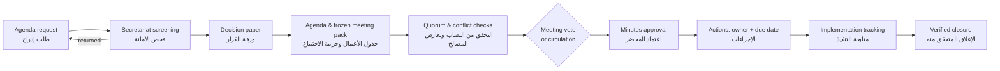
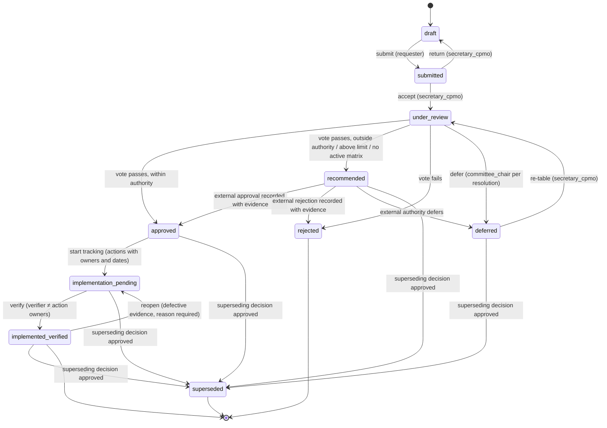

# Committee Meeting and Decision Workflow

# سير عمل الاجتماعات والقرارات

> **Status: proposed business rules (P0).** Source: `docs/MASTER_PROMPT.md` §4.2, §20 (AT-04, AT-05, AT-16, AT-18).
> Every rule marked **[server]** must be enforced by the API/domain layer, not only by the UI. Violations are rejected
> and written to the audit log in the same transaction.

## 1. End-to-end workflow (سير العمل الكامل)

| Step | Who | What the platform records | Rules |
|---|---|---|---|
| 1. Agenda request | Any project member with contribute permission | Requested item, linked issue/risk/gate/CP, urgency, latest safe decision date | Classification set at creation |
| 2. Secretariat screening | `secretary_cpmo` | Accept, return with reasons, or merge | Returned items go back to Draft with the reasons kept |
| 3. Decision paper | Requester | Required paper fields (§2) | Cannot be submitted incomplete **[server]** |
| 4. Agenda and meeting pack | `secretary_cpmo` | Numbered agenda; pack frozen as a snapshot | Changes after freeze create a new pack version **[server]** |
| 5. Quorum and conflict checks | Chair, with `secretary_cpmo` | Attendance, declared conflicts, recusals per item | Quorum computed per item after recusals **[server]**; recusals before the member votes; attendance frozen while an item has votes and no outcome **[server]** |
| 6. Discussion and vote, or circulation | Voting members | Votes (approve / reject / abstain) against the frozen paper version | Recused, self-interested and non-voting users cannot vote **[server]** |
| 7. Minutes approval | Committee (next meeting or circulation) | Numbered minutes, versioned; approval record | Approved minutes are immutable; corrections are new versions |
| 8. Actions | `secretary_cpmo` | Action number, owner (one accountable), due date, linked decision | Action owner must be an active project member |
| 9. Implementation tracking | Action owners | Progress, evidence | Approval does not imply implementation |
| 10. Verified closure | Verifier ≠ action owner | Verification with evidence | Owner cannot verify own action **[server]** |

## 2. Decision paper content (محتوى ورقة القرار)

Required before submission: issue; why a decision is needed now; alternatives; recommendation; financial, operational
and schedule impacts (money with currency and unit); risks; dependencies; latest safe decision date; requester;
decision type (from the authority matrix) and required approving authorities; evidence; attachments; classification.

## 3. Decision states (حالات القرار)

| State | Arabic | Meaning |
|---|---|---|
| `draft` | مسودة | Being prepared by the requester |
| `submitted` | مقدَّم | Submitted to the secretariat for screening |
| `under_review` | قيد المراجعة | Accepted for the agenda or for circulation; open for deliberation and voting |
| `recommended` | موصى به | The committee resolved in favour, but final approval belongs to another authority (outside delegation, above the limit, or no active matrix). Displayed as **Recommended — pending external authority** |
| `approved` | معتمد | Approved by an authority that holds the power to approve it |
| `rejected` | مرفوض | Not approved (by the committee or the external authority) |
| `deferred` | مؤجل | Consideration postponed with a reason and a revisit date |
| `superseded` | مستبدَل | Replaced by a later approved decision; kept read-only |
| `implementation_pending` | بانتظار التنفيذ | Approved; implementation actions with owners and dates are being tracked |
| `implemented_verified` | منفَّذ ومتحقق منه | All linked actions verified closed with evidence by someone other than their owners |

## 4. State diagram (مخطط الحالات)

## 5. Transition table and guards (جدول الانتقالات والضوابط)

Guard codes: **Q** quorum · **R** recusal · **A** authority · **S** self-approval · **V** optimistic version
(`expectedVersion`) · **F** frozen paper version · **E** external evidence · **P** paper completeness ·
**X** supersede linkage · **T** action verification.

| # | From → To | Command | Who may trigger | Server-side guards |
|---|---|---|---|---|
| 1 | draft → submitted | `POST .../decisions/:id/submit` | Requester (contributor, workstream lead, project manager) | P, V |
| 2 | submitted → draft | `.../return` | `secretary_cpmo` | Reason required; V |
| 3 | submitted → under_review | `.../accept` | `secretary_cpmo` | Decision type exists in the matrix (else flagged "outside authority" up front); V |
| 4 | under_review → approved | `.../close-vote` (outcome computed by the server) | Chair or `secretary_cpmo` closes; votes cast by eligible voting members | Q, R, S, F, A (within authority and amount ≤ limit in same currency/unit), threshold, tie rule, V |
| 5 | under_review → recommended | `.../close-vote` | As above | Q, R, S, F, threshold; A evaluates to outside authority / above limit / no active matrix; records `pendingExternalAuthority` and `escalateTo` |
| 6 | under_review → rejected | `.../close-vote` | As above | Q, R, S, F |
| 7 | under_review → deferred | `.../defer` | Chair, per committee resolution | Reason and revisit date required; V |
| 8 | deferred → under_review | `.../retable` | `secretary_cpmo` | New or re-frozen paper version (F); V |
| 9 | recommended → approved / rejected / deferred | `.../record-external-decision` | Recorded by `secretary_cpmo`, confirmed by the chair (two different users) | E: evidence of the competent body's decision (e.g. `board_resolution`), body matches `escalateTo`; S (recorder ≠ confirmer); V. **As implemented:** `POST …/record-external-approval` with `externalReference` and `evidenceLinkId` — an active evidence link on the decision (documents module) verified by a second person; the recorder is neither the recorder of the recommendation nor the verifier of the evidence (DOM-P2-12) |
| 10 | approved → implementation_pending | `.../start-implementation` | `secretary_cpmo` or decision owner | At least one action with one accountable owner and a due date; V |
| 11 | implementation_pending → implemented_verified | `.../verify-implementation` | Verifier (`secretary_cpmo` or designated reviewer) | T: all linked actions verified-closed with evidence; verifier is not an owner of those actions (S); V |
| 12 | implemented_verified → implementation_pending | `.../reopen` | Chair or `secretary_cpmo` | Reason and evidence of defect; prior verification preserved in history; V |
| 13 | approved / implementation_pending / implemented_verified / deferred / recommended → superseded | Automatic on approval of the superseding decision | System (on transition 4 or 9 of the new decision) | X: new decision references this one and is `approved`; the superseded record becomes read-only |

Additional invariants **[server]**:

- **No automatic implementation.** Nothing moves a decision to `implemented_verified` except transition 11.
- **Quorum (Q).** Per agenda item: eligible voting members present, minus recused members, minus the requester/owner,
  must satisfy the active matrix quorum rule. Otherwise `close-vote` is rejected (AT-05).
- **Recusal (R).** A vote from a member recused on the item is rejected and logged (AT-05). A recusal for a member who
  already voted in the current round is refused (`governance.recusal.after_vote`); restart the round (defer → resume)
  instead. On behalf of a member it needs a reason and is audited with the recorder (DOM-P2-06).
- **Round integrity.** Every vote cast in the round counts: if a current-round vote belongs to a recused member, the
  requester, or (in a meeting) a member no longer recorded present, the outcome is refused
  (`governance.outcome.vote_integrity`) instead of dropping the vote; attendance is frozen while an item has votes and no
  outcome (`governance.attendance.frozen_voting_open`, DOM-P2-20).
- **Self-approval (S).** A requester/owner cannot vote on or approve their own item; the same user cannot record and
  confirm an external decision; an action owner cannot verify their own action (AT-05).
- **Authority (A).** Evaluated against the matrix version active at vote time (`authority-matrix.md` §3). An outside-authority
  item never becomes `approved` by committee vote (AT-04); dependent gates remain blocked. Baseline and change-request
  approvals follow the same matrix (`authority-matrix.md` §3.1): outside the delegation they need the final decision of
  this workflow (DOM-P2-03).
- **Frozen paper (F).** Votes attach to a specific paper version. If the paper, amount or attachments change after voting
  opens, existing votes are invalidated and a re-vote is required (AT-18 analogue for human approvals).
- **Concurrency (V).** Every command carries `expectedVersion`; a mismatch returns 409 and requires reload (AT-16).
- **Demo policy.** Decisions evaluated under the Demo policy are badged `Demo` and excluded from actual reporting.
- **Immutable history.** Votes, attendance and recusals are append-only and do not change when delegation expires or
  membership changes.
- **AI assistant.** The runtime AI project manager may draft papers and suggest actions but cannot vote, approve,
  record external decisions, verify actions or create waivers.

## 6. Approval is not implementation (الاعتماد ليس تنفيذاً)

An approved decision starts implementation tracking; it is complete only when its actions are verified closed with
evidence (transition 11). Reports show approved-but-not-implemented decisions separately.

## 7. Resolutions by circulation (القرارات بالتمرير)

1. Allowed only for items designated by the chair and not listed as reserved matters (proposed).
2. The circulation packet is a frozen paper version with a response deadline.
3. Quorum is computed on eligible responses received by the deadline; recusal and self-approval rules apply.
4. A member's request to discuss in a meeting lapses the circulation (proposed); the item returns to `under_review`
   for the next meeting.
5. Outcomes follow the same transitions (4–6) and are tabled for noting in the next minutes.

## 8. Minutes approval (اعتماد المحضر)

- Minutes are numbered, linked to the meeting, agenda items, decisions, votes, recusals and actions.
- Draft minutes are circulated to attendees; approval is recorded at the next meeting or by circulation.
- Approved minutes are immutable. Corrections create a new version with a reason; the previous version remains.
- Exports (DOCX/PDF) respect classification and are re-authorized at download.

## 9. Actions and verified closure (الإجراءات والإغلاق المتحقق منه)

- Each action has a number, one accountable owner, a due date (business date, project timezone), the linked decision
  and issue, and the evidence required for closure.
- States: `open → in_progress → closure_requested → verified_closed` (or `returned` to `in_progress`), and `cancelled`
  with reason. Cancelled actions do not count as complete.
- Closure requires evidence and verification by someone other than the owner.

## 10. Escalations (التصعيد)

An escalation records: the requested action, the decision deadline (latest safe decision date), the options with
impacts, the recommended option, the escalation target (from the matrix `escalateTo`), and the outcome with evidence.
Escalations appear in the committee pack and the executive summary until resolved.

## 11. Acceptance tests covered (اختبارات القبول)

| Test | Rule in this document |
|---|---|
| AT-04 | Transition 5 and the authority invariant; dependent gate stays blocked |
| AT-05 | Quorum, recusal and self-approval invariants |
| AT-16 | Optimistic concurrency (V) |
| AT-18 | Frozen paper version invalidates stale votes/approvals |
| AT-30 | End-to-end: submit decision → vote → action → verified closure |
